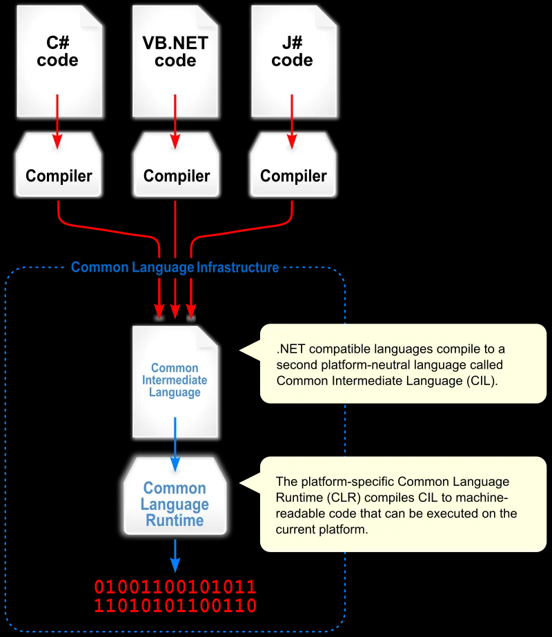
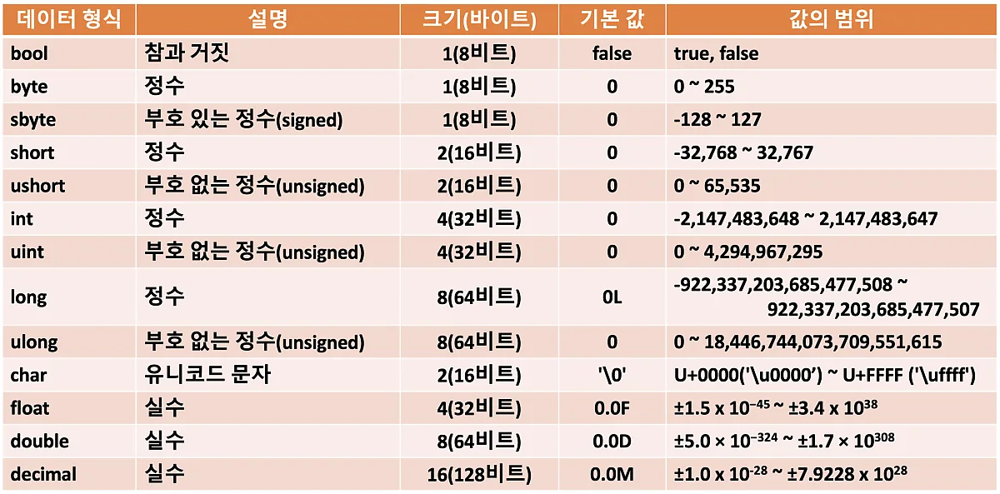
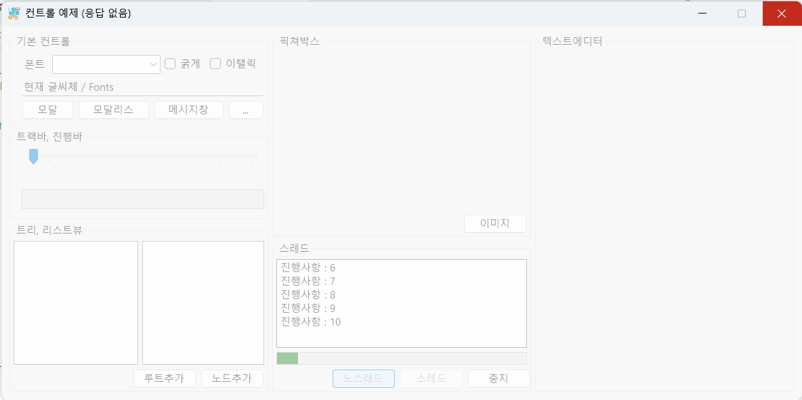
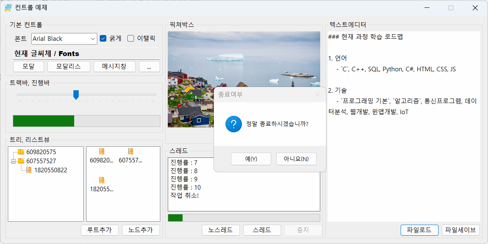
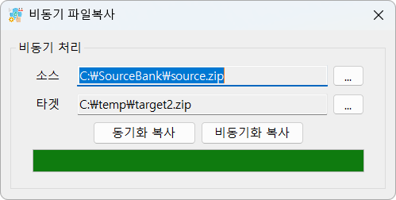
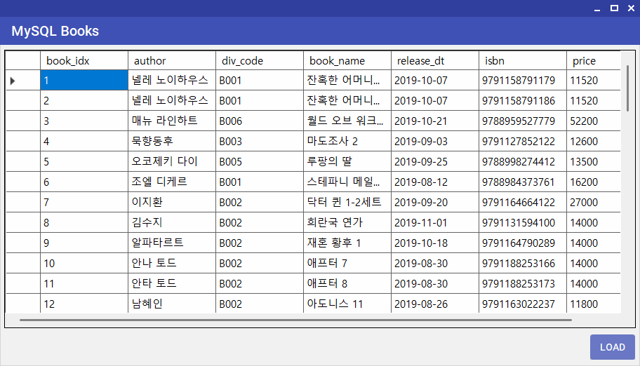
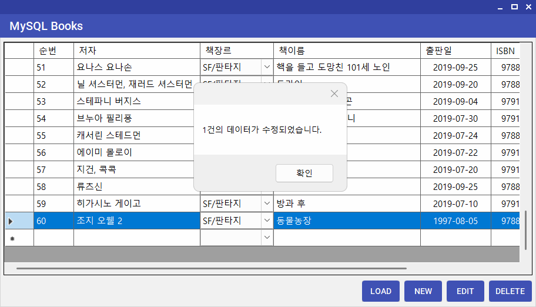
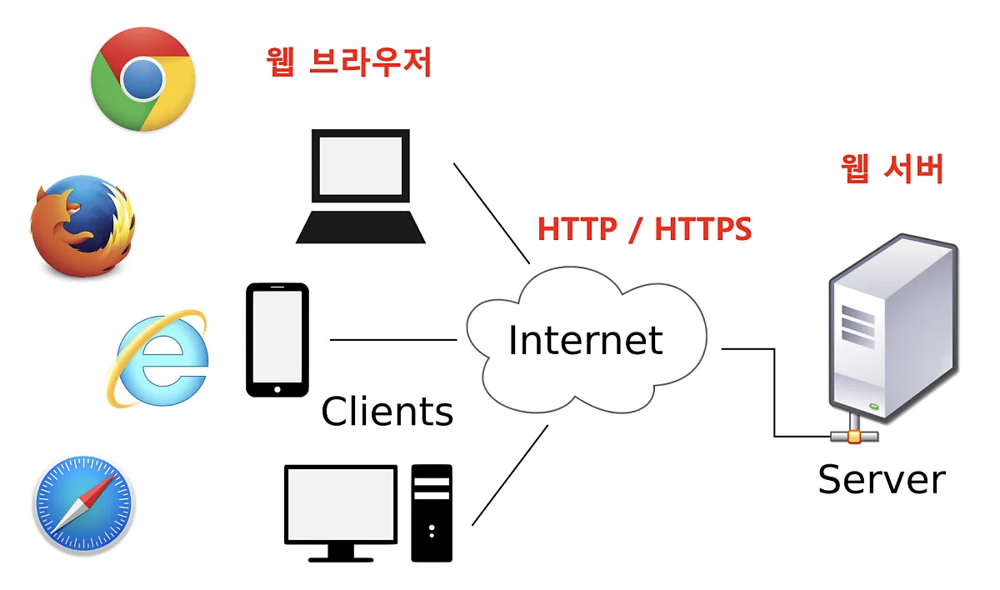
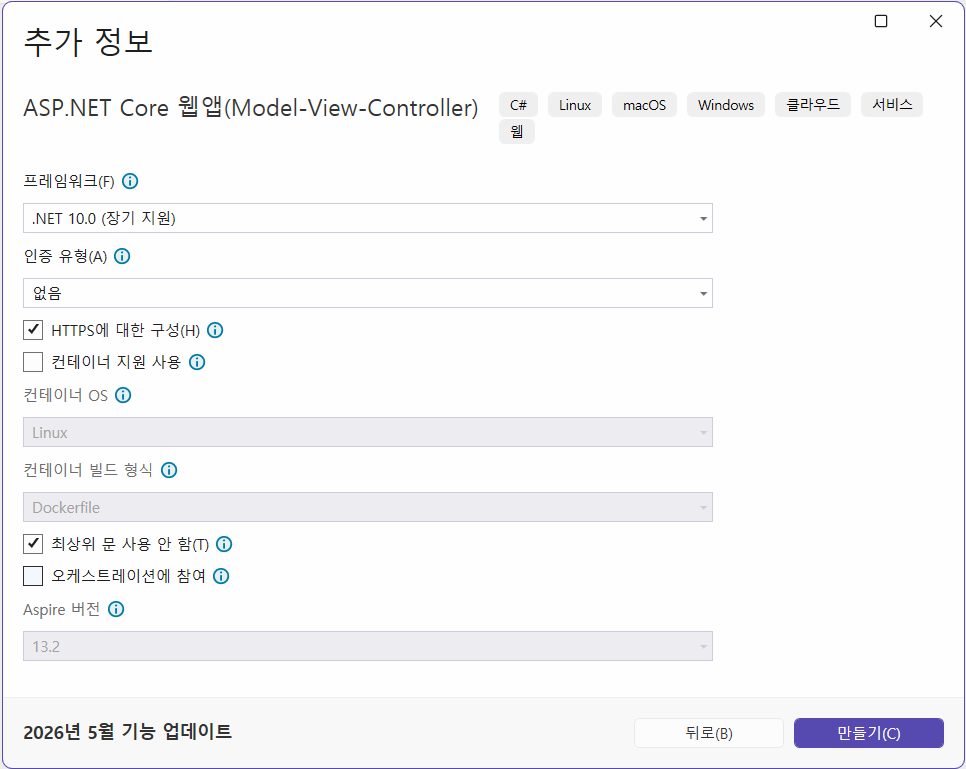

# iot-dotnet-2026
IoT 개발자 닷넷 리포지토리(기본, 중급, 응용, 프로젝트)

## C# 기본

### C# 개요
- 현 세대 프로그래밍언어 랭킹 5위
- C++, 파이썬, 자바와 동일한 객체지향 프로그래밍 언어
- MS 윈도우에 종속적이었지만 현재 멀티플랫폼으로 변환 중
- MAUI(구 자마린)으로 모바일앱 개발 가능
- 유니티 게임 엔진 기본 스크립트 채택
- 스마트팩토리, KIOSK 개발 등에 많이 활용

### C#은 닷넷 프레임워크 위에서 동작
- 자바는 버주얼머신(VM)위에서 동작하면,
- C#은 닷넷 프레임워크(VM)위에서 동작함
- .NET(dotNET) 프레임워크의 구조를 따르면 무슨 언어든지 동작가능
    - C#, VB, J#, F#, C++.NET, Python... 

    
- 출처 : https://wikidocs.net/227163

- 버전명칭
    - .NET Framwork > .NET Core > .NET 5.0 이상

### 절차적 프로그래밍 vs 객체지향 프로그래밍

- 절차적 : 순서대로 수행하도록 프로그래밍을 구현하는 것
- 객체지향 : 모든 것을 객체로 선언해서 메서드로 동작, 각 객체별로 메시지를 전달하는 형태로 프로그래밍을 구현하는 것

- 포괄적 의미 : 절차적 프로그래밍을 하면서 객체를 최대한 사용하는 방식

### C# 개발분야
- 윈도우 프로그램 : 윈 앱(Application -> App)
    - 아직 완벽하게 멀팀플랫폼이 안됨
- 웹 앱 : ASP(Active Server Page).NET <--> Spring(Java Server Page)
    - MacOS, Linux, Windows 모두 가능
- 유니티 : 게임, 디지털트윈(산업계)
    - 크로스플랫폼(모바일까지)
- IoT 연동 : 아두이노, 라즈베리파이 가능

- C# 언어 난이도 
    - C > C++ > Java > C# > Python

### C# 콘솔 구현순서

1. Visual Studio 실행
2. C#이 없으면 추가 기능 설치
    - ASP.NET 및 웹 개발 선택
    - .NET 데스크톱 개발 선택
    - Unity 게임 개발 선택

    

3. Visual Studio 재실행
4. 새 프로젝트 만들기
5. 언어 C#으로 선택
6. 콘솔 앱 선택
7. 새 프로젝트 구성 : 프로젝트 명, 저장 위치, 솔루션 이름 지정
8. 추가 정보 : 프레임워크 선택, `최상위 문 사용 안 함(Do not use top-level statement)` 체크안함

    
    
9. 만들기 버튼 클릭 - [소스] 추가해야함

    ```cs
    // 최신방식 - 처음 학습시에 도움이 안되는 방식
    Console.WriteLine("Hello, World!");
    ```

10. 추가 정보에서 `최상위 문 사용 안 함`을 체크할 것

### C# 기본 문법

- 기본문법 - [소스] 추가해야함

    ```cs
    using System;

    // C#은 네임스페이스 내 동작
    // Python에 import로 불러올수 있는 패키지와 동일
    namespace ConsoleApp2
    {
        // C# OOP. 모든 것은 객체
        internal class Program
        {
            // 기본 진입점(EntryPoint) 메서드(C#은 함수라고 부르지 않음)
            /// <summary>
            /// Main 메서드
            /// </summary>
            /// <param name="args">콘솔명령 옵션 파라미터</param>
            static void Main(string[] args)
            {
                // 빌트인 클래스 콘솔 내의 WriteLine 메서드로 콘솔에 문자열 출력
                Console.WriteLine("Hello, C#!");
            }
        }
    }
    ```

- 주석 : 한 줄 주석(//), 여러줄 주석(/* */), XML주석(///)

- 변수와 타입 - [소스] 추가해야함
    - 초기화 : `접근제한자 타입 변수명`
    - 기본타입(구조체) : bool, sbyte, ..., ushort, int, uint, long, float, double, decimal, char, bool
    - 기본타입과 매핑되는 구조체 타입 : Boolean, Int16~128, Single, Double    
    - 참조타입(클래스) : class, interface, array, string
    - 변수 선언은 C/C++와 동일
    - 형변환
        - 묵시적 형변환 : 작은 타입 변수를 큰 타입의 변수로 옮길때 
        - 명시적 형변환 : `(타입)` 지정
    - var: 가변타입. javascript var와 동일. C++ auto와 동일
    - 변수명 지정 시 class AppleName와 같이 사용(java appleName)

    

- 연산자
    - C/C++ 과 동일

- 제어문
    - if, switch, for, while 까지 C/C++ 동일
    - foreach는 컬렉션 이후 

- 메서드 
    - C/C++, Python 함수와 동일

- 객체지향
    - C++, Python 객체지향 클래스 개념/내용과 동일
    - 클래스 : 명사와 동사의 집합
        - 명사 : 멤버변수, 속성(Property), Get or Set
        - 동사 : 멤버함수, 메서드(Method)

    ```cs
    class Person {
        public string Name;

        public void Eat() {
            Console.WriteLine(Name + "이(가) 먹다.");
        }
    }

    static void Main() {
        Person p1 = new Person();
        p1.Name = "길동";
        p1.Eat();
    }
    ```

    - 생성자 : 클래스명과 동일한 특수메서드
    - 오버로딩 지원 : 메서드 파라미터 갯수가 다르면 가능
    - 상속 : 동일하게 사용가능, 단일 클래스 상속 지원
        - 다중 인터페이스 구현으로 멀티클래스 상속 대체(Java, Python 동일)
    - 오버라이딩 가능 : 부모클래스의 메서드와 다르게 동작하는 메서드로 변경
    - this : 자기 클래스를 지칭할 때 

- 클래스 속성에서
    - get: 속성값을 가져올 수만 있음
    - set: 속성값을 변경할 수만 있음
    - get; set;: 둘 다 가능

- 컬렉션 - [소스](./basic/Ex01_app/Prac04Collection/Program.cs)
    - 배열, 리스트 등 여러요소를 묶어서 사용하는 구조
    - ArrayList, List, Hashtable, Dictionary, Stach, Queue, Hashset, ...
    - 배열보다 컬렉션을 사용할 것

    

    - foreach: python 'for (i in range(n))'와 동일    
    - 보기 > 개체 브라우저 

- 예외처리
    - try ~ catch ~ finally 형식 사용 가능


### MSDN(MicroSoft Developer Network)
- https://learn.microsoft.com/ko-kr/dotnet/csharp/

### C# 프로그래밍

- C#으로 프로그램을 구현한다는 뜻
    - 윈도우 애플리케이션(WinApp), 웹앱(WebApp), Unity, 모바일(MAUI), 키오스크(WPF) 개발함
    - GUI(Graphic User Interface) 활용

## 윈앱

- WinForms, Window Application, GUI ... -> `WinApp`으로 통일
    - Windows Forms: 가장 오래된 웹앱개발 방식
    - WPF: 좀 더 최신의 웹앱개발 방식


- 윈앱 개발에는 각 두개로 구분 되어 있음
        - NET Framework: .NET FrameWork 4.8 이전 구형 계산방식
        - 기본: .NET 5.0 이상의 최신 개발방식

### 윈폼즈 앱 구현순서

1. 새 프로젝트 - [위치](./winapp/IoT02WinSolution/)
2. 프로젝트명, 위치, 솔루션명 지정
3. 프레임워크 .NET 10.0 선택 후 만들기
4. IDE 툴에서 펑션키 F4로 속성창 오픈
5. 보기 > 도구상자 클릭
6. 기본 개발화면

    

7. 저장할 때는 항상 Ctrl + Shift + S(모두 저장)으로 저장할 것
8. 도구상자의 컨트롤을 디자인 화면으로 드래그해서 구성 
9. 컨트롤의 속성 변경으로 디자인 적용
10. 컨트롤의 이벤트 추가로 기능 구현
11. 디자이너 화면에서 `F7` <--> 비하인드 코드 `Shift + F7`
12. `Ctrl + Space`, `Alt + Enter` VS(VS Code 포함)에서 가장 많이 쓰는 단축기


### 트러블 슈팅


- Visual Studio 2022 이상에서 윈폼즈 개발시 디자인화면에서 버튼을 더블클릭 이벤트 추가할 경우 발생하는 오류
- Designer.cs에 생성되는 이벤트 선언문에 대한 .cs파일 이벤트핸들러가 생성되지 않아서 발생

#### 첫번 째 방법
1. Designer.cs 내 `Windows Form Designer generated code` 영역을 확장
2. 빨간색 밑줄이 그인 오류 이벤트 이름 삭제
3. VS 시작

#### 두번 째 방법
1. Designer.cs 내 `Windows Form Designer generated code` 영역을 확장
2. 빨간색 밑줄 오류난 이벤트에서 `Alt+Enter`
3. 메서드 생성
4. .cs로 메서드 이전

### 윈폼즈앱 용어
- 모달/모달리스: 부모창과 자식창의 관계
    - 모달(Modal): 서브(모달)창 종료 전에는 부모창 제어 불가
    - 모달리스(Modaless): 서브창 종료와 관계 없이 부모창 제어 가능

- 속성 변경방법
    - 디자인타입 변경: [디자인] 작업 시 속성창의 속성값 입력
    - 런타임 변경: 코드내에서 속성값을 변경. 실행시 변경되는 것

### 스레드 사용법
- 윈앱 자체가 UI 스레드 사용
- 반복작업을 스레드 없이 수행하면 UI 스레드와 충돌 발생 - (응답 없음)

- C#에서 스레드 사용 방법
    - 직접 스레드 클래스 생성 - 개발자 코딩 필요
    - 백그라운드워커 클래스 사용 - 필수요소만 처리해주면 됨

- 백그라운드워커 구현법
    1. 워커_DoWork - 첫 실행하는 부분
    2. 워커_ProgressChanged - 진행사항 UI 스레드로 전달
    3. 워커_RunWorkerCompleted - 스레드 완료 후 처리할 것들 구현

- async/await 키워드로 진행
    - 비동기처리를 지원하는 메서드만 사용 가능

### 윈앱 기본컨트롤 예제앱

- 라벨, 콤보박스, 체크박스, 텍스트박스, 버튼
- 메시지박스, 다이얼로그
- 트랙바, 진행바
- 트리뷰, 리스트뷰, 이미지리스트
- 픽쳐박스
- 백그라운드워커(스레드)
- 리치 텍스트박스



### 비동기 처리 앱
- 비동기로 호출할 메서드 앞에 await 키워드 추가
- 비동기메서드 호출하는 부모 메서드 접근 제어 키워드와 리턴값 사이에 async 키워드 추가
- 일반메서드를 비동기메서드로 변경(일반메서드 뒤에 Async 포함)
- 리턴값이 있을 때 변경 long -> Task<long>
- 아주 간단하게 스레드 처리가 가능

- 동기화 복사는 복사 기능 도중, 다른 이벤트 사용 불가
- 비동기화 복사는 다른 이벤트 가능



### DB 연동 앱
- MySQL bookrentalshop 연동

#### 외부 라이브러리 활용
- 윈폼즈 앱 개발시 직접 디자인이 어려움
- 3rd 파티사에서 여러 라이브러리 제공
- 예전에는 따로 설치, 내 프로젝트에 붙여넣기
- NuGet Package 존재 - Python pip와 동일한 기능
- https://www.nuget.org/packages 에서 설치방법 확인

#### NuGet 설치 순서
1. 프로젝트 마우스 오른쪽 버튼 > NuGet 패키지관리 클릭
2. 찾아보기에서 필요한 라이브러리 검색
3. 패키지 세부사항 > 종속성 - 현재 프로젝트 버전에서 사용여부 확인
4. 설치 클릭, 변경내용 미리보기 확인
5. 라이센스 허용여부 다이얼로그 표현될 때 있음, 허용

#### DB 연동 구현
1. NuGet 패키지 MySQLConnector 설치
2. DatabaseHelper 클래스 생성, 작성
    - Select 메서드 작성 - [소스](./winapp/IoT02WinSolution/DotNet06DbBooksApp/DatabaseHelper.cs)
3. DataGridView, Button 컨트롤 추가
4. 버튼 클릭이벤트에 메서드 추가




### DB연동 앱 - 데이터 추가, 수정, 삭제
- INSERT, UPDATE, DELETE 기능 구현




#### C# 개발 Tip
- C# 문법 중 새 객체 생성할 때 초기화 방법

    ```cs
    // 전통적인 속성 할당 방식 객체 생성방식
    // book_idx 
    DataGridViewTextBoxColumn colBookIdx = new DataGridViewTextBoxColumn();
    colBookIdx.Name = "book_idx";
    colBookIdx.HeaderText = "순번"; // 화면표시 컬럼명
    colBookIdx.DataPropertyName = "book_idx";
    colBookIdx.ReadOnly = true;  // PK는 수정하면 안됨!!
    ```
    
    ```cs
    // C# 3.0 이후 객체 이니셜라이저 방식
    // book_idx 
    DataGridViewTextBoxColumn colBookIdx = new 
    DataGridViewTextBoxColumn
    {
        Name = "book_idx",
        HeaderText = "순번", // 화면표시 컬럼명
        DataPropertyName = "book_idx",
        ReadOnly = true  // PK는 수정하면 안됨!!
    };
    ```

## 웹앱

### 서버 클라이언트



### 웹 서비스

- 통칭해서 웹 서버와 API 서비스 모두 웹 서비스라고 칭함
- API 서버 - 데이터만 전달하는 형태의 웹 서비스
    - 공공데이터포털, 네이버API, 구글API

### 일반 웹서버
- HTML, CSS, Js 사용 웹화면 개발 + 백엔드
- ASP.NET, Spring Boot 등을 사용해서 기본적인 웹서버 개발
- 네이버, 구글, 기업 홈페이지...

### ASP.NET
1. 새 프로젝트 - ASP.NET Core 웹앱(MVC) 선택
2. 프로젝트명, 위치, 솔루션명 여비력 다음
3. 프레임워크 선택, 인증 유형 없음, HTTPS 체크, 최상위문 사용 안함 쳌,
- 나머지는 기존 상태 그래도 만들기



### ASP.NET API서버
1. 새 프로젝트 - ASP.NET Core 웹 API
2. 위와 동일
3. OpenAPI, 컨트롤러 사용 체크 나머지 동일
4. 서버 실행
    - Get으로 데이터 조회
    - 서버 상태 확인 

    

5. `PostMan`으로 Http메서드 테스트

### Http 메서드
- GET - Select와 동일, 조회
- POST - Insert와 동일, 등록 위주. 수정, 삭제도 가능
- PUT - Update와 동일, 수정
- DELETE - Delete와 동일, 삭제

## 유니티
- 게임엔진+: Unity(C#), Unreal(C++), Blender(Python), Godot Engine(C#)
- Unity 특장점
    - 구현 쉽다. 툴 실행이 빠르다
    - 인더스트리 분야 진입 속도가 빠름
    - 캐주얼 게임, 디지털 트윈(현실세게와 가상세계를 일치화)

### 유니티 설치
- https://unity.com/ 에서 회원가입, 로그인 후 다운로드
- 유니티 허브 설치
- 유니티 허브 실행 > 로그인
- Personal License 승인하면 활성화
- Install -> Editor 설치

### OpenAPI 연동 앱
- 미세먼지 모니터링 앱
- 국가교통정보 CCTV뷰 앱
- IoT 모니터링 앱
- ...

### 키오스크 앱
- 결제이전까지 동작하는 버전
- WPF를 사용해서 구현

### 라이브러리 만들기


