# 2026 닷넷 개발자 데스크톱 개발

## 2. Unity 실습

### 2.1 유니티 학습
- https://learn.unity.com/ 튜토리얼대로 따라하기
- keijiro Takahashi Github: https://github.com/keijiro
- 이전버전 https://

#### GetStarted with Unity
- Tutorial 순서대로 따라하기


- 1번 챕터 완료 후


### 2.1 Essentials PathWay
- 가장 짧은 ㅡ시간에 Unity 학습할 수 있는 튜토리얼


#### Essentials PathWay Template


- 템플릿 다운로드 우선
- 프로젝명, 프로젝트 위치 선택 프로젝트 생성


#### 화면/시점 이동
- 방향키, WSAD 
- Mouse Right, Wheel 
- Fly Mode: Mouse Right + WSAD / E(UP), Q(DOWN)


- Object 선택 후 F 클릭(오브젝트 더블클릭)


#### Pan Tool
- 오브젝트 위치, 회전, 크기 등을 조절할 수 있는 아이콘 툴바


- View, Move, Rotate, Scale, Rect, Transform까지 여섯 개 아이콘
- 단축기: Q, W, E, R, T, Y


#### 오브젝트 위치(Position), 회전(Rotation), 크기(Scale) 조정
- Inspector > Position x, y, z 값을 입력 또는 마우스로 좌우 드래그 
- Rotation, Scale 동일하게 적용


### Kid's Room 꾸미기
- 방 오브젝트
- 침대, 카페트, 협탁, 알람시계,  


#### Material
- 오브젝트 재질 표현 객체
- Material 객체 생성 후 Inspector에서 조정


- Material 객체를 Ball 객체에 드래그


#### RigidBody
- 물리역학 기능 제공 컴포넌트
- Ball 선택 Inspector에서 Add Component 버튼 클릭


#### Physics Material
- 물체가 충돌할 때 마찰력, 반발력을 설정하는 자산
- Bounciness: 1 완전 탄성 충돌
    - 0.1(쇠구슬), 0.7(축구공), 0.9(고무공), 1.0(스포츠공)


#### Ramp Object 추가
- 위치, 회전 지정
- Mesh Collider 컴포넌트 추가


#### Block 객체 생성
- Cube로 생성
- Scale x,y,z를 0.1, 0.25, 0.1로 설정 - Ball이 튕겨서 닿는 위치에 배치
- Rigid Body 추가


#### 카메라 시점 변환
- Flythrough 모드로 이동 후 > 카메라 오브젝트 선택
- Ctrl+Shift+F: 현 카메라 시점을 플레이 카메라 시점으로 변경


#### 프리팹 변경
- PreFab를 선택 후


#### Block 쌓기
- Pivot을 Center로 변경 후
- 프리팹 Block을 쌓아올림


#### 프리팹 편집모드
- 프로젝트 창의 프리팹을 더블클릭
- Inspector 수정
- Rigidbody > mass를 1보다 작게 수정(0.1)
- 충돌하는 물체의 mass에 상대적으로 반응
- Hierarchy 창의 < 버튼 클릭


#### 라이트, 스카이박스 조정
- 라이트 
- y, z 축으로 낮밤 조정 가능
- Emission > Color 조정 - 빛 색상 조절
- Emission > Light Appearance, Filter and Temperature 선택 후
- 빛의 온도와 조명 조정


- 스카이 박스
- 하늘 전체 배경 변경
- Materials > Skyboxes


#### 플레이모드 구분짓기
- Preferences > Colors > Play mode tints 색상 변경
- Play시 UI 색상이 Edit 모드와 다르게 표시


#### 피벗기능
-Object를 쌓을 때 v를 누르면 Object의 기준점 변경 됨


#### Chapter2


#### Chapter3 Audio Effect
- 냄비 프리팹 선택, 가스레인지 위 위치
- Audio Source 컴포넌트 추가
- Audio Generator 선택, Loop 체크
- Spatial Blend: 2D ~ 3D로 변경

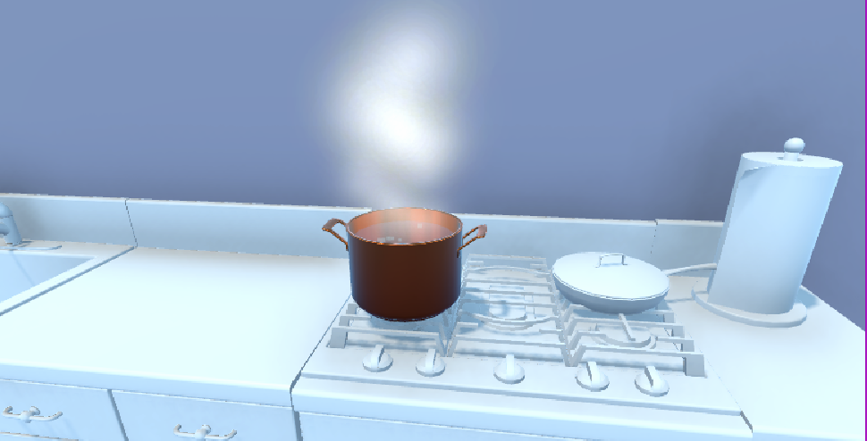

#### Unity 오브젝트 복사
- Ctrl + D: 선택한 오브젝트 바로 복사

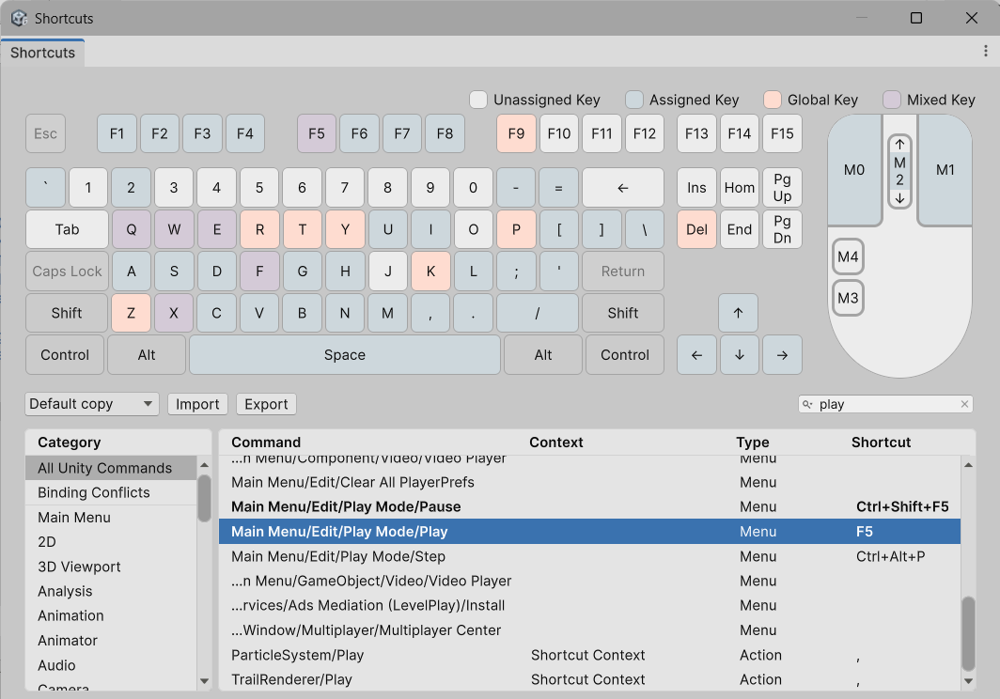

#### 배경음악, 새소리
- 계층창에서 Audio Source 선택
- 알맞은 사운드 Audio Generator에 선택
- 시작하면서 바로 음악 플레이하고 싶으면
    - Play on Awake 체크
- 새소리처럼 랜덤하게 플레이하고 싶으면
    - Play on Awake 체크 해제
    - PlaySoundAtRandomIntervals 스크립트 추가
    - Min/Max Seconds 랜덤 시간 지정


#### Chapter4 Programming
- 유니티 개발시 가장 핵심!

- Player 오브젝트 위치, 회전, 크기 조정
- PlayerController 스크립트 생성, Player 드래그

- 입력시스템 변경
    - Project Settings > Player > Other Settings > `Active Input Handling`, Old 또는 `Both`로 변경 후 에디저 ㅌ재시작


#### 카메라 플레이어 Child 설정
- Main Camera, Player 위치 
- 방 아래 Cube까지 화면에 출력, 위치 조정 잘 해줘야 플레이시 카메라 진동 X

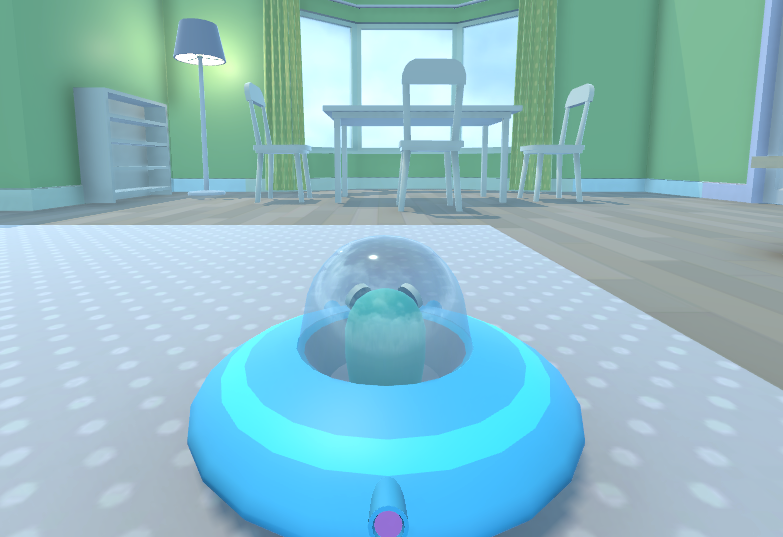
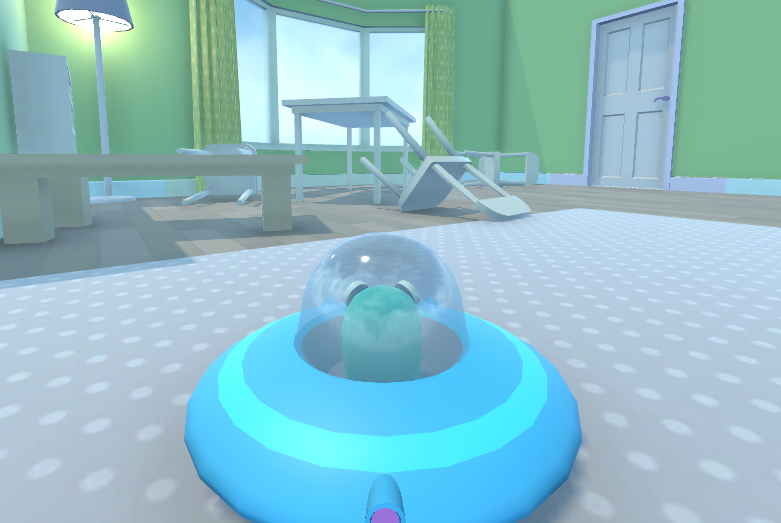


#### 플레이모드 변수값 변경
- Speed: 5.0f, RotationSpeed: 120.0f
- 플레이시 이동 속도가 빠름
- 플레이모드 변수값 수정하면서 알맞은 속도 확인
- Speed: 0.3f, RotationSpeed:100.0f 적당함
- Inspector에 지정된 스크립트 Reset

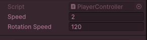


#### 아이템 코인 오브젝트
- Prefabs 폴더에서 Collectible Coin 드래그, 위치/사이즈 조정
- Collectable.cs 스크립트 생성

```cs
public class Collectible : MonoBehaviour
{
    [Header("회전 설정")]
    [Tooltip("프레임당 회전 속도")]
    [Range(0, 10)]
    public float rotationSpeed = 1.0f; 

    // Update is called once per frame
    void Update()
    {
        transform.Rotate(0, rotationSpeed, 0);  // 매프레임마다 y축을 1씩 회전
    }
}
```

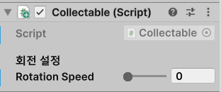


#### 아이템 획득 기능 추가
- Coin에 Box Collider > `Is Trigger` 체크
- 충돌은 발생하지 않고, 충돌감지 기능 활성화

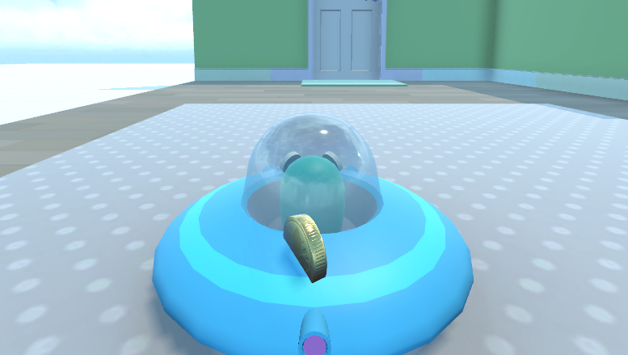


#### Collectable.cs에 OnTriggerEnter 메서드 추가
```cs
// 물체끼리 충돌이 발생했을 때 이벤트처리
private void OnTriggerEnter(Collider other)
{
    // Destroy the collectible - 코인 삭제
    Destroy(gameObject);    
}
```

* 임시 - 전체 코드
```cs
using UnityEngine;

public class Collectible : MonoBehaviour
{
    [Header("회전 설정")]
    [Tooltip("프레임당 회전 속도")]
    [Range(0, 10)]
    public float rotationSpeed = 1.0f;

    [Tooltip("아이템 획득 시 이펙트 지정")]
    public GameObject onCollectEffect;

    // Start is called once before the first execution of Update after the MonoBehaviour is created
    void Start()
    {
        
    }

    // Update is called once per frame
    void Update()
    {
        transform.Rotate(0, rotationSpeed, 0);  // 매프레임마다 y축을 1씩 회전
    }

    // 물체끼리 충돌이 발생했을 때 이벤트처리
    private void OnTriggerEnter(Collider other)
    {
        // Destroy the collectible - 코인 삭제
        Destroy(gameObject); 
        
        // Instantiate the particle effect
        Instantiate(onCollectEffect, transform.position, transform.rotation );
    }
}

```

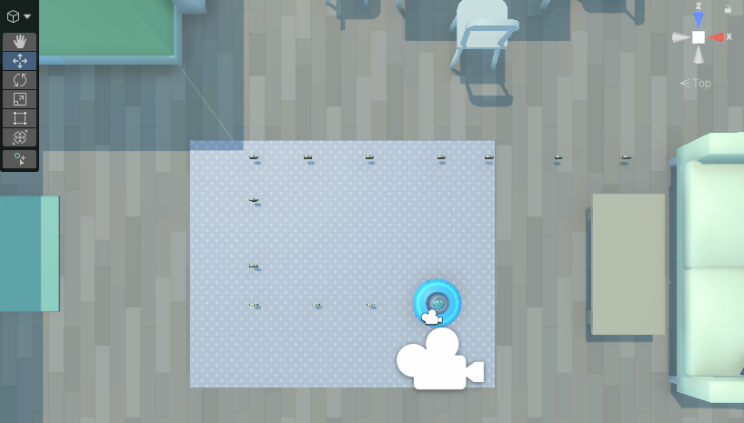

#### 점프기능 추가
- PlayerController.cs에 공용변수, Update() 추가

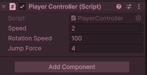

```cs
[Tooltip("점프강도")]
public float jumpForce = 3.0f;

// 입력처리, 카메라... Frame별 실행
// LateUpdate() : Update() 후에 실행되는 메서드. 카메라 추적
private void Update()
{
    if (Keyboard.current.spaceKey.wasPressedThisFrame)
    {
        rb.AddForce(Vector3.up * jumpForce, ForceMode.VelocityChange);
    }
}
```

- Play후 Space 누르면 점프 확인

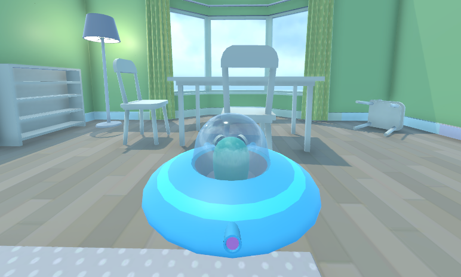


#### 생성형 AI 활용 밤낮 처리 추가
- 프롬프트로 요청
```
유니티에서 Directional Light를 조정해서 밤낮으로 바뀌는 스크립트를 작성해줘. 20초에 한번씩 해가지고 다시 뜨도록 만들어줘. DayNightCycle.cs로 만들어줘


```

- Directional Light 오브젝트에 할당
- 변수 Sun Directional Light 할당

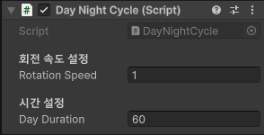


- Tutorial 스크립트 방식

```cs
[Header("회전 속도 설정")]
    public float rotationSpeed = 1f;

    [Header("시간 설정")]
    [Tooltip("하루(24시간)가 지나는데 걸리는 실제 시간(초)")]
    public float dayDuration = 60f;

    private float timePassed = 0.0f;

    void Start()
    {
        rotationSpeed = Mathf.Abs(rotationSpeed);
    }

    void Update()
    {
        float angleToRotate =
            (360.0f / dayDuration) * Time.deltaTime;

        transform.Rotate(
            Vector3.right,
            angleToRotate * rotationSpeed);

        timePassed += Time.deltaTime;

        if (timePassed >= dayDuration)
        {
            timePassed = 0.0f;
        }
    }
```

#### 방문열기 기능
- DoorOpener.cs 생성
- Door 루트오브젝트에 스크립트 지정
- Box Collider 추가 > Is Trigger 체크 후 위치, 크기 수정
- 튜토리얼에 있는 스크립트 붙여넣기
- Player 객체에 Tag 콤보박스에서 `Player` 태그 선택

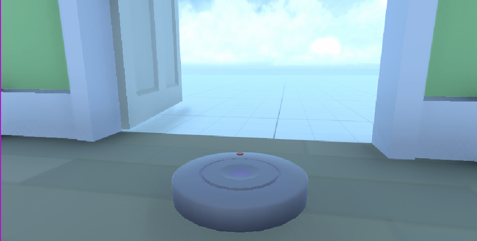


#### 코인 획득 사운드 추가
- Collectable.cs에 소스 추가

```cs
[Header("이펙트 사운드")]
public AudioClip pickupSound;

// 물체끼리 충돌이 발생했을 때 이벤트처리
private void OnTriggerEnter(Collider other)
{
    if (other.CompareTag("Player"))
    {

        AudioSource.PlayClipAtPoint(pickupSound, transform.position); ;

        // Destroy the collectible - 코인 삭제
        Destroy(gameObject);

        // Instantiate the particle effect
        Instantiate(onCollectEffect, transform.position, transform.rotation);
    }
}
```

- 프리팩의 코인을 선택, Script 내 pickupSound 설정

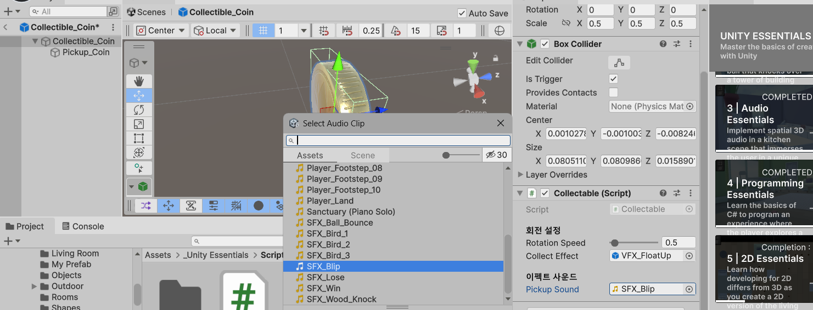


#### Chapter 6. 배포하기
- UI(Canvas) 메뉴에서 선택

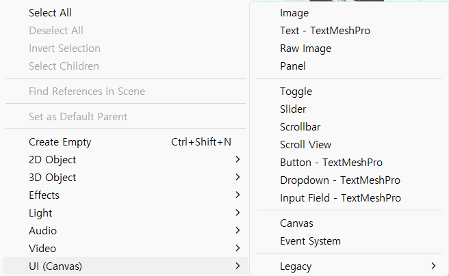


#### 빌드 시 사용할 신리스트 설정
- 메뉴 File > Build Profiles 선택
- 필요한 씬 Scene List에 추가

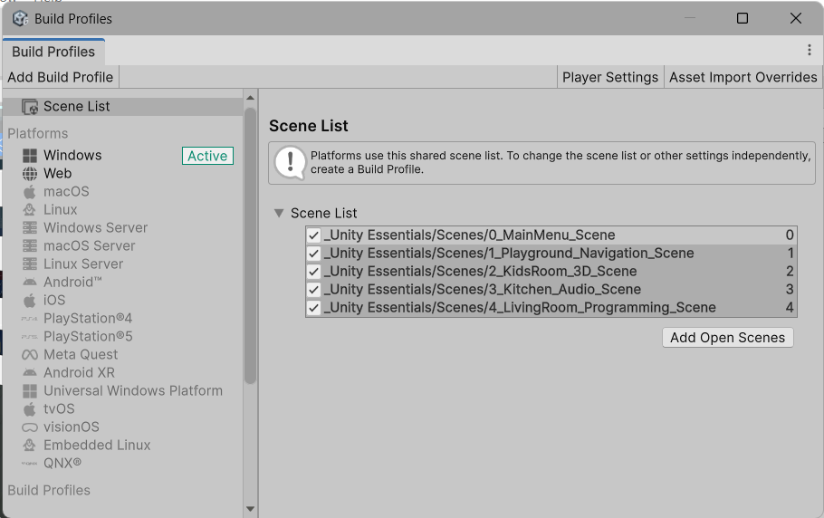


- 플레이어 세팅 작업
    - CompanyName, ProductName, Version, Default Icon
    - Resolution > Windowed, Width, Height 설정

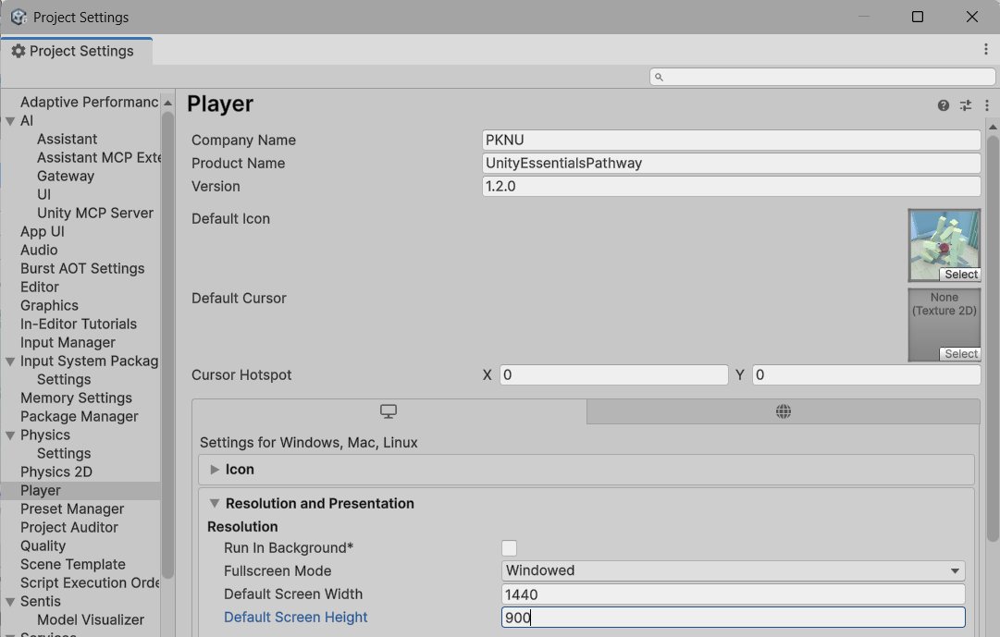

- Build Profiles > Build 또는 Build And Run 버튼 클릭

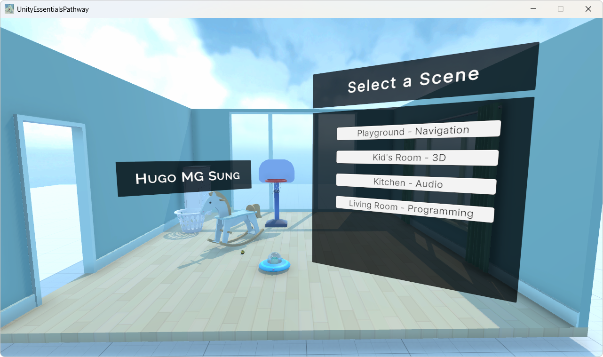

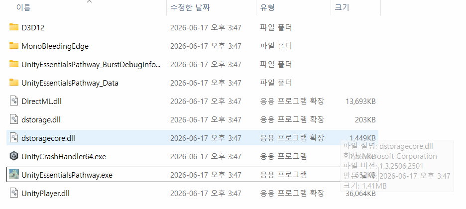

- 메뉴 클릭 신 이동, ESC키로 메뉴 되돌아오기

- 유니티 UI Canvas > Button Inspector 속성
- On Click 이벤트

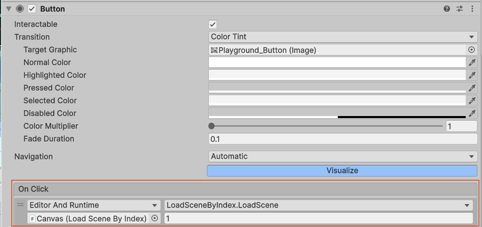

---

### 2.2 3D 모델 불러오기

#### 렌더링 파이프라인
- 오브젝트 생성, 카메라 확인, 빛 계산, 그림자 계산, 재질 생성/계산, 후처리 후 모니터 출력 등의 순서 과정

#### Built-In / SRP
- Built-In - Unity가 렌더링 방식 고정. 수정 어려움
- SRP(Scriptable Render Pipeline) - Unity는 뼈대만 제공, 개발자가 원하는 렌더링을 추가하는 방식

#### 프로젝트 구분
- 렌더링 파이프라인 종류 3가지 구분

|종류 | 성능 | 그래픽품질 | 모바일/VR 지원 |
|---|---|---|---|
|Built-in | 보통 | 보통 | 보통 |
|URP | 좋음 | 좋음 | 좋음 |
|HDRP | 낮음(고사양 필요) | 매우 좋음 | 제한적 |

- 기본적으로 Built-in으로 학습

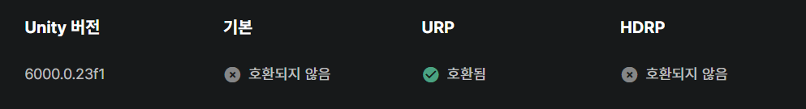

- 에셋스토어에서 제공하는 에셋의 RP 종류 확인하고 사용할 것


#### 3D 모델 활용방법

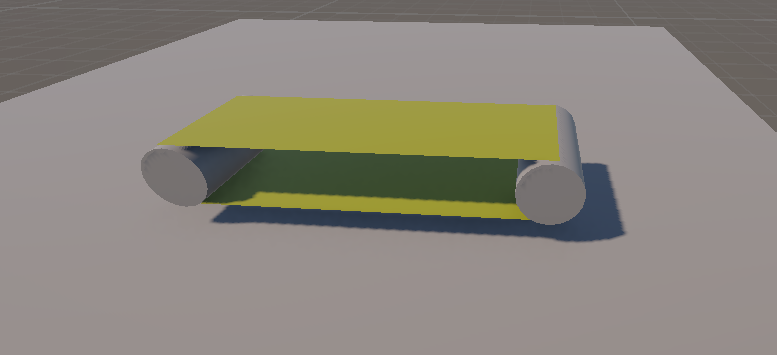

- 유니티에서는 3D 모델링이 아주 제한적
- 3D 모델 활용방법
    - Blender 무료 3D 모델링 틀에서 작업한 모델 import
    - 3D Max, Rhino 사용 모델링 툴 작업 모델 import
    - Unity Asset Store에서 제공하는 3D 모델 import
    - 생성형 AI로 모델 생성 import


#### 3D 모델 가져오기
- https://www.cgtrader.com 
- https://poly.pizza/ (low polygon model)
- https://sketchfab.com/

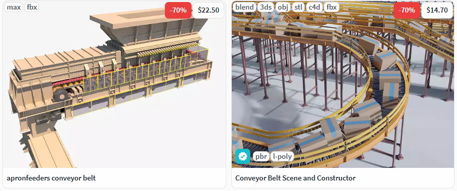

- 호환되는 파일 포맷 
    - `FBX`: Autodesk 3D(AutoCAD) 교환 포맷. Unity에서 가장 호환 잘 됨
    - `OBJ`: 범용 정적 모델 포맷. Unity 사용 가능
    - STL: 3D 프린터용 포맷. 비추천
    - BLEND: Blender 원본 파일. 애니메이션 기능 포함. Unity 사용 가능(Blender 설치)
    - 3DS: 구형 AutoDesk 3D Studio 모델. 사용 가능

- 스케치팹 사이트 > Conveyor Belt 검색 > 로그인 후 다운로드

- 압축해제, fbx, 텍스처를 프로젝트 Assets 폴더 아래 이동

    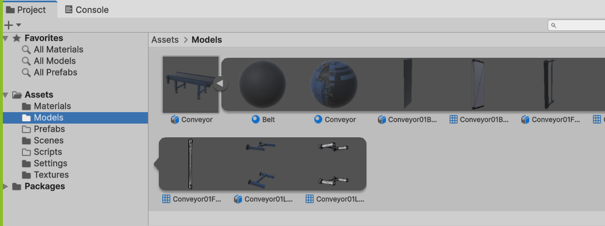

- Models 폴더에 위치한 Conveyor를 Scene뷰에 드래그

    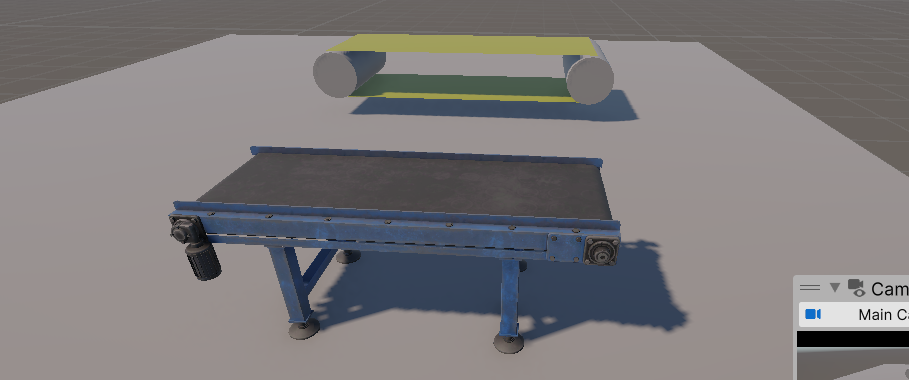

---

### 2.3 생산라인 구축


#### 생산품 박스
- Cube 오브젝트로 생성
- 구글에서 `Plastic Normal Map` 검색
- 텍스쳐 이미지 저장 > Assets > Textures 아래 위치
- Material 생성, Base Map 앞 사각형에 텍스쳐를 드래그
- Rigid Body 추가

    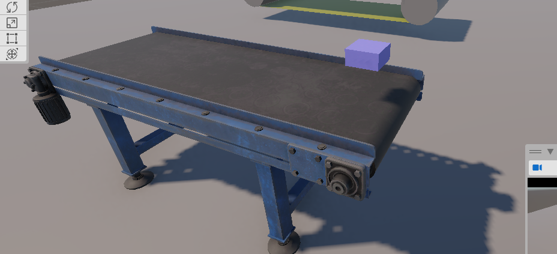


#### 컨베이어 벨트 물리컴포넌트
- Belt에만 Collider 추가
    - Mesh Collider: 3D 모델 폴리곤 메시 개수만큼 충돌영역 지정. 리소스 부하
    - `Box Collider`: 큐브 형태로 충돌 영역 지정. 부하 적음


#### 컨베이어 벨트 스크립트
- ConveyorBelt.cs 스크립트 생성
- 충돌이 감지되는 동안 물체이동 로직

```cs
using UnityEngine;  // 유니티 엔진 클래스

// MonoBehaviour: C# 스크립트가 기본적으로 상속받는 핵심 클래스
// 개발자 코드가 유니티 엔진과 인터랙티브하게 소통할 수 있도록
// 오브젝트에 컴포넌트로 연결, 동작을 제어
public class ConveyorBelt : MonoBehaviour
{
    [Header("물체이동 방향")]
    public Vector3 moveDirection = Vector3.right;

    [Header("물체이동 속도")]
    public float speed = 2.0f;

    // 매 프레임 두 충돌영역이 접촉하고 있는 동안 발생하는 이벤트 핸들러 
    private void OnCollisionStay(Collision collision)
    {
        Rigidbody rb = collision.rigidbody; // 충돌감지된 오브젝트 리지드바디 가져오기   

        if (rb != null)
        {
            rb.linearVelocity = moveDirection.normalized * speed;   // 이동방향으로 속도만큼 이동
        }
    }
}
```

- 컨베이어 오브젝트 중 Collider 컴포넌트 적용한 벨트에 스크립트 할당
- 플레이 테스트 후 방향 변경

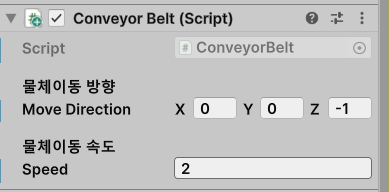


#### Box Spawner 생성
- 박스를 일정시간마다 하나씩 생성하도록 하는 기능
- Product 박스, 컨베이어를 프리팹으로 이동

    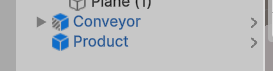

- EmptyObject 생성, 위치를 이전 Product 위치로 지정
- BoxSpawner.cs 스크립트 생성

```cs
using UnityEngine;

public class BoxSpawner : MonoBehaviour
{
    [Header("프리팹 지정")]
    public GameObject prdPrefab;

    [Header("생성 간격")]
    public float interval = 3.0f;

    float timer;
    
    void Update()
    {
        timer += Time.deltaTime; // HW 성능별 FPS 고정

        if (timer >= interval)
        {
            timer = 0;

            // Instant = 예제, 샘플
            // Quatenrnion.identity = 회전값 없는 상태
            Instantiate(prdPrefab, transform.position, Quaternion.identity);
        }
    }
}
```

- Spawner 빈오브젝트에 스크립트 할당

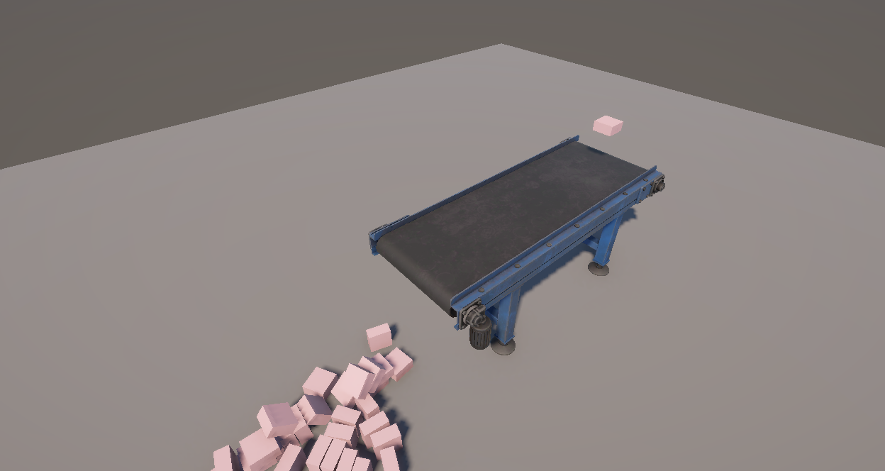


#### 실행결과

(링크 첨부)


#### 컨베이어 벨트 여러 개 구성
- 프리팹 드래그 추가

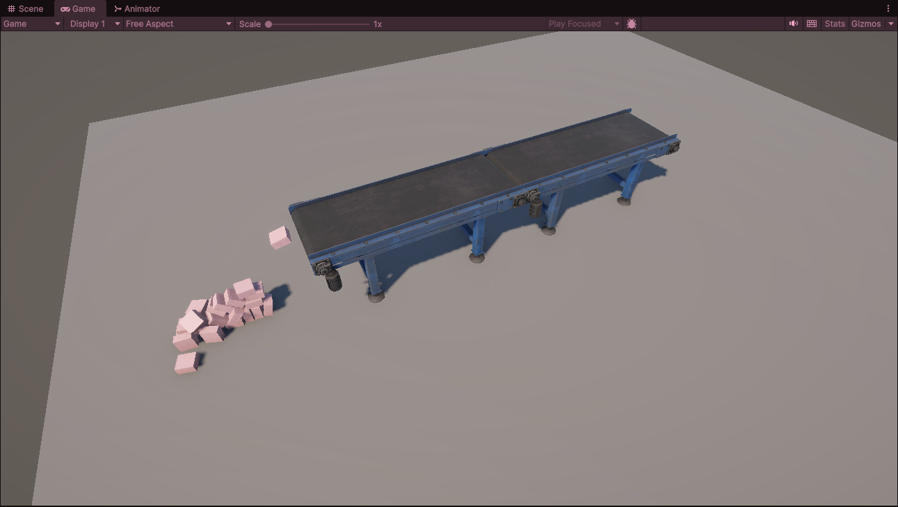


#### 컨베이어 벨트 멈추기 기능
- ConveyorBelt.cs 오픈
- 로직 변경

```cs
using UnityEngine; 

public class ConveyorBelt : MonoBehaviour
{
    [Header("물체이동 방향")]
    public Vector3 moveDirection = Vector3.right;

    [Header("물체이동 속도")]
    public float speed = 2.0f;

    [Header("벨트 동작여부")]
    public bool isRunning = true;

    // 매 프레임 두 충돌영역이 접촉하고 있는 동안 발생하는 이벤트 핸들러 
    private void OnCollisionStay(Collision collision)
    {
        Rigidbody rb = collision.rigidbody; // 충돌감지된 오브젝트 리지드바디 가져오기   

        if (rb == null) return;
        
        if (!isRunning)
        {
            rb.linearVelocity = Vector3.zero; // 0으로 초기화
            return;
        }

        rb.linearVelocity = moveDirection.normalized * speed;   // 이동방향으로 속도만큼 이동
    }

    public void stop()
    {
        isRunning = false;  // 중지
    }

    public void StartBelt() 
    {
        isRunning = true;   // 재시작
    }
}
```

- 벨트 동작여부 체크 확인

    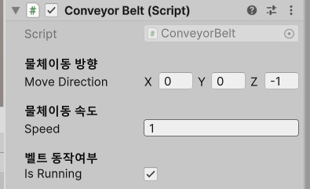

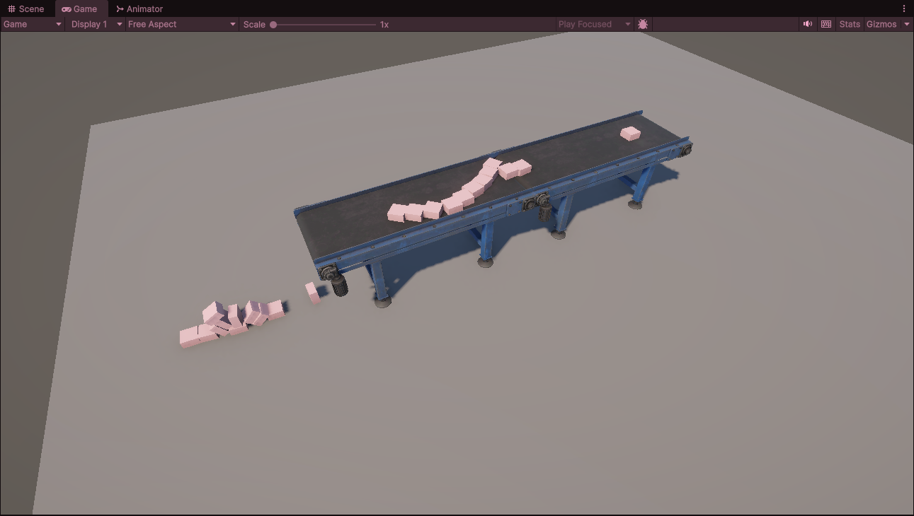

- 컨베이어 끝에 센서 있다고 가정. Collider 트리거 발생하면 멈춤 기능
- 빈 오브젝트 생성 > `Sensor` 명명
- Sensor 오브젝트 > `Box Collider` 컴포넌트 추가. `Is Trigger` 체크
- `Edit Collider` 아이콘 클릭 -> 위치, 크기 조정

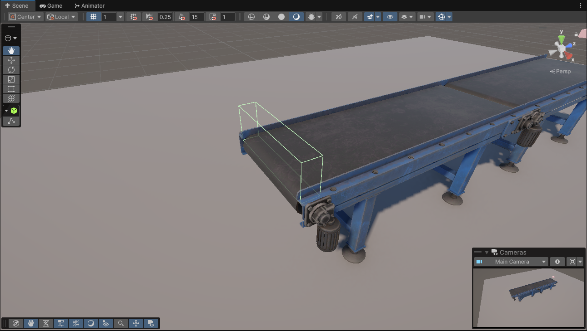

- SensorTrigger.cs 스크립트 생성

```cs
public class SensorTrigger : MonoBehaviour
{
    // 다른 Collider가 들어와서 Trigger 발생하면?
    private void OnTriggerEnter(Collider other)
    {
        Debug.Log("제품 감지!");
    }
}
```

- Sensor 객체에 스크립트 추가
- 콘솔로 변경. 실행

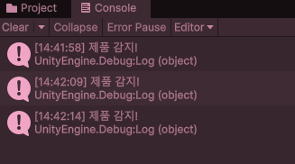


- SensorTrigger.cs 스크립트 재수정

```cs
public class SensorTrigger : MonoBehaviour
{
    [Header("컨베이어 1")]
    public ConveyorBelt conveyor1;

    [Header("컨베이어 2")]
    public ConveyorBelt conveyor2;

    private bool isProcessing = false;

    // 다른 Collider가 들어와서 Trigger 발생하면?
    private void OnTriggerEnter(Collider other)
    {
        if (isProcessing) return;

        if (other.CompareTag("Product"))
        {
            // 시간이 걸리는 작업을 여러 프레임에 나눠서 실행하는 기능
            StartCoroutine(Process());
        }
    }

    private IEnumerator Process()
    {
        isProcessing = true;

        Debug.Log("제품 감지!");

        conveyor1.Stop();  // isRunning = false;
        conveyor2.Stop();

        yield return new WaitForSeconds(3.0f);  // 3초동안 대기한 뒤 다음로직으로 

        conveyor1.StartBelt();
        conveyor2.StartBelt();

        yield return new WaitForSeconds(1.0f); 

        isProcessing = false;
    }
}

```

- ConveyorBelt 컨베이어 1번 변수에 Collider 지정된 벨트 객체 할당
- ConveyorBelt 컨베이어 2번 변수에 Collider 지정된 벨트 객체 할당

    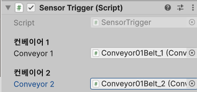


- Product 프리팹에 `Product` 태그 생성 지정

    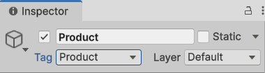


#### 벨트 동작화면

- mp4 등록 예정 


#### 컨베이어, 스폰 기능 동기화
- 센서가 감지되면 Conveyor와 Spawner 같이 중지
- BoxSpawner.cs 수정 - isRunning 추가

```cs
private bool isRunning = true;

void Update()
{
    if (!isRunning) return; // isRunning이 false면 아래 로직 실행 안 함
    timer += Time.deltaTime; // HW 성능별 FPS 고정
    if (timer >= interval)
    {
        timer = 0;
        Instantiate(prdPrefab,
                    transform.position,
                    Quaternion.identity);
    }
}

public void Stop()
{
    isRunning = false;
}

public void StartSpawner()
{
    isRunning = true;
}
```

- SensorTrigger.cs 수정 - BoxSpawner 변수 추가

```cs

```

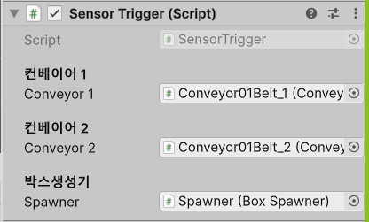


---

### 2.4 ProBuilder

#### 개요
- Unity에서 건물이나 여러 오브젝트를 손쉽게 만들 수 있도록 도와주는 패키지
- 3D 모델링 기능이 없는 Unity를 Blender처럼 모델링할 수 있도록 지원
- Blender 


#### 설치
- Windows > Package Manager > Unity Registry에서 `ProBuilder` 검색 후 설치

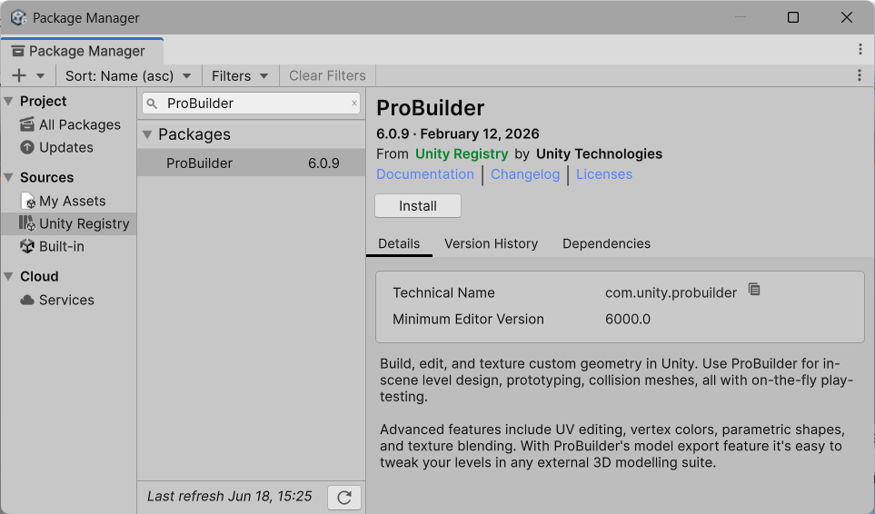

#### 사용법
- 메뉴 Tools > ProBuilder > Create Shape > 오브젝트 선택

    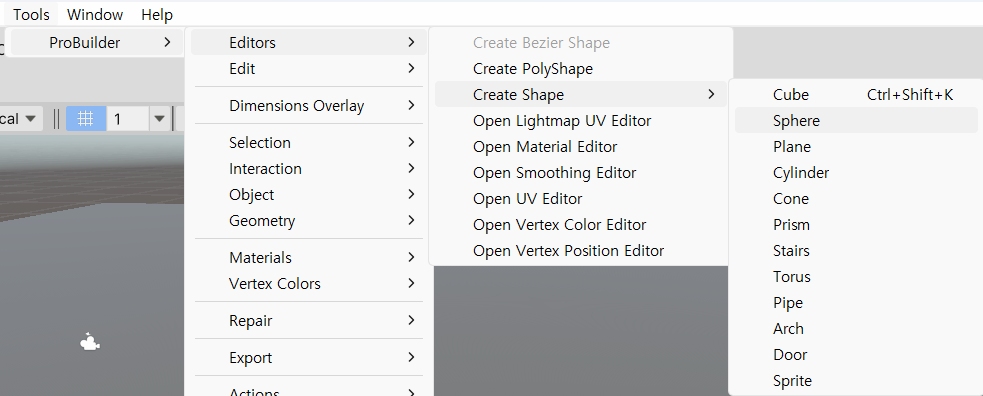

- Heirarchy 창 > 마우스 오른쪽 > ProBuilder Shape > 오브젝트 선택

- 프로빌더로 생성한 오브젝트 선택 후 
- Scene 뷰 툴바 > ProBuilder 선택


- 상단 툴바에 프로빌더용 아이콘 버튼 추가

    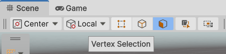

- Cube 상태에서 ..
- Vertex Selection(점 선택), Edge Selection(선 선택), Face Selection(면 선택)
- Move, Rotate, Scale 기능으로 오브젝트 Shape를 변형

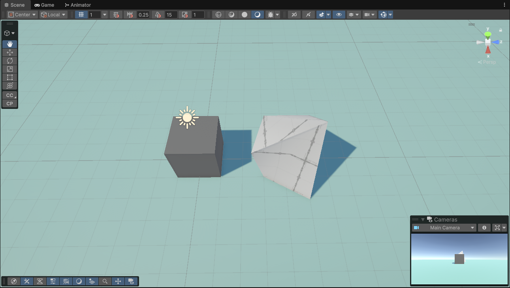

- 3D 모델링툴 Blender와 유사한 기능


#### Tip
- 바닥 오브젝트와 다른 오브젝트(Cube등 )를 공간없이 
    - Cube에서 V키 누른 상태에서 위치 이동 

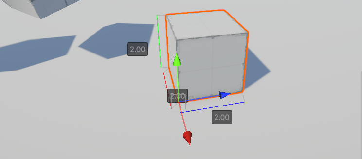


#### 오브젝트 변형법
- ProBuilder 큐브 생성
- 변형툴바 ProBuilder 선택
- Face Selection 클릭. 앞쪽 세로면 선택 > Move 기능으로 확장

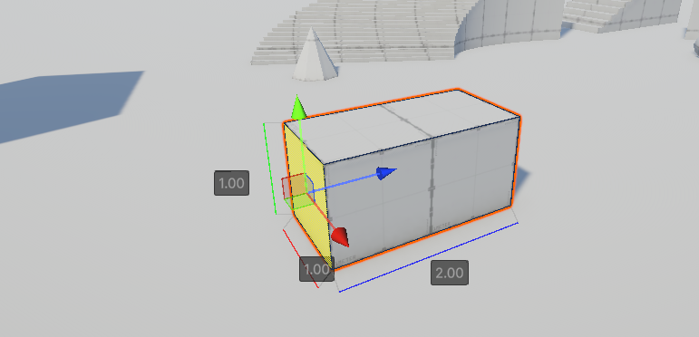

- Edge Selection 클릭. 왼쪽 상단 선 선택 > Move 기능으로 축소

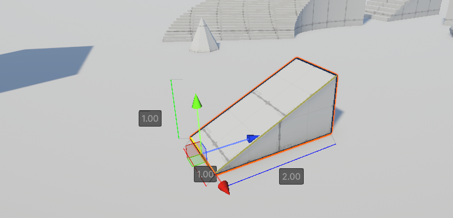

- Face Selection 클릭. 반대편 면 클릭. Context Menu > Extrude Faces 클릭

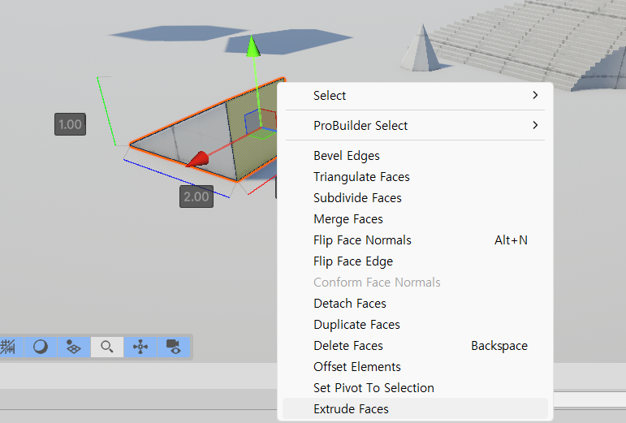

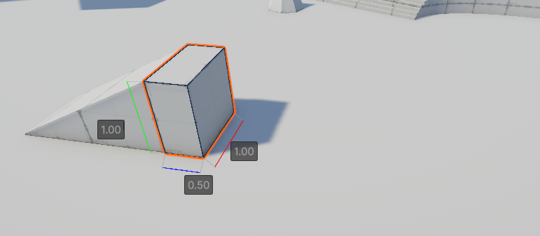

- Move, Rotate, Scale 사용 - 모양 변형
- Face Selection 클릭. Cube 상단 클릭
- Shift 누른 상태에서 Scale 조정

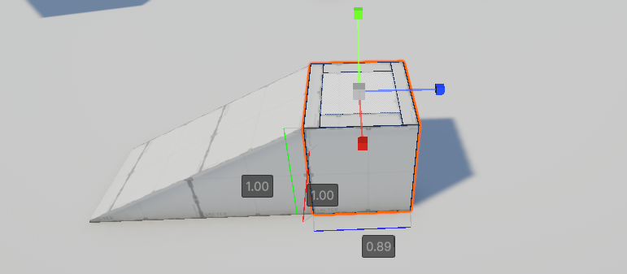

- Context Menu > Extrude Faces 클릭

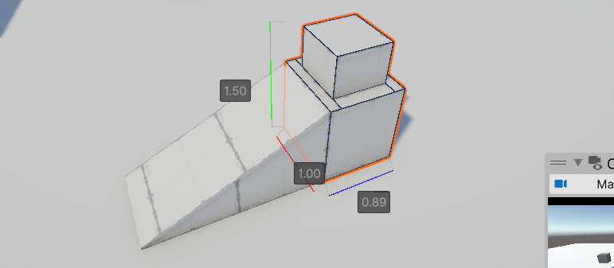

- Edge Selection 클릭. 취상후면 선 클릭 > Bevel Edges

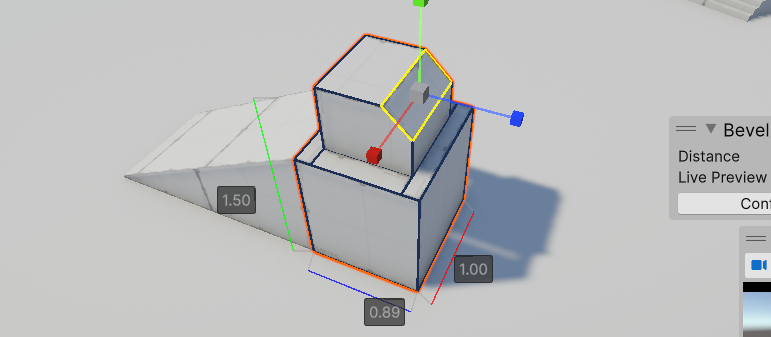

- Edge를 여러 개 선택 > 한번에 Bevel Edge 선택

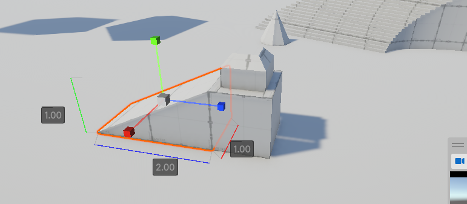

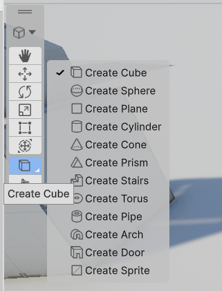

- 바닥에서 1번 마우스 드래그드롭으로 x, z 넓이 생성, 2번 드래그드롭으로 y 높이 생성

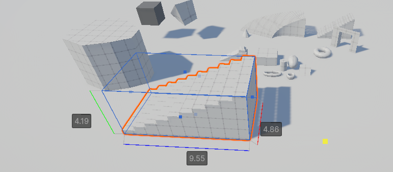


### 큐브형태 벽 생성
- 기존 큐브 > Face 선택 > Scale 선택
- Shift 누른 상태에서 크기 조정

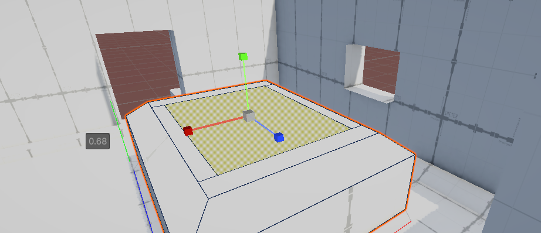

- 원본 면 크기보다 작게 조정 가능
- Move 선택
- Shift 누른 상태에서 위치 이동

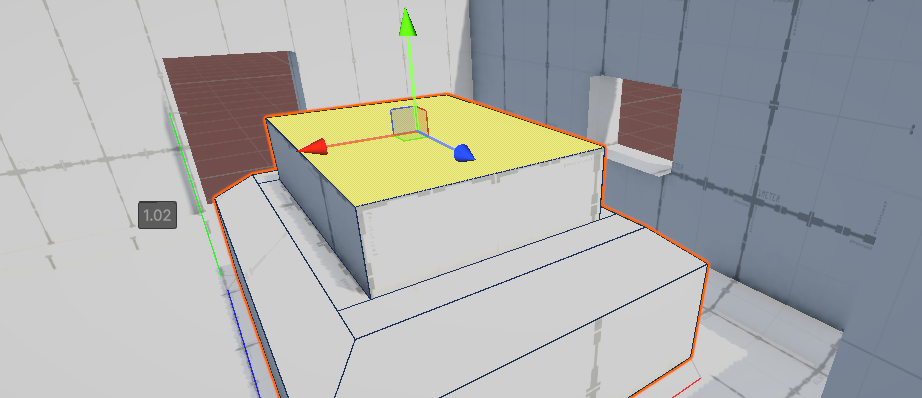

- 반복 작업, 벽 생성


#### 문, 창문 만들기
- 직교 기준 Edge 선택 > Context Menu > Insert Edge Loop 클릭

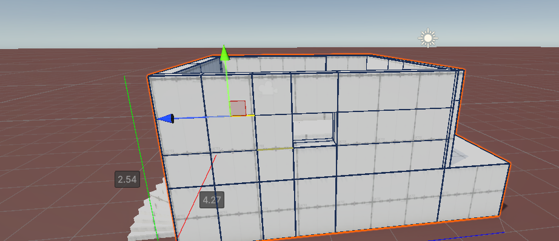

- 창문, 문 위치 Face 선택 > Move 선택. 창문/문 내려는 방향으로
- Shift 누른 상태에서 이동

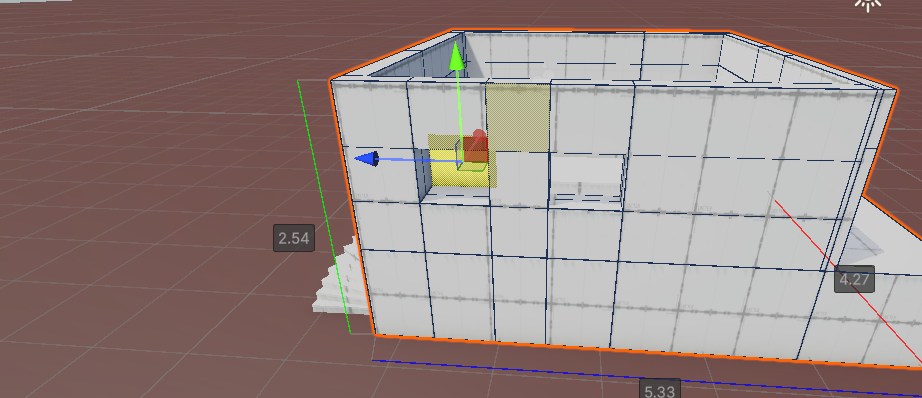

- Context Menu > Delete Face 선택
- 반대편 면에서도 Delete Face 선택

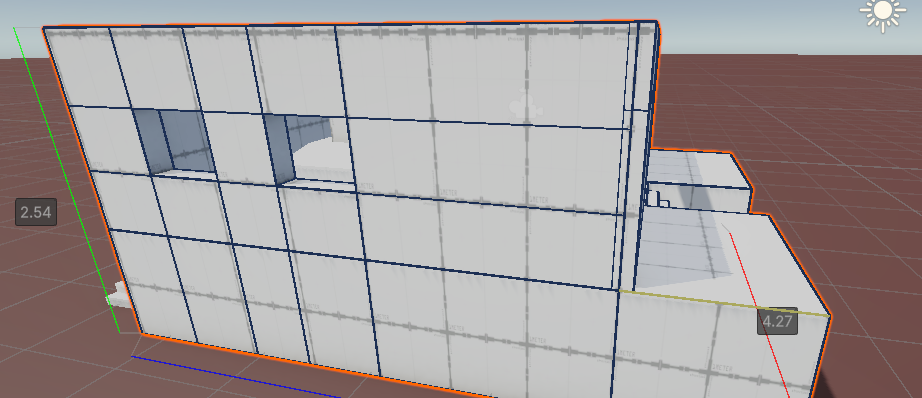


#### 재질 적용
- Asset Store Web > Material 검색 > 애셋 추가
- Unity Editor Import

- Tools > ProBuilder > Editors > Material Editor 클릭

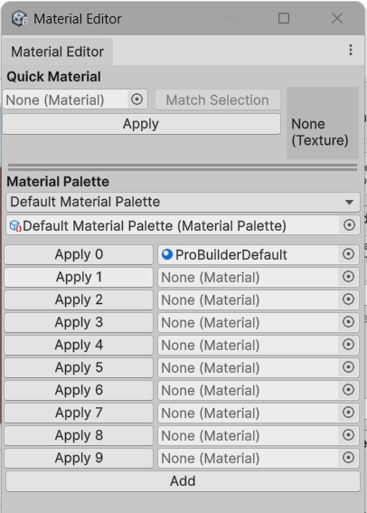


#### Material 렌더링 문제

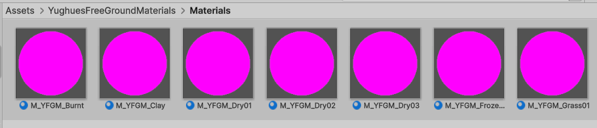

- Window > Rendering > Render Pipeline Converter 선택
- Scan

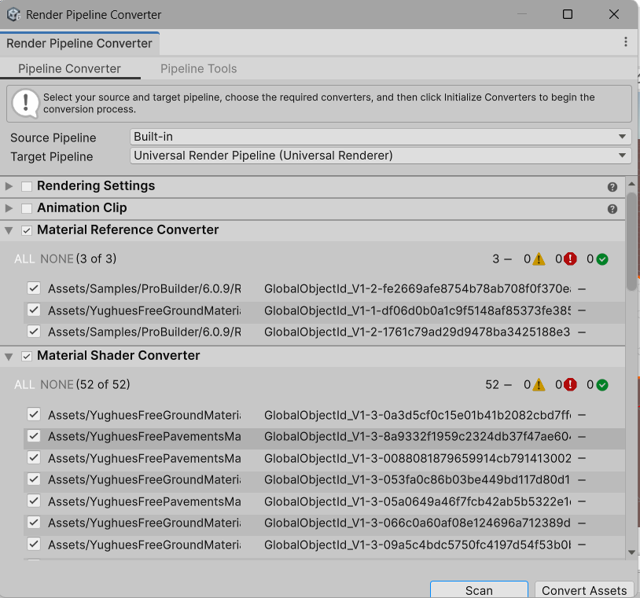

- Convert Assets 버튼 클릭

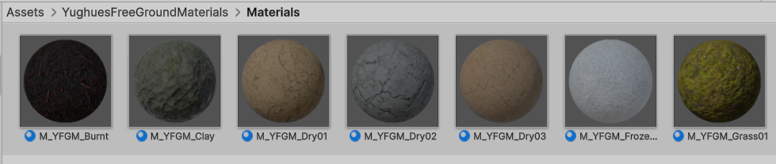

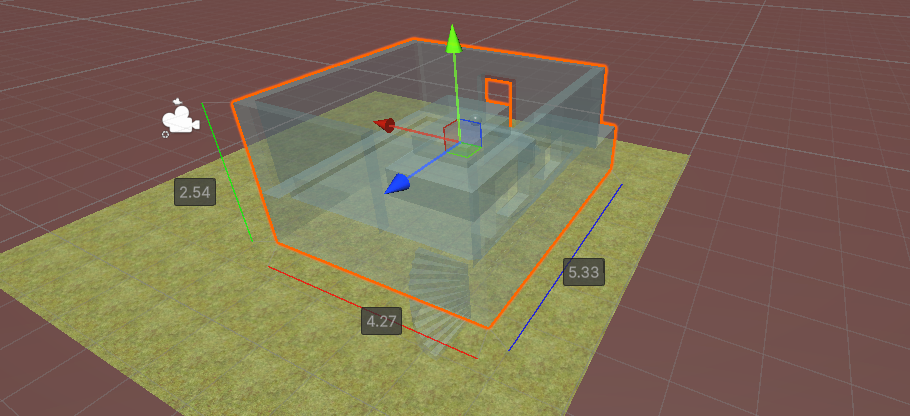


### 2.5 Unity Factory HDRP
- Unity Technologies Japan에서 제공하는 무료 HDRP 공장 시뮬레이션 에셋
- 공장 건물부터 컨베이어 라인, 로봇팔, 작업자, 조명 ..
- https://assetstore.unity.com/ 에서 `Unity Factory` 검색

#### 프로젝트 생성
- HighDefine Rendering Pipeline 3D(HDRP) 프로젝트 생성
- My Assets에서 Unity Factory 검색 후 Import


- Import 후 오류 발생
    - SplineContainer 에러
        - Package Manager > Unity Registry, `Splines` 검색 후 설치
    - Input System 오류
        - 키보드, 마우스 입력 시스템이 Unity 6부터 변경
        - 예전 방식 입력시스템 사용
        - Project Settings > Player > Other Settings > Active Input Handling, Old 또는 Both로 변경 후 에디터 재시작

- Global Volume 오브젝트 


- 기존 Scene을 다름이름으로 재저장
- 계층창

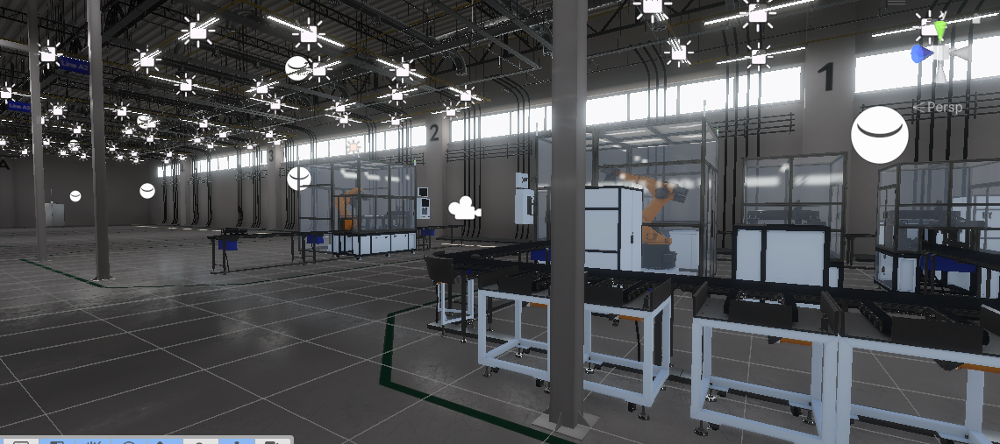

#### Spline 애니메이션 기능
- 설치한 Splines 기능 사용
- Hierarchy 창 > Create > Spline > 하위 메뉴 선택

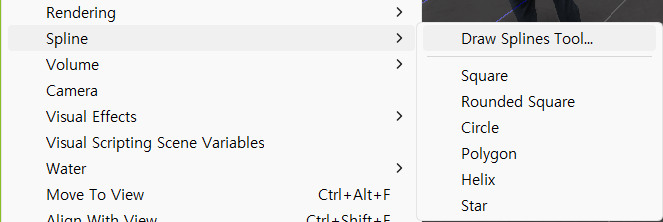

- 움직일 오브젝트 선택 > Add Component > Spline Animate 추가
- Spline 속성 > 적용한 Spline 지정
- Movement Method Time Duration 변경 


#### Product Spline 애니메이션
- 컨베이어 위 생산품 동작 기능
- 컨베이어 생산라인 매핑되는 Spline 생성
- 이동 후 로봇팔 챔버에 도착하면 동작 멈춤
- 일정시간 로봇팔 애니메이션 발생
- 생산품 Spline 위로 이동
- CustomSplineAnimate.cs 확인 필요


### 2.6 IoT Sample Project
- IoT Sample Project 애셋

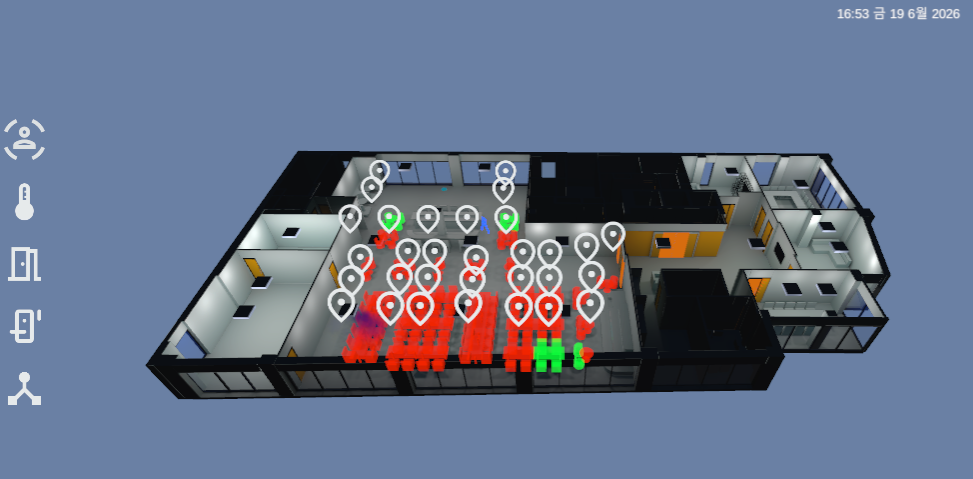


#### 전체 분석
- IoT Sample Scene 오픈
    - Hierarchy 창 맨 위 오브젝트부터 분석 시작

- 프로젝트 창
- IoTConnector 폴더 - IndustryCSE.IoT 네임스페이스 사용

- 게임오브젝트 활성화 구분
    - activeSelf - 자기 자신이 활성상태인지 여부
    - activeHierarchy - 부모오브젝트 포함해서 활성상태인지 여부

1. Canvas UI 클릭
    - Top Menu Bar 아래 구성 확인
    - btn - Cloud 불필요. 사용 체크 해제/비활성화
    - Date and Time 오브젝트
        - DateTimeGenerator 스크립트 더블 클릭
        - yyyy-MM-dd HH:mm:ss 포맷팅으로 변경

    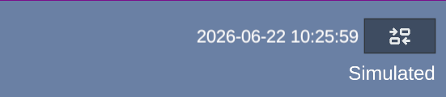

2. ControlSystem - Canvas UI 왼쪽 버튼 집합
    - Button - 캔버스 사용시 제일 중요 

    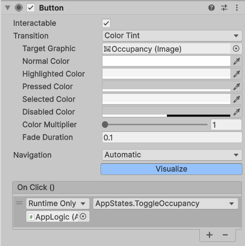

    - On Click() 이벤트 확인
    - AppStates.ToggleOccupancy()
        - AppLogic 빈 그룹 오브젝트 연결
        - AppStates.cs가 컴포넌트로 연계

    - AppStates.cs 스크립트 분석/수정

    - 한글 폰트 Assets에 복사
    - Window > TextMeshPro > Font Asset Creator 선택
    - 폰트 선택
    - Character Set 선택
    - 한글 입력 범위를 `AC00-D7A3` 까지 지정
    - Generate Font Atlas 클릭

    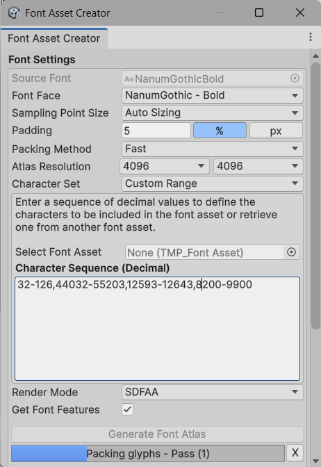

    - 완료 후 Save As.. 리소스 폴더에 저장

    - OverlayMode TextMeshPro 컴포넌트에 폰트 지정

    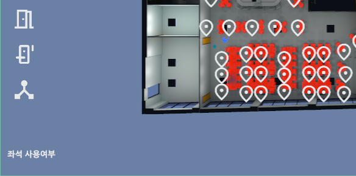

    - 실행

    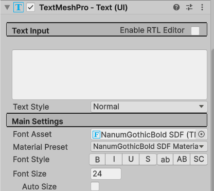

    - AppState에 적용된 폰트 변경 처리 


3. Camera
    - CameraController.cs - 물체를 기준으로 화면 회전 or 줌인아웃 기능

    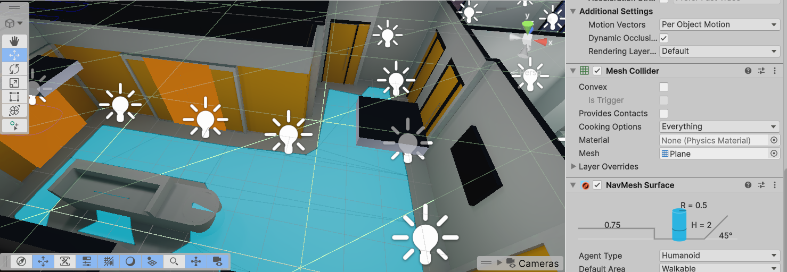


4. BrightonOffice 오브젝트
    - 3DMax, Blender 같은 3D 모델링 툴에서 작업한 3D 사무실 모델
    - Brighton_Floor_4 - 분석의미 없음

5. BrightonOffice.Plane
    - NavMesh Surface

    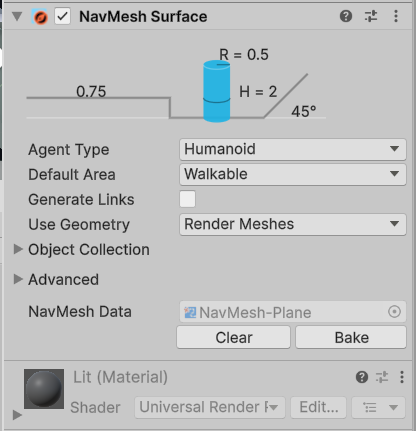

    - NPC나 로봇이 길을 찾기 위해 사용하는 이동가능한 바닥정보
    - 로봇청소기의 경우 프리팹에 길이 셋팅되어 있음. Prefabs > AI BOTS 클릭

    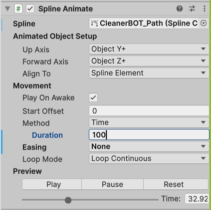

    - NavMesh - 벽이나 장애물 피하고, 이동가능한 바닥만 따라다니게 미리 계산해놓은 객체
    - Agent Type - 어떤 캐릭터 사용할지 결정
    - Default Area - Walkable(이동가능), Not Walkable(이동불가), Jump(점프필요)

    - Bake(굽기) 버튼 - 바닥 분석 후, 이동 가능한 영역 계산 후 새로운 NavMesh 생성
    - 중간에 바닥을 막는 오브젝트가 존재하면 NavMesh가 분리됨

    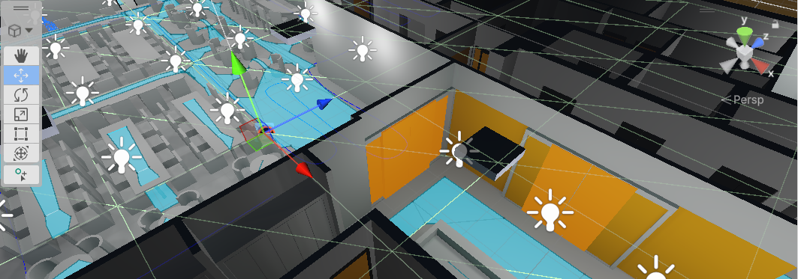

    - 문 등의 오브젝트를 제거하고 Clear후 재 Bake

    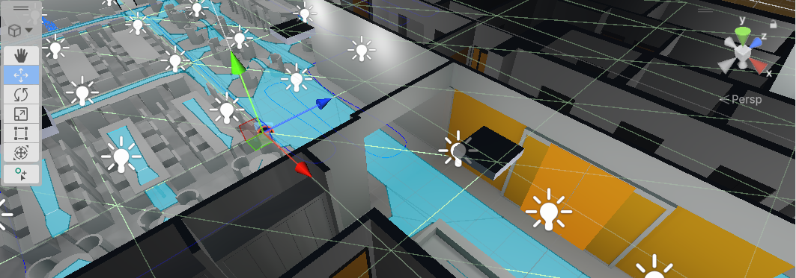

6. IoTDevices - 오피스에 위치하는 IoT 센서 장비들에 대한 설정

7. DeviceSimulator - IoT 시뮬레이션을 위한 더미데이터 생성용 클래스

8. AppLogic - Humanoid, Robot청소기 동작 처리용 오브젝트

    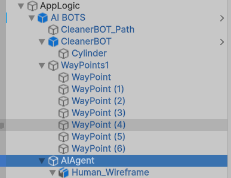

    - AIAgent - Humanoid 오브젝트 PathWalker 스크립트 컴포넌트에 WayPoint 7개 이미 지정
    - WayPoint 위치 변경하면, NavMash Surface를 자동으로 이동


9. MQTT Connector - IoThub.MqttMessageProvider.cs(MQTT 브로커 연결용), IoThub.IoTDeviceMessageReader(MQTT 메시지 읽기용) 스크립트로 구성

#### 분석 및 수정 결과화면

- 동영상

### 2.7 WPF Dummy IoT 연동 프로젝트
- IoT Sample Project는 M2Mqtt 라이브러리로 동작
- MQTTnet으로 진행

#### Unity Project 생성
- URP로 프로젝트 생성
- Asset Store에서 `Low Poly`로 검색 후 Free 클릭
    - Cute Magic – Stylized Low Poly Interior Pack
    - Cute Low Poly Furniture Pack
    - Pandazole - 저 폴리 에셋 번들


#### 방 구성
- Pandazole Home Interior 애셋으로 구성

#### NuGet 패키지 불러오기
- Github에서 [NuGetForUnity]https://github.com/GlitchEnzo/NuGetForUnity 설치

- MQTTnet은 DLL을 직접 가져와서 구성. MQTTnet 버전 충돌
- MQTT for Unity(M2Mqtt)를 사용


#### M2MqttUnity 설치
- M2Mqtt를 유니티 스크립트로 재정의해서 Unity에서 사용할 수 있게 만든 버전
- https://github.com/gpvigano/M2MqttUnity 코드 - 다운로드 집
- 압축해제 후
- Project 창 Assets에 M2MqttUnity 압축해제한 Assets 폴더 복사
- Unity에서 컴파일 진행

- 테스트

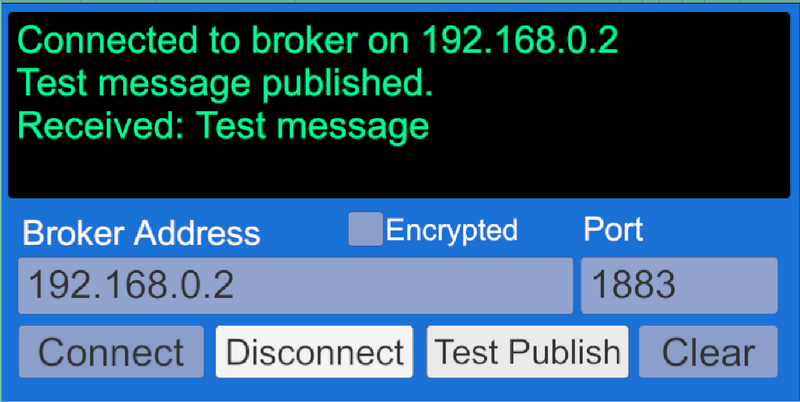

- MQTT Publish 메시지 확인

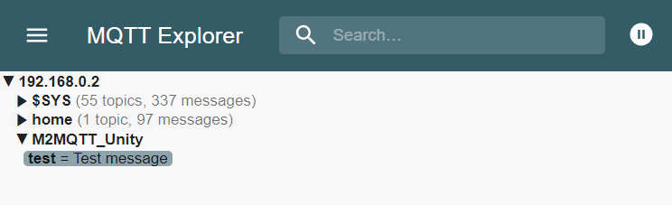

#### Unity MQTT Subscribe 메시지 수신
- Canvas UI 

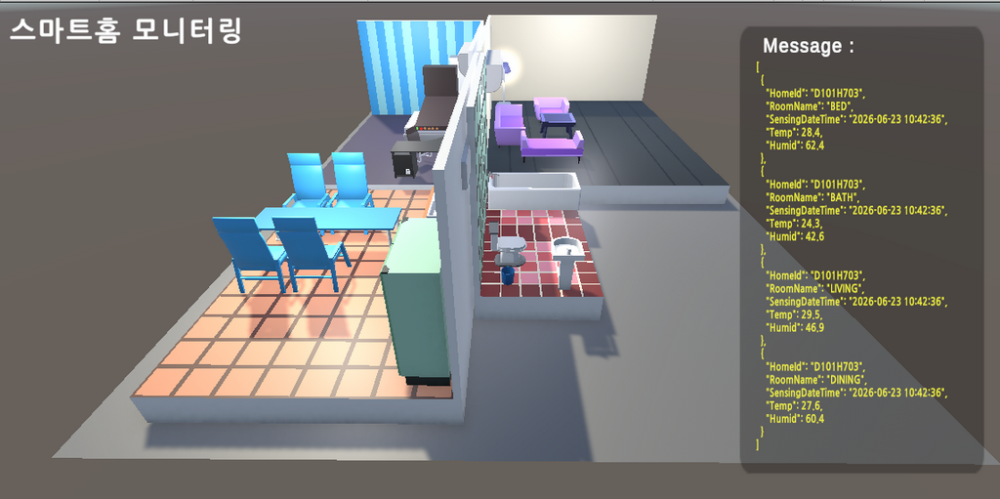

- SmartHomeMqttClient.cs 작성
- 빈 객체 생성 > MqttClient 명명
- 위 스크립트 컴포넌트 지정
- Inspector에서 필요 데이터 입력, Broker Address, User Name, Password
    - TOPIC, 상태표시 TextMesh Pro, JSON 데이터 출력 TextMesh Pro 지정

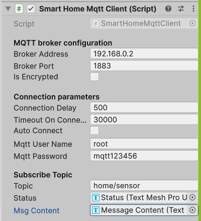

- IoT Sample Project 애셋에서 CameraController.cs 가져오기

- Essentials Pathway 애셋에서 SkyBox 머티리얼