# 2026 닷넷 개발자 데스크톱 개발

## 2. Unity 실습

### 2.1 유니티 학습
- https://learn.unity.com/ 튜토리얼대로 따라하기
- keijiro Takahashi Github: https://github.com/keijiro
- 이전버전 https://

#### GetStarted with Unity
- Tutorial 순서대로 따라하기

- 1번 챕터 완료 후

### 2.1 Essentials PathWay
- 가장 짧은 ㅡ시간에 Unity 학습할 수 있는 튜토리얼

#### Essentials PathWay Template
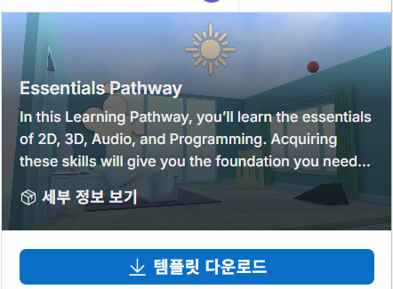

- 템플릿 다운로드 우선
- 프로젝명, 프로젝트 위치 선택 프로젝트 생성

#### 화면/시점 이동
- 방향키, WSAD 
- Mouse Right, Wheel 
- Fly Mode: Mouse Right + WSAD / E(UP), Q(DOWN)

- Object 선택 후 F 클릭(오브젝트 더블클릭)

#### Pan Tool
- 오브젝트 위치, 회전, 크기 등을 조절할 수 있는 아이콘 툴바

- View, Move, Rotate, Scale, Rect, Transform까지 여섯 개 아이콘
- 단축기: Q, W, E, R, T, Y

#### 오브젝트 위치(Position), 회전(Rotation), 크기(Scale) 조정
- Inspector > Position x, y, z 값을 입력 또는 마우스로 좌우 드래그 
- Rotation, Scale 동일하게 적용

### Kid's Room 꾸미기
- 방 오브젝트
- 침대, 카페트, 협탁, 알람시계,  

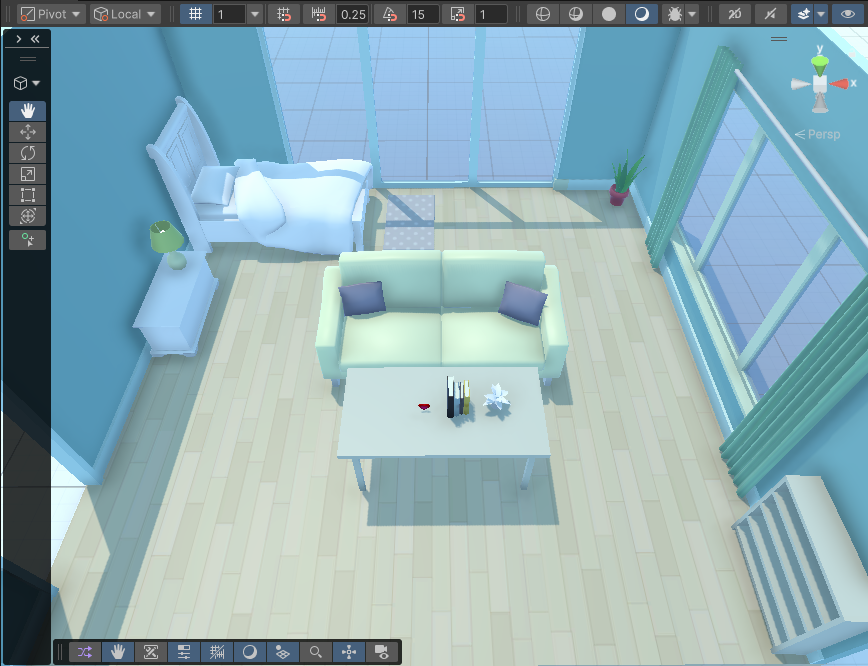

#### Material
- 오브젝트 재질 표현 객체
- Material 객체 생성 후 Inspector에서 조정

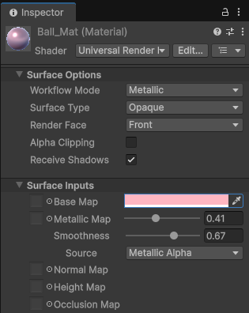

- Material 객체를 Ball 객체에 드래그

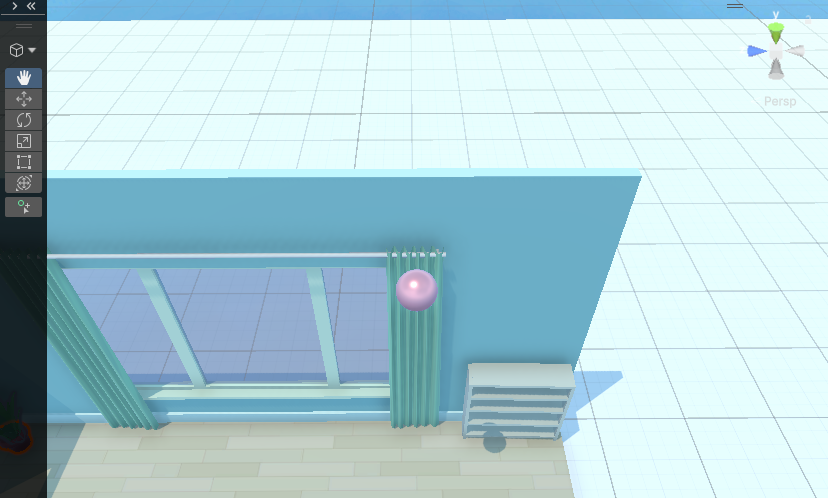

#### RigidBody
- 물리역학 기능 제공 컴포넌트
- Ball 선택 Inspector에서 Add Component 버튼 클릭

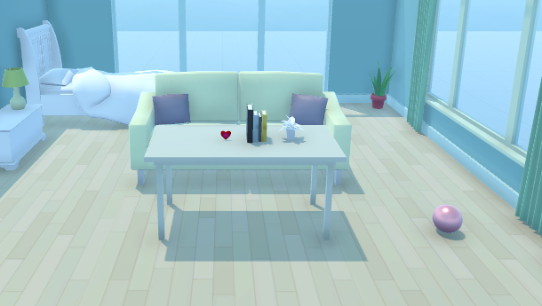

#### Physics Material
- 물체가 충돌할 때 마찰력, 반발력을 설정하는 자산
- Bounciness: 1 완전 탄성 충돌
    - 0.1(쇠구슬), 0.7(축구공), 0.9(고무공), 1.0(스포츠공)

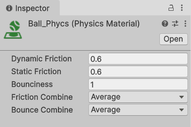

#### Ramp Object 추가
- 위치, 회전 지정
- Mesh Collider 컴포넌트 추가

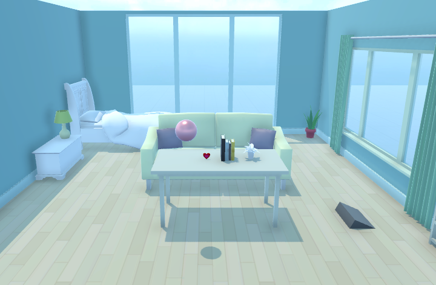

#### Block 객체 생성
- Cube로 생성
- Scale x,y,z를 0.1, 0.25, 0.1로 설정 - Ball이 튕겨서 닿는 위치에 배치
- Rigid Body 추가

#### 카메라 시점 변환
- Flythrough 모드로 이동 후 > 카메라 오브젝트 선택
- Ctrl+Shift+F: 현 카메라 시점을 플레이 카메라 시점으로 변경

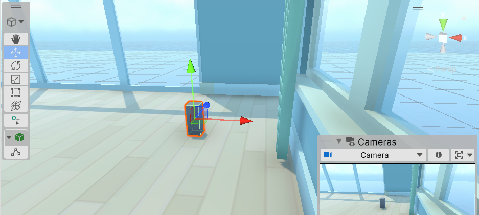

#### 프리팹 변경
- PreFab를 선택 후

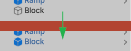

#### Block 쌓기
- Pivot을 Center로 변경 후
- 프리팹 Block을 쌓아올림

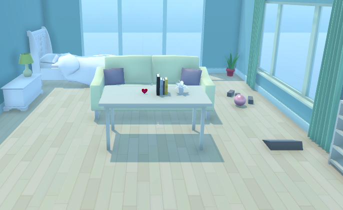

#### 프리팹 편집모드
- 프로젝트 창의 프리팹을 더블클릭
- Inspector 수정
- Rigidbody > mass를 1보다 작게 수정(0.1)
- 충돌하는 물체의 mass에 상대적으로 반응
- Hierarchy 창의 < 버튼 클릭

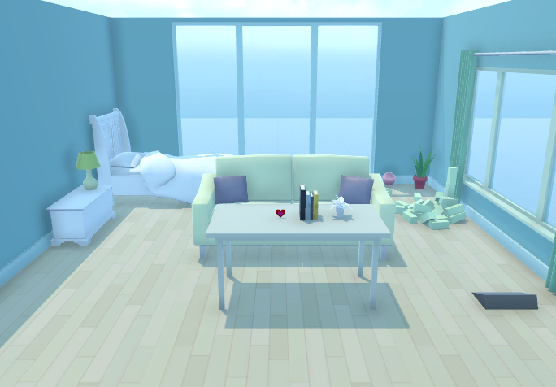

#### 라이트, 스카이박스 조정
- 라이트 
- y, z 축으로 낮밤 조정 가능
- Emission > Color 조정 - 빛 색상 조절
- Emission > Light Appearance, Filter and Temperature 선택 후
- 빛의 온도와 조명 조정

- 스카이 박스
- 하늘 전체 배경 변경
- Materials > Skyboxes

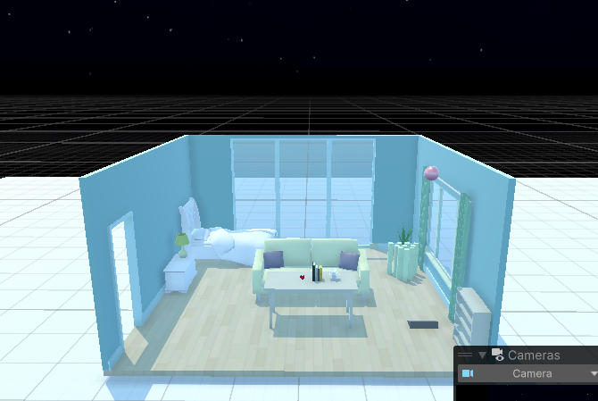

#### 플레이모드 구분짓기
- Preferences > Colors > Play mode tints 색상 변경
- Play시 UI 색상이 Edit 모드와 다르게 표시

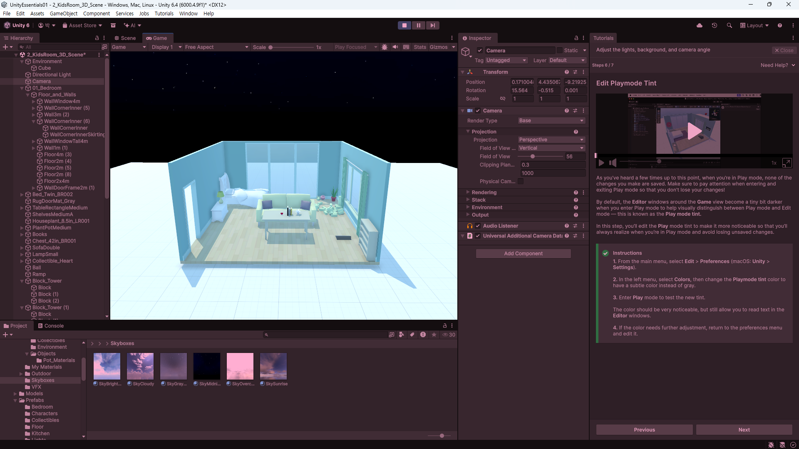

#### 피벗기능
-Object를 쌓을 때 v를 누르면 Object의 기준점 변경 됨

#### Chapter2
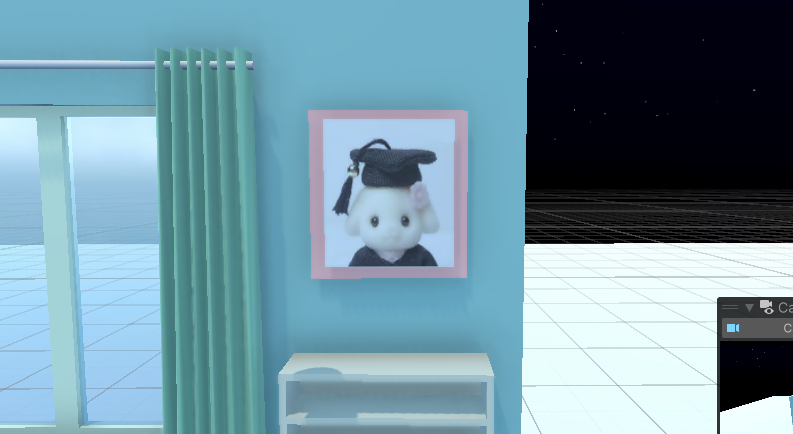

---

### 2.2 Unity Factory
- Unity Technologies Japan에서 제공하는 무료 HDRP 공장 시뮬레이션 에셋
- 공장 건물부터 컨베이어 라인, 로봇팔, 작업자, 조명 ..
- https://assetstore.unity.com/ 에서 `Unity Factory` 검색

#### 프로젝트 생성
- HighDefine Rendering Pipeline 3D(HDRP) 프로젝트 생성
- My Assets에서 Unity Factory 검색 후 Import

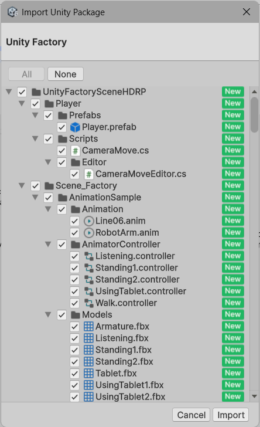

- Import 후 오류 발생
    - SplineContainer 에러
        - Package Manager > Unity Registry, `Splines` 검색 후 설치
    - Input System 오류
        - 키보드, 마우스 입력 시스템이 Unity 6부터 변경
        - 예전 방식 입력시스템 사용
        - Project Settings > Player > Other Settings > Active Input Handling, Old 또는 Both로 변경 후 에디터 재시작

- Global Volume 오브젝트 

### 2.2 Unity Factory