# 2026 닷넷 개발자 비즈니스앱 개발

## 1. 웹 개발 개요

### Web
- World Wide Web을 줄여서 부르는 단어
- 인터넷의 목적: 핵전쟁이 나더라도 데이터를 완전 소실하지 않고 보관하기 위해서 시작(ArpaNet)
- 인터넷에서 통신 및 데이터를 전달의 어려움
- 1990년 팀 버너스리가 WWW를 발표. 1980년대부터 연구해온 결과
- XML이 너무 복잡해서 사용이 불편 -> 개량화해서 HTML을 개발
- 2014년 이후 HTML5로 적용 중

### 웹 구조
- `프론트엔드` - 웹 기술등을 사용해서 사용자가 브라우저에서 볼 수 있는 눈에 보이는 화면을 개발 영역
- `백엔드` - 프론트엔드에 전달할 데이터나 동적인 화면을 생성 처리등 눈에 보이지 않는 개발 영역

### 프론트엔드 웹 기술
- `HTML` - HyperText Markup Language 약자. 링크로 페이지를 이동하는 기술 [구조]
- `CSS` - Cascaded Style Sheet 약자. HTML에 디자인을 적용시키는 기술 [디자인]
- `JavaScript` - 원래 HTML(클라이언트, 프론트엔드)에 동작을 지원해주는 기술로 나온 언어. JS로 호칭 [동작]
    - JS기술이 진보해서 현재는 서버개발, 앱개발 등 여러 방면으로 개발하는 언어로 발전

### 백엔드 웹 기술
- 웹 서버(서비스) 단을 개발하는 기술. 프로그래밍 언어별로 구분
- 보통 Server Page라는 용어 사용. JSP(Java Server Page), ASP(Active Server Pagge)
- Java - Java Bean > EJB > JSP > Spring > **Spring Boot**
-.NET - ASP(.NET 이전, VBScript) > ASP.NET(윈도우만) > `ASP.NET Core` (멀티플랫폼)
- Python - Flask(간단한 웹개발), django(기업 솔루션), **FastAPI**(OpenAPI 개발용)

### 웹서버, 웹 서비스
- 웹 서버 - 프론트엔드 + 백엔드로 사용자가 웹화면을 사용할 수 있도록 서비스
- `웹 서비스` - 백엔드로 데이터만 전달하는 서비스

### 웹을 사용하는 이유
- `설치가 필요 없음` - PC 프로그램은 설치파일. 모바일 앱은 앱스토어 설치절차 필요
    - 웹은 웹브라우저만 있으면 URL로 사용 가능
- `운영체제 독립적` - 운영을 하면 OS에 관계없이 사용 가능
    - WPF는 윈도우 종속적
- `업데이트가 쉬움` - 서버만 내용을 업데이트하면 사용자는 기존과 동일하게 사용만하면
    - 유지보수 비용이 낮음
- `데이터 공유` - 서버에 존재하는 데이터를 실시간으로 공유가능
    - 데이터포털 OpenAPI, 카카오톡, 네이버 지도, 구글 드라이브 .. 
- AI와 연결 쉬움 - 대부분의 AI 서비스가 웹API 형태로 제공


## 2. 웹 표준 기술


### HTML 기본


#### Live Server 설치
- VS Code에서 로컬 HTML 파일을 서버형식으로 보여주는 플러그인
- 로컬 웹서버가 동작
- 확장 > `Live Server` 검색 후 설치
- html > 컨텍스트 메뉴 > Open with Live Server 클릭 
- 5500 포트 기본 사용

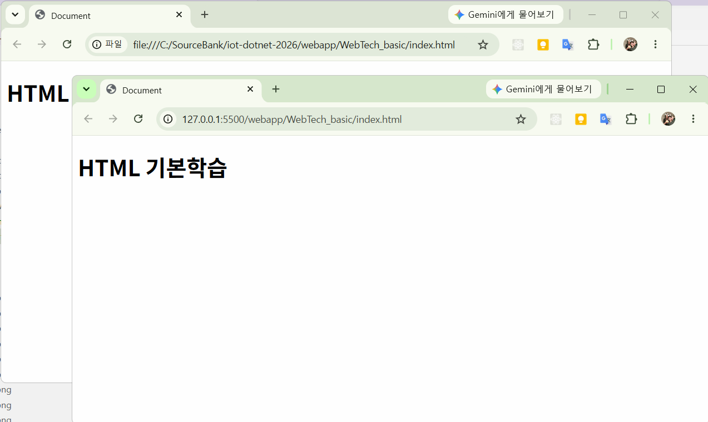


#### HTML 기본구조
- index.html - 대부분 웹페이지의 첫 페이지 파일
- VS Code, html 파일 생성 후!, tab키로 HTML 기본 코드 생성

```html
<!DOCTYPE html><!-- 문서가 HTML5 양식 선언 -->
<html lang="ko"><!-- 가장 root 태그 -->
<head><!-- 웹 페이지 설정구역 -->
    <meta charset="UTF-8"><!-- 페이지설정, 유니코드 사용 -->
    <!-- Responsive Web 사용. 화면크기에 따라 디자인이 알맞게 변형되는 웹 -->
    <meta name="viewport" content="width=device-width, initial-scale=1.0">
    <title>Document</title>
</head>
<body><!-- 웹 페이지 표현구역 -->
    
</body>
</html><!-- XML과 동일, 모든 태그는 <tag></tag> 로 구성 <tag /> -->
```

- head - 웹 페이지 설정할 태그 작성
- body - 웹 페이지 표현할 태그 작성


#### HTML 기본 태그
- 마크다운 문법 -> HTML 태그로 변경
- HTML에서는 space, enter 제대로 적용되지 않음

|태그 | 설명 |
|---|---|
|`<html>` | HTML 문서 시작 |
|`<head>` | 문서정보(설정) |
|`<title>` | 브라우저 제목 |
|`<meta>` | 문서 구성정보 |
|`<body>` | 화면에 표시될 내용 |
|`<h1>`~`<h6>` | 제목. 마크다운 #과 동일 |
|`<p>` | 문단 표현 |
|`<a>` | anchor의 prefix. 하이퍼링크. 다른 페이지로 이동 |
|`` | 이미지 |
|`<video>`| 동영상 위치 태그 |
|`<div>` | 영역 구분. HTML5에서 가장 많이 쓰는 태그 |
|`<span>` | 인라인 영역 구분 |
|`<ul>` | 순서 없는 목록 시작. 마크다운 -와 동일 |
|`<ol>` | 정렬된 목록 시작. 마크다운 1. 와 동일 |
|`<li>` | 목록 항목 |
|`<br>` | 줄바꿈 |
|`<hr>` | 구분선(가로) |
|`<table>` | 표(테이블) 시작 태그 |
|`<tr>` | row. 한줄 태그 |
|`<th>` | header. 표 제목. 테이블의 칼럼 |
|`<td>` | cell. 표 내용. 테이블의 데이터 |
|`<iframe>`| html 내 다른 html 소스를 추가하는 기능 | 

- 공백 - `&nbsp;`로 공백 표현 키워드 사용

- lorem - 화면에 텍스트 꾸미는 작업 도와주는 스니펫
    - lorem20 - 임의 표준텍스트 20 단어 생성


#### HTML 입력 태그
- HTML에서 사용자 입력을 받기 위한 태그

|태그| 설명|
|---|---|
|`<form>`| 입력영역 태그 |
|`<label>`| 라벨 태그 |
|`<button>` | 버튼 태그 |
|`<textarea>` | 멀티라인 텍스트박스 |
|`<select>` | 콤보박스 시작태그 |
|`<option>` | 콤보박스 목록태그 |
|`<input>` | 가장 중요한 입력 태그. type 속성으로 여러 컨트롤로 분기 |

- input 타임 목록

|속성값|예제|설명|
|---|---|---|
|text | `<input type="text">` | 한 줄 텍스트 입력 |
|password | `<input type="password">` | 비밀번호 입력 |
|email | `<input type="email">` | 이메일주소 입력 |
|number | `<input type="number">` | 숫자 입력 |
|checkbox | `<input type="check">` | 체크박스 |
|radio | `<input type="radio">` | 라디오버튼 |
|file | `<input type="file">` | 파일업로드  |
|date | `<input type="date">` | 날짜선택 |
|hidden | `<input type="hidden">` | 페이지 내 숨김값 |
|submit | `<input type="submit">` | 등록/저장 버튼 |
|button | `<input type="button">` | 일반 버튼 |
|reset | `<input type="reset">` | 입력값 초기화 버튼 |

- input 중 type, submit, button, reset은 button 태그와 동일
- 웹에서 회원가입, 로그인, 게시판 등록 화면 등의 90%는 위 태그로만 구성.

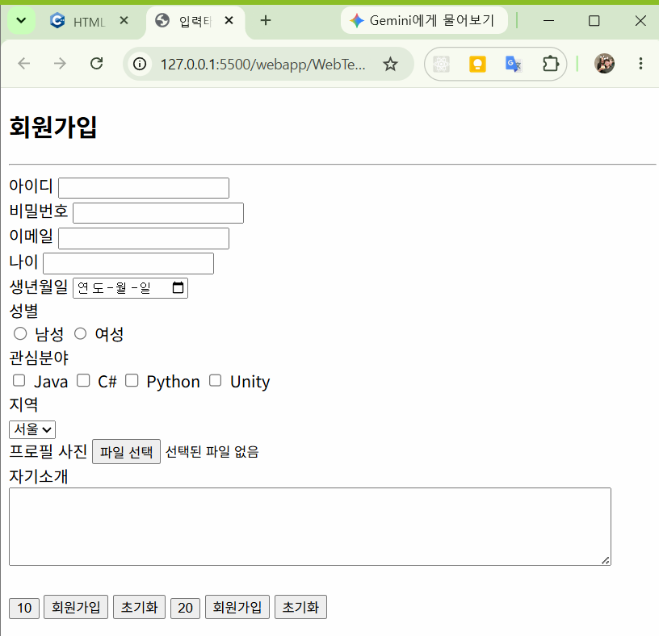

- html에서 id에 같은 값을 써도 컴파일오류 발생 안 함. 이런 오류는 개발자 몫


### CSS


#### inputs.html 디자인 바꾸기
- Bootstrap - 트위터에서 개발한 UI library

- 아래 태그를 `<title>` 태그 아래 붙여넣기
```html
<link href="https://cdn.jsdelivr.net/npm/bootstrap@5.3.8/dist/css/bootstrap.min.css" rel="stylesheet" integrity="sha384-sRIl4kxILFvY47J16cr9ZwB07vP4J8+LH7qKQnuqkuIAvNWLzeN8tE5YBujZqJLB" crossorigin="anonymous">
```

- 아래 태그를 `</body>` 태그 위에 붙여넣기
```html
<script src="https://cdn.jsdelivr.net/npm/bootstrap@5.3.8/dist/js/bootstrap.bundle.min.js" integrity="sha384-FKyoEForCGlyvwx9Hj09JcYn3nv7wiPVlz7YYwJrWVcXK/BmnVDxM+D2scQbITxI" crossorigin="anonymous"></script>
```

- 각 태그별 class를 적절하게 입력
```html
<!-- class 속성이 CSS를 적용시키는 속성 -->
<input type="text" name="userId" id="userId" class="form-control>

```

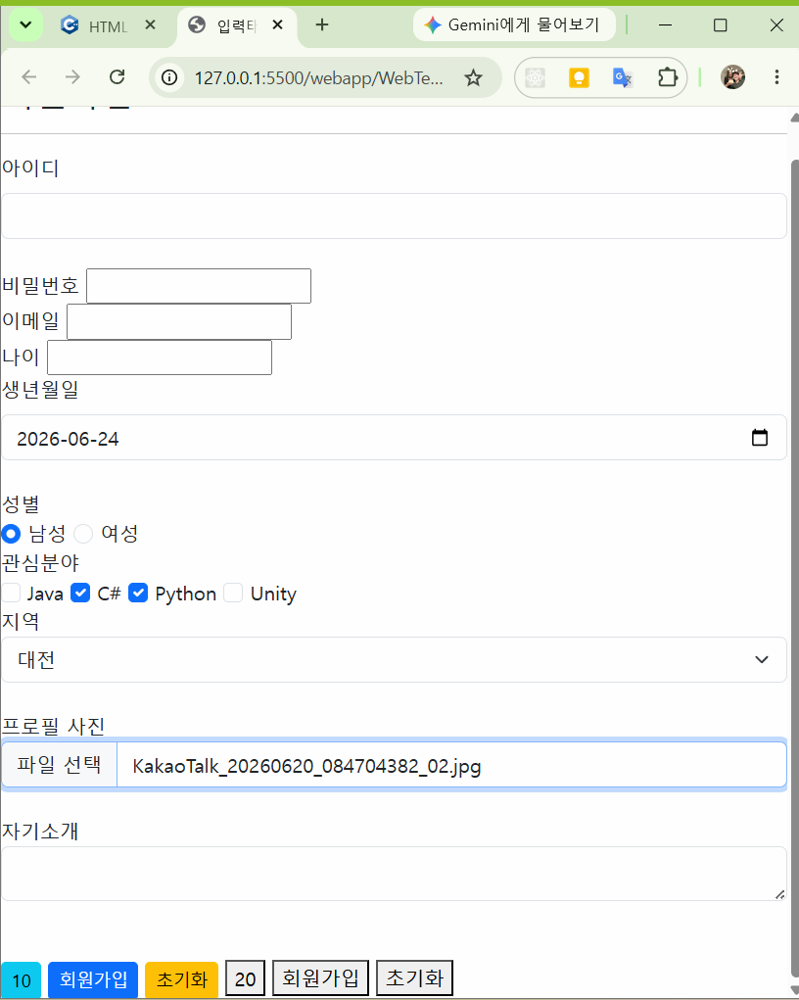

- CSS는 HTML에 디자인을 미려하게 변경하는 기술

- [소스](./webapp/WebTech_basic/css_exam.html)

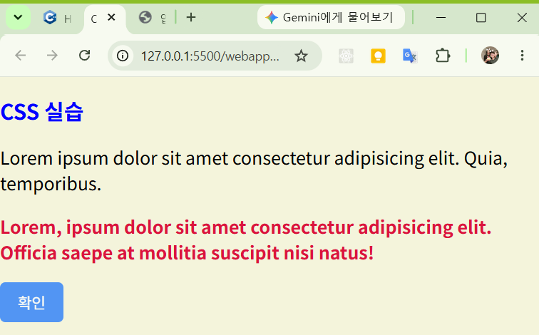


### Javascript
- 웹페이지(HTML)을 동적으로 변경시켜주는 프로그래밍 언어
- 기본 문법은 C, C++과 동일. 변수 지정등은 Python과 동일
- Typescript, React, Node.js .. 활용되는 곳이 매우 많음


#### HTML 연결
- html에 `<script>` 태그를 사용해서 내부에 같이 표현하거나, 외부 js 파일을 연결
- 필요한 경우 웹브라우저(Chrome)에서 개발자도구(F12)로 확인할 것

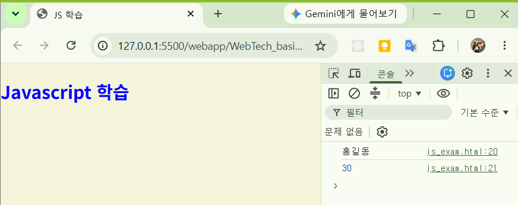


#### 기본 문법
- 변수부터 객체까지 - [소스](./webapp/WebTech_basic/js_exam.html)


#### DOM
- Document Object Model의 약자. HTML 트리 구조를 객체로 만든 모델
- JS로 접근 가능 - [소스](./webapp/WebTech_basic/js_dom.html)

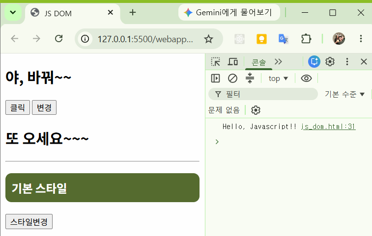


#### JS 목적
- 웹페이지 동적으로 만들기. HTML 요소 접근 내용 변경 등
- 사용자와 상호작용. 클릭, 드래그 등 이벤트 처리
- DOM 제어
- 서버와 데이터 통신
- 데이터 처리 및 검증. 입력값 검사, 데이터 가공, 계산 등


## 3. ASP.NET Core


### 개요
- Microsoft에서 개발한 크로스 플랫폼 웹 개발 프레임워크


#### 특징
- 크로스플랫폼 Windows/Linux/macOS 지원
- ASP.NET에 비해서 속도 개선
- MVC(Model-View-Controller) 패턴 지원(SpringBoot MVC 동일)
- REST API 개발 가능
- EntityFramework (DB ORM) 기능 지원 - 쿼리문 없이 DB 핸들링 가능
- Docker, Cloud(Azure) 연동


#### 개발분야
- 홈페이지, 쇼핑몰, ERP/MES/스마트팩토리, 그룹웨어, REST API 서비스, IoT 데이터서버, AI 서버, 게임 서버 ..


### 사용법


#### Visual Studio 활용법
1. Visual Studio 오픈
2. 프로젝트 형식 -> 웹 선택
3. 웹앱 템플릿 중 ASP.NET Core로 시작하는 템플릿 선택
    
    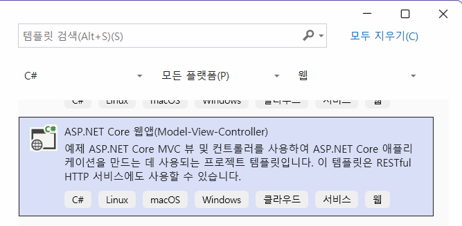

4. 추가 정보 선택 후 만들기

    


#### ASP.NET Core MVC 패턴 구성


- Connected Service - 외부 클라우드 서비스 연결을 관리(API를 써도 잘 사용 안 함)
- Properties - 프로젝트 실행 및 빌드 환경 설정
    - launchSettings.json - 실행 포트, 로그 출력 설정을 관리
- wwwroot - 정적 파일(일반 html, css, js, 이미지 파일) 프론트엔드 웹용 파일 위치
- 종속성 - 패키지, NuGet 패키지 내부/외부 라이브러리

- 핵심 패턴
    - Controllers - 사용자의 요청(대부분이 URL)을 가장 먼저 받아서 처리하는 영역
        - 필요한 데이터는 Models에서, 화면은 Views에서 그려서 전달해주는 역할
    - Models - 데이터 구조 클래스, 비즈니스 로직 등을 정의하고 처리하는 곳
    - Views - 사용자에게 실제로 보여지는 동적 화면(UI) 담당
        - `*.cshtml` - 기본 HTML 소스에 C# 로직이 섞여있는 html 파일. `Razor 뷰`

- appsettings.json - 애플리케이션 환경 설정. DB 연결 문자열, 로깅수준 변경
- Program.cs - 웹앱 시작점(Entry Point)
    - 웹서버 구동에 필요한 서비스 등록, 사용자 요청 라우팅 구성

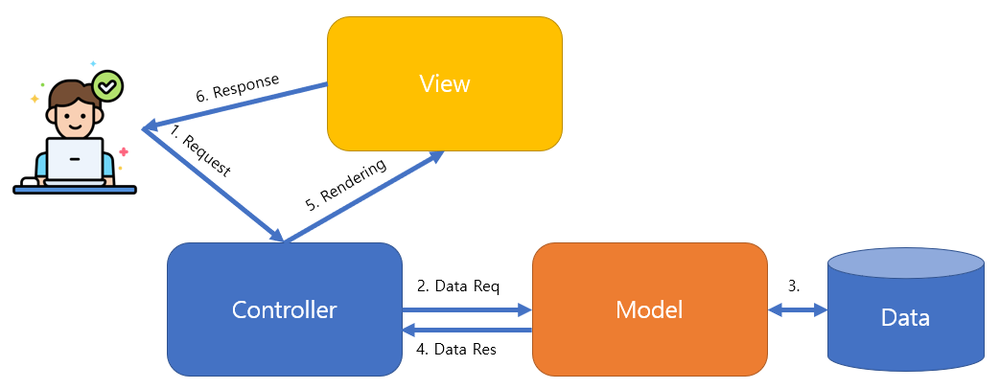

- Program.cs

```cs
public static void Main(string[] args) {
    // ASP.NET 가장 중요객체. 설정, 로깅, 환경변수 등으로
    // 실행할 웹 서버 빌더 생성역할
    var builder = WebApplication.CreateBuilder(args);

    // 서비스 등록, MVC 패턴에 필수 코드
    builder.Services.AddControllersWithViews();

    var app = builder.Build();  // 웹앱 생성

    // 개발환경 아닐 때 처리영역
    if (!app.Environment.IsDevelopment())
    {
        app.UseExceptionHandler("/Home/Error"); // 예외페이지 보이기
        app.UseHsts();  // 보안프로토콜 https 강제 실행
    }

    app.UseHttpsRedirection();  // https로 변환
    app.UseRouting();   // 라우팅 활성화
    app.UseAuthorization(); // 권한검사

    app.MapStaticAssets();  // wwwroot(정적파일) 사용하겠다는 설정
    // 가장 중요 !
    app.MapControllerRoute(
        name: "default",
        pattern: "{controller=Home}/{action=Index}/{id?}")
        .WithStaticAssets();

    app.Run();  // 웹 서버 실행
}
```
- URL 규칙(라우팅)
    - `{controller=Home}/{action=Index}/{id?}` == `{controller}/{action}/{id?} `
    - /Home/Index/3 또는 /Home/Index --> https://localhost:port/Home/Index/3 
    - HomeController 클래스에 Index 액션 메서드에 파라미터를 3을 넣어서 실행하라는 의미

- Controller - HomeController.cs 
    - Home 뒤에 Controller는 실행시 무시

```cs
    public class HomeController : Controller {
        public IActionResult Index() { 
            // Views > Home > Index.cshtml 를 리턴(보여달라)  
            return View();
        }
    }
```

- Views - 화면 영역

    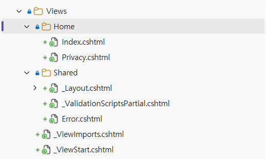

    - Home 폴더 - HomeController에서 사용하면 View
        - Index.cshtml - HomeController 내 Index() 액션 메서드
        - `return View();` 에서 Index.cshtml을 랜더링해서 리턴
        - html 전체 소스는 없음. `main 화면 영역`만 존재

    - Shared 폴더 - 모든 View가 함께 공유하는 공통화면
       - _Layout.cshtml - 모든 View가 함께 공유하는 공통화면 틀. `html 전체 소스` 포함
       - 유지보수를 편하게 하기 위해 

        ```html

        ```

        - _ValidationScriptsPartial.cshtml - 폼 입력값 검사 Javascript 영역
        - Error.cshtml - 예외발생 리턴 화면
        - _ViewImports.cshtml - 모든 View에 공통으로 사용하는 설정파일
        - _ViewStart.cshtml - 모든 View가 시작하기 전에 실행하는 파일

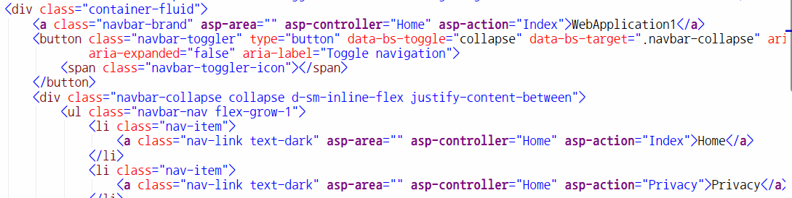

    - _LayOut.cshtml 내 태그가 일반 html 태그와 asp.net 태그로 구분
        - 각 태그 내부 속성에 asp- 시작하는 속성이 포함
        - `asp-area`, `asp-controller`, `asp-action`, ... ASP.NET에서 HTML을 백엔드와 연결하기 위해서 만든 태그
        - `asp-controller="Home" asp-action="Index"` - HomeController의 Index 액션메서드 실행

- 핫 다시 로드(Hot Reload) - 웹 실행중 수정사항을 곧ㄷ바로 반영해서 확인할 때 사용
    - 프론트엔드를 변경시는 반영. C# 백엔드를 수정했을 때는 재시작 해야함

    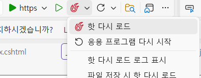

#### 시맨틱웹 태그 리스트
- HTML 기본 외 화면 구성 위해서 추가로 만든 구역탭
- 웹 페이지를 구성할 때 단순히 디자인만을 위해 태그를 사용하는 것이 아니라, 개발자가 의도한 요소의 역할과 의미가 명확히 드러나도록 작성하는 방식
- 모든 화면에 구성되는 동일한 영역을 구역으로 나눔
- `<div>` 태그로 대체할 수 있음

| 태그 | 설명 |
|---|---|
|`<header>`| 머릿글 담당 영역태그 |
|`<main>`| 주요 내용표시 영역태그 |
|`<footer>`| 회사명이나 Copyright 출력 영역태그 |
|`<nav>`| 웹페이지 메뉴표시 영역태그 |
|`<content>`| main 내 컨텐츠 영역태그 |


#### ASP.NET Core 메뉴/기능 추가
1. Controller 폴더 > Context Menu > 추가 > 컨트롤러

    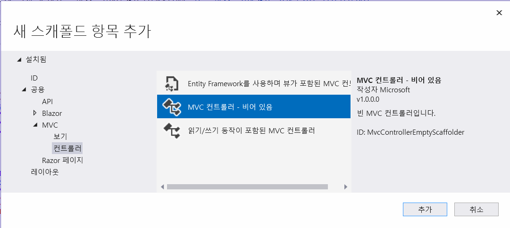

    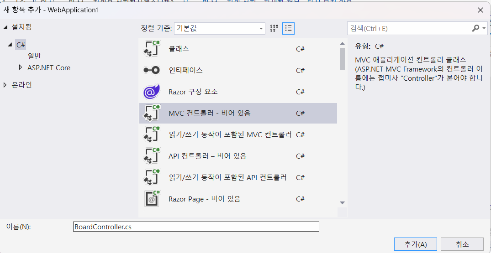

2. BoardController.cs Index() 액션메서드 > Context Menu > 뷰 추가

    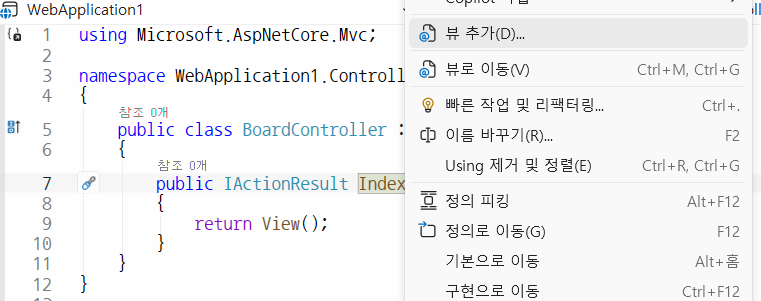

    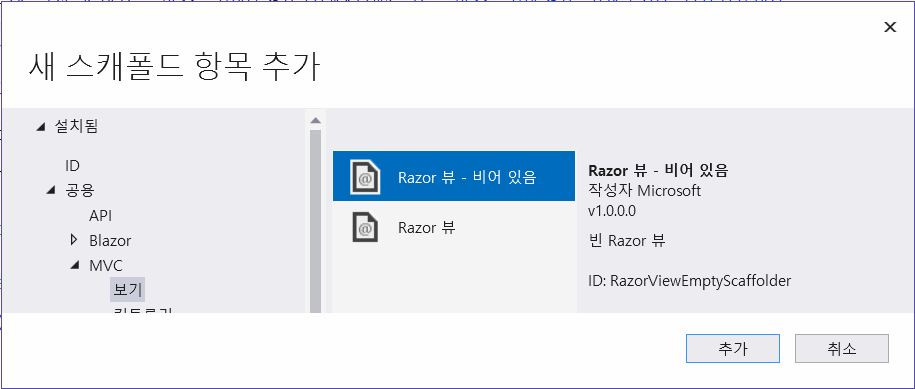

    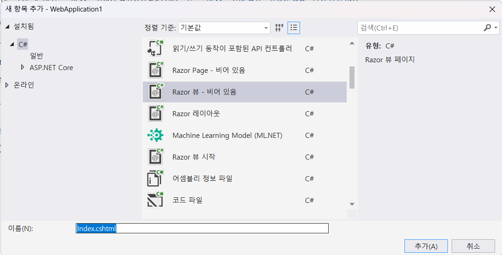

    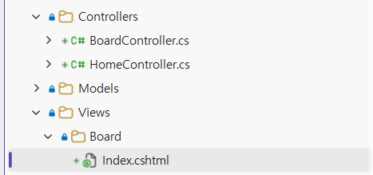

3. _Layout.cshtml에 메뉴 추가

    ```html
    <li class="nav-item">
    <a class="nav-link text-dark" asp-area="" asp-controller="Board" asp-action="Index">게시판</a>
    </li>
    ```

4. Board > Index.cshtml 편집

    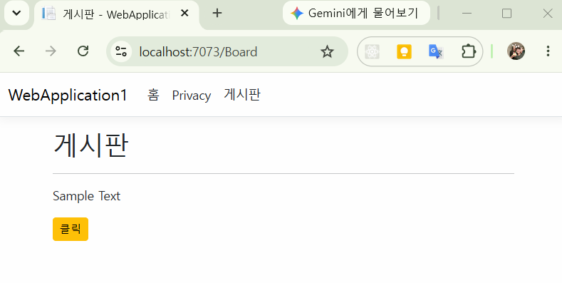


#### DB 핸들링
- MySQL bookrentalshop 연동
- MySQL Connector 대신 EntityFrramework Core 사용

1. NuGet 패키지 설치
    - **EntityFramework는 Major 버전 숫자가 일치해야 함**
    - POMELO와 Microsoft 버전 일치해야 함

    - Microsoft.EntityFrameworkCore 9.0.17
    - Microsoft.EntityFrameworkCore.Tools 9.0.17
    - Pomelo.EntityFrameworkCore.MySql 9.0.0

2. appsettings.json - [소스](./webapp/WebApplication1/appsettings.json)
    - 연결문자열 추가

    ```json
    "AllowedHosts": "*",
"ConnectionStrings": {
  "BookRentalShopConnection": "Server=localhost;
  Port=3306;Database=bookrentalshop;User Id=root;
  Password=my123456;Charset=utf8mb4;"
}
    ```
3. Model 만들기 - NuGet 콘솔 명령어 생성 vs 직접 코딩
    - Book.cs 생성 - [소스](./webapp/WebApplication1/Model/Book.cs)

4. DBContext 생성 - EF에서 매핑 사용할 DB집합 구성
    - MySqlDbContext.cs 작성 - [소스](./webapp/WebApplication1/Models/MySqlDbContext.cs)

5. Program.cs DB로직 추가 - builder 객체에 연결
    - DB연결 문자열, DbContext를 연결 - [소스](./webapp/WebApplication1/Program.cs)

6. Controller 생성 - Db와 연결할 컨트롤러
    - context menu > 추가 > 컨트롤러

    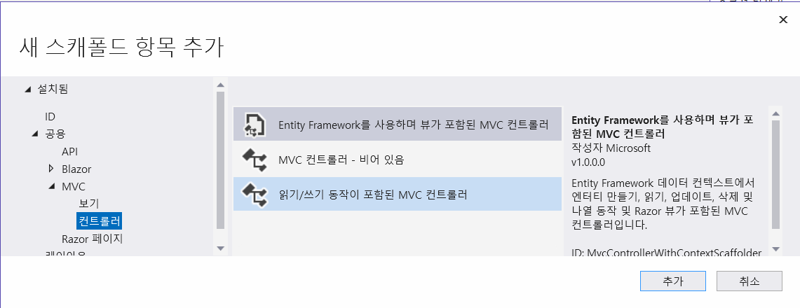

    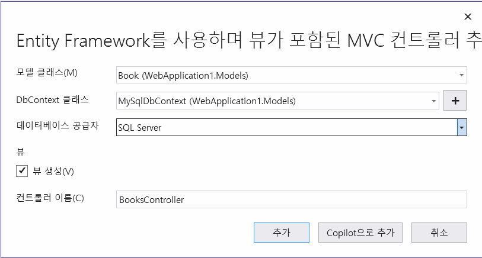

    - 데이터베이스 공급자 문제, MySQL 없어서 SQL Server 관련 설정 자동 추가
    - NuGet 패키지 버전 변경, appsettings.json 연결문자열 삭제

7. _Layout.cshtml 메뉴 추가

8. 오류사항
    - 모델명에 s를 사용하지 말 것 Book`s`Controller -> BookController
    - Routing URL에서 /controller/action/id?인데 MySQLKey값이 book_idx. id 매핑불가. book_idx -> id로 변경
    - DB모델링 시 PK이름을 id로 고정할 것 
    - BookController.cs에 메서드 파라미터 bookidx -> id로 변경. Ctrl+H 변경할 때 대소문자 구분 클릭.

9. 현재 웹개발 DB연동 Mapping 기술
    - ASP.NET Core - EntityFrameworkCore
    - SpringBoot - JPA
    - 실무에서 아주 많이 쓰이지는 않음
    

#### HTTP 메서드
- 웹브라우저(클라이언트)와 서버가 데이터를 주고받는 대표적인 HTTP 메서드(요청방식)

- GET: 데이터를 가져올 때 사용
    - URL로 요청
        - https://localhost:port/Book/Detail/7
        - https://apis.data.go.kr/idnum/servicename/getFestivalKr?serviceKey=servicekey&pageNo=1&numOfRows=10&resultType=json
    - 데이터 노출위험, 길이제한 단점. 일반적인 요청방식

- POST: 데이터 처리 수행/변경/삭제시 사용
    - URL에 데이터를 붙이지 않고, 눈에 보이지 않는 HTTP body에 데이터를 숨겨서 전송
    - submit 타입버튼 클릭했을 때 실행 또는 submit을 수동으로 발생시킬 때
    - 데이터 노출 위험 적음, 길이제한 없음, 일반적인 데이터처리 방식


### ASP.NET Core RESTAPI

- 웹페이지 화면 없이 데이터만 서비스 형태
- 웹페이지는 다른 웹/앱기술로 개발 가능
    - Node.js, React, WPF, 안드로이드 등 여러 앱을 사용해서 개발 가능
- 데이터포털에서 OpenAPI 서비스와 같은 웹서비스 구축


#### product 테이블 생성
- testdb 데이터베이스에 product 생성

```sql
-- 테이블
CREATE TABLE products (
    product_id INT NOT NULL AUTO_INCREMENT,
    product_name VARCHAR(100) NOT NULL,
    category VARCHAR(50) NULL,
    price DECIMAL(10,0) NOT NULL,
    stock INT NOT NULL,
    created_at DATETIME DEFAULT CURRENT_TIMESTAMP,
    PRIMARY KEY (product_id)
);

-- 더미데이터
INSERT INTO products(product_name, category, price, stock)
VALUES
('무선 마우스', '전자기기', 55000, 30),
('기계식 키보드', '전자기기', 89000, 15),
('텀블러', '생활용품', 18000, 50),
('노트북 거치대', '사무용품', 32000, 20),
('핸드폰 충전기', '전자기기', 18000, 10);
```


#### ASP.NET Core Web API 프로젝트 생성
- ASP.NET Core 웹 API 템플릿 선택
- 나머지 동일. OpenAPI 지원 사용. 컨트롤러 사용 체크 만들기
- wwwroot(js, css정적파일), Views 폴더 없음
- Models 폴더는 직접 생성

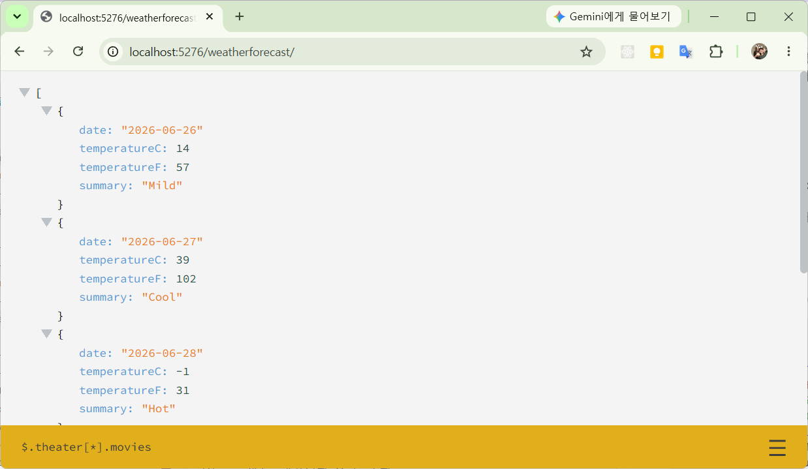


#### Postman 설치
- https://www.postman.com/downloads/

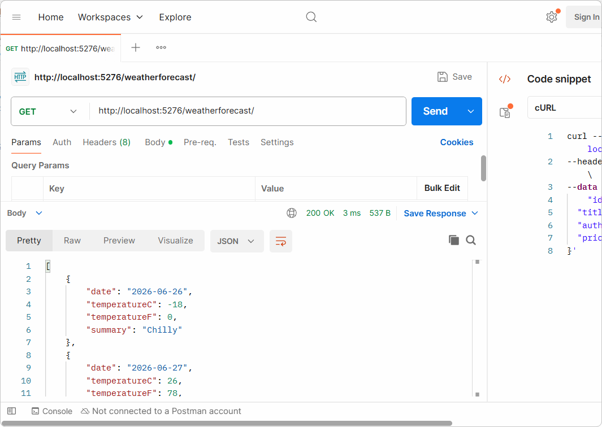


### MySqlConnevtor NuGet 패키지 설치
- NuGet 패키지 관리자 > MySqlConnector 검색 후 설치


#### Product 모델 클래스 생성
- Models > Product.cs 생성 - [소스](./webapp/WebApiSolution/ProductApi/Models/Product.cs)


#### DB 연결 구성
- appsettings.json 연결문자열 추가 - [소스](./webapp/WebApiSolution/ProductApi/appsettings.json)
- Program.cs 연결변수 추가 - [소스](./webapp/WebApiSolution/ProductApi/Program.cs


#### ProductsController 생성
- Controller / ProductsController.cs 생성 - [소스](./webapp/WebApiSolution/ProductApi/Controllers/ProductsController.cs)


#### GET - 상품 리스트 조회
- GET 메서드 작성


#### 실행결과

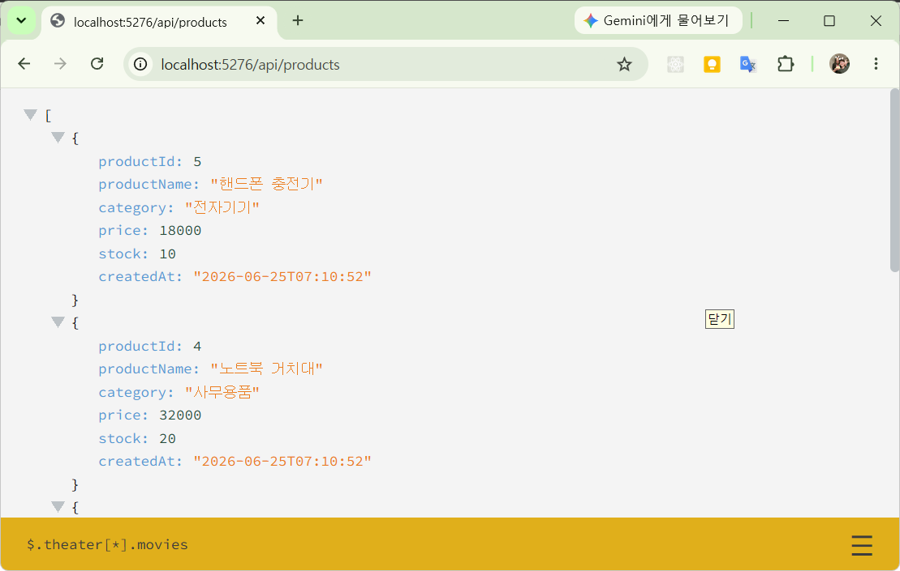


#### 일반메서드 vs 비동기메서드

- 일반메서드 - DB처리가 완료될 때까지 나머지 로직이 중지
```cs
[HttpGet]   // GET 메서드 선언(없어도 기본)
public IActionResult GetProducts()
{
    List<Product> products = new(); // new List<Product>(); 와 동일기능

    using var conn = new MySqlConnection(connString);
    conn.Open();

    string query = 
        @"
         SELECT product_id, product_name, category, price, stock, created_at
         FROM products
         ORDER BY product_id DESC
        ";      // 여러 줄 문자열: @" 또는 """

    using var cmd = new MySqlCommand(query, conn);
    using var reader = cmd.ExecuteReader();

    while (reader.Read()) { //  
        Product product = new Product
        {
            ProductId = reader.GetInt32("product_id"),
            ProductName = reader.GetString("product_name"),
            Category = reader.GetString("category"),
            Price = reader.GetDecimal("price"),
            Stock = reader.GetInt32("stock"),
            CreatedAt = reader.GetDateTime("created_at")
        };

        products.Add(product);
    
    }
    return Ok(products);
```

- 비동기 메서드 - 백그라운드로 동작, 다른 기능 사용

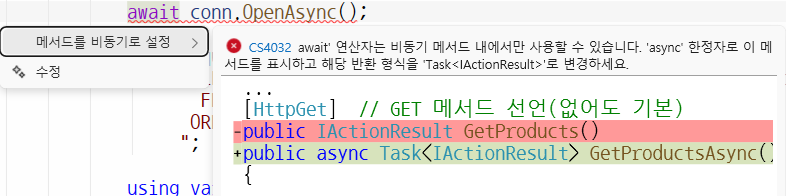

```cs
[HttpGet]   // GET 메서드 선언(없어도 기본)
public async Task<IActionResult> GetProductsAsync()
{
    ...
    await conn.OpenAsync();

    ...
    using var reader = await cmd.ExecuteReaderAsync();

    while (await reader.ReadAsync()) { 
        ...
    }
    return Ok(products);
}
```

- GET /api/products


#### Get - 상품 단건 조회
- ProductsController에 단건 조회용 메서드 생성

- GET /api/porducts/id

#### 실행결과


- 성공

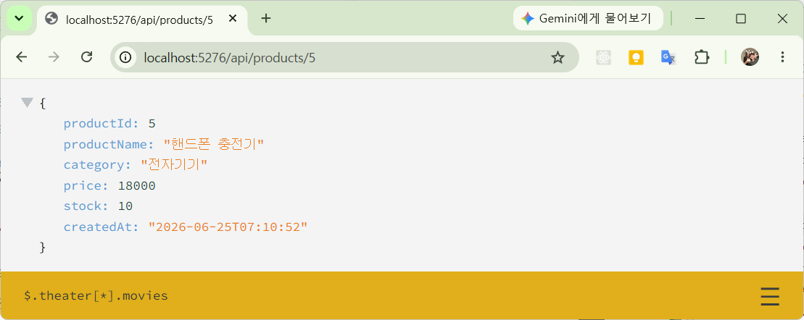

- 실패

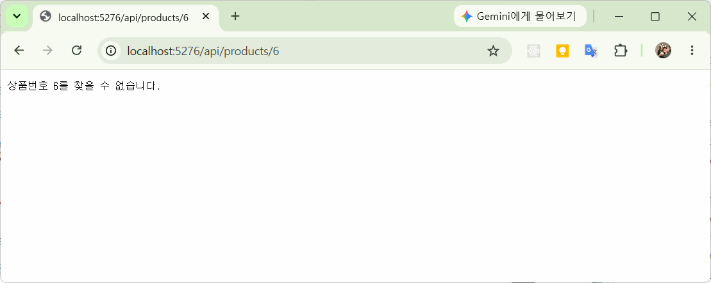

- 포스트맨 결과화면

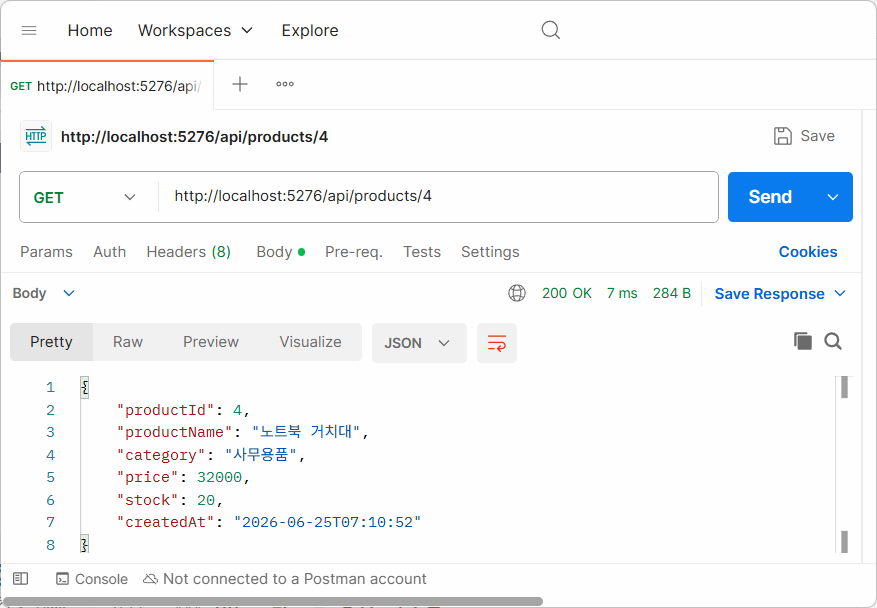

- 공공데이터포털 기능은 대부분 여기까지


#### POST - 상품 등록
- ProductsController에 단건 등록 메서드 생성
- POST /api/products


#### PostMan에서 테스트
- GET 메서드 이외는 웹브라우저에서 테스트 매우 어려움
- Swagger, Postman 등의 테스트 툴 사용 거의 필수


#### 실행결과
- Postman Post메서드 선택, Body > raw > JSON 형식으로 데이터 입력 > Send
- Response 결과 맨 아래 확인

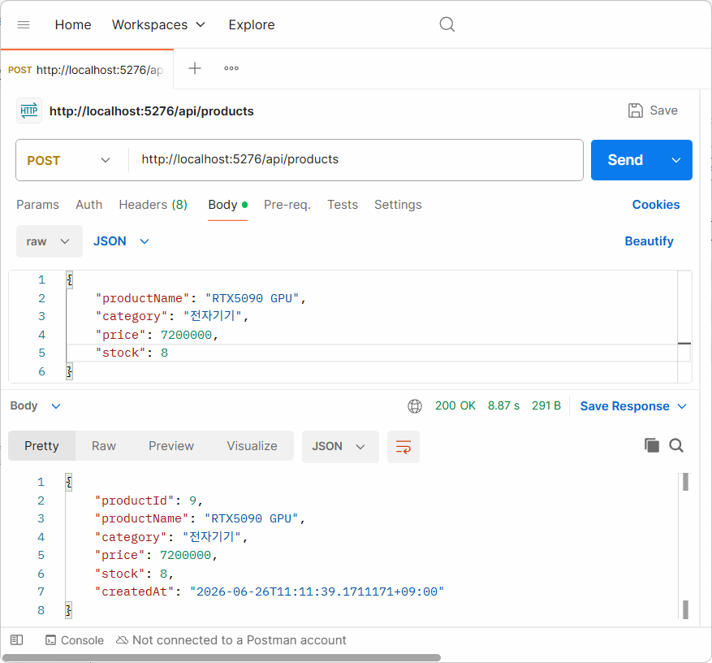

- 데이터 베이스 결과화면

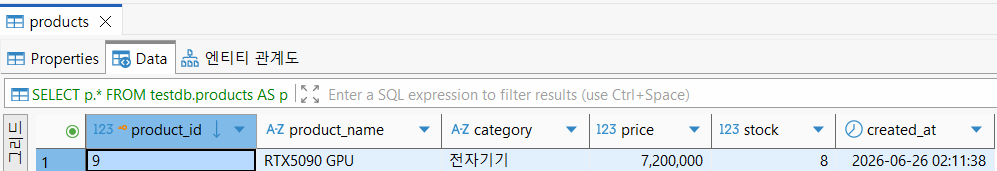


#### Command Execute 비교

|메서드|사용방법|
|---|---|
|ExecuteReader() | SELECT 여러 행 조회 |
|ExecuteNonQuery() | INSERT, UPDATE, DELETE 실행 |
|ExecuteScalar() | 값 1개 반환(COUNT, MAX/MIN, LAST_INSERT_ID ...) |

- 비동기는 Async()로 작성할 것


#### PUT - 상품 수정
- POST 메서드로 구현 가능

- PUT /api/products/id


#### 실행결과
- 포스트맨 결과화면

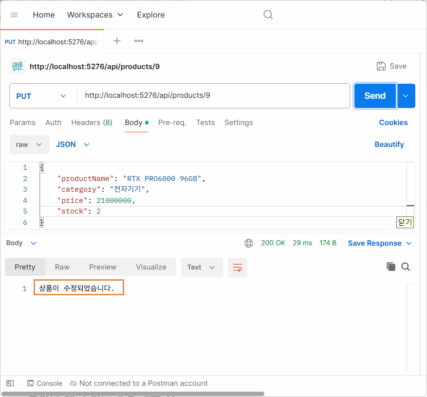

- 데이터 베이스 결과화면

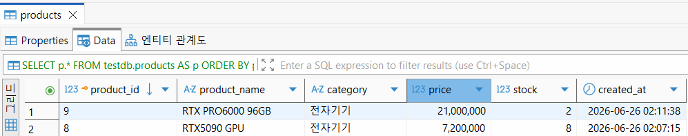

- Postman에서 GET으로 변경하고 Send 확인 


#### PATCH - 필요컬럼 수정

- POST 메서드로 구현 가능. 기능을 완전 분리하고 싶을 때 사용
- PATCH /api/products/id
- ex) 재고 or 카테고리만 수정하는 기능을 추가하고자 할 때

- Models Product.cs를 복사해서 ProductStock.cs로 변경
- [HttpPatch("{id}/stock")] 로 URL 변경


#### 실행결과
- PATCH 메서드에 맞게 URL 변경

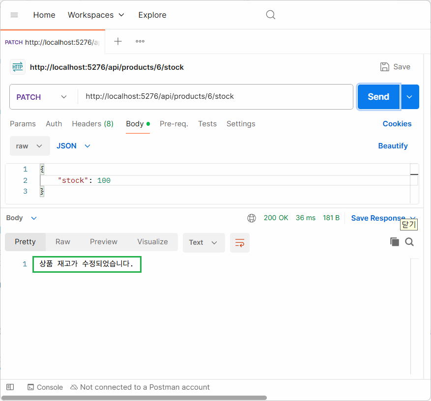


#### DELETE - 상품 삭제
- DELETE /api/products/id
- HttpDelete 메서드 추가


#### 실행결과
- 포스트맨 결과화면

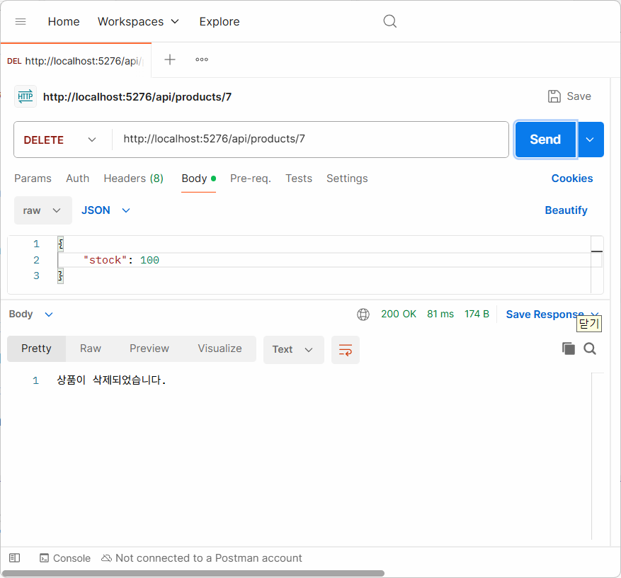

- 데이터 베이스 결과화면

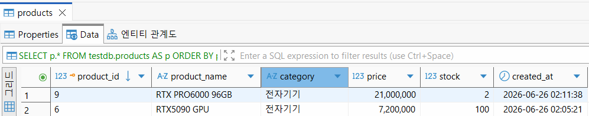


#### HEAD, OPTIONS
- 웹서비스 사용 여부 확인
- 웹서비스에 지원하는 메서드 확인


#### 실행결과
- HttpHead 결과화면

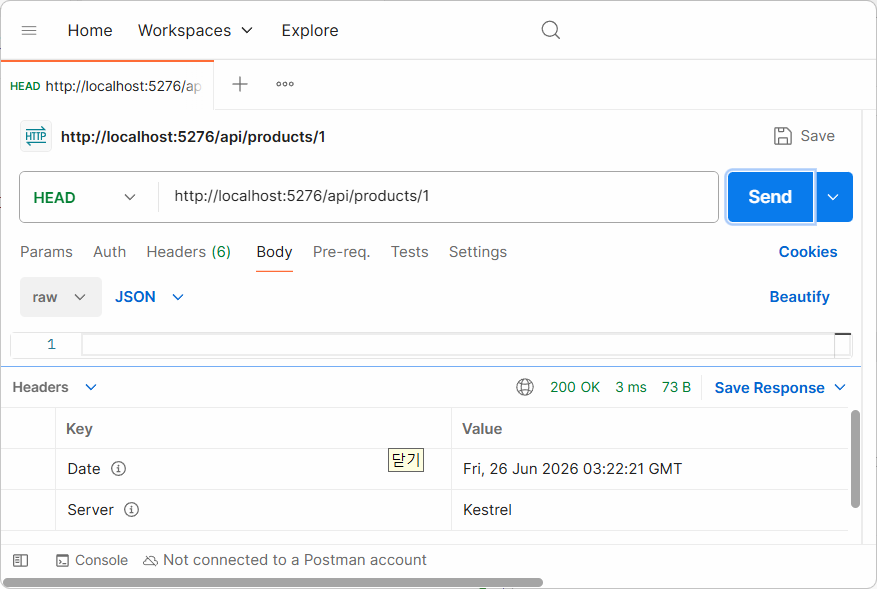

- HttpOptions 결과화면


#### HttpMethod
- [HttpMethod("GET")], [HttpMethod("POST")] 등으로 명시적으로 사용
- 거의 사용 안 함


### RESTAPI 서비스 사용 애플리케이션
- 하나의 웹 서비스를 가지고 여러 종류 애플리케이션에서 사용


#### CORS 설정
- Cross Origin Resource Sharing: 교차 출처 자원 공유. 서버가 다른 공간에 데이터 요청을 안전하게 하도록 허용해주는 설정
- Program.cs 추가


#### HTML + Javascript 

- product-client.html 생성
- HTML, Javascript 구현 


##### 실행결과


- 일반 조회결과

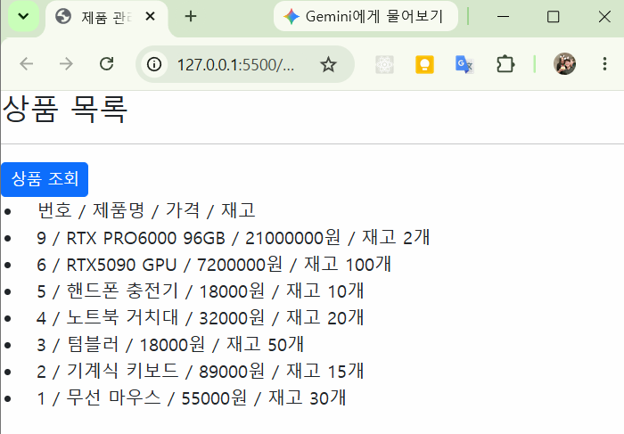

- 부트스트랩 기본적용 결과

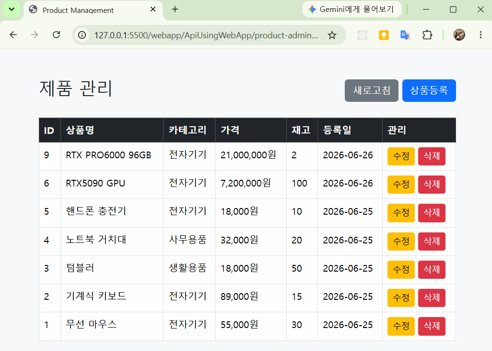

- 부트스트랩 일괄적용 화면


#### WPF 1

- 공공데이터포털 부산축제정보 앱 WPF 활용
- 부산축제정보 앱 다운사이징 코딩


##### 실행결과

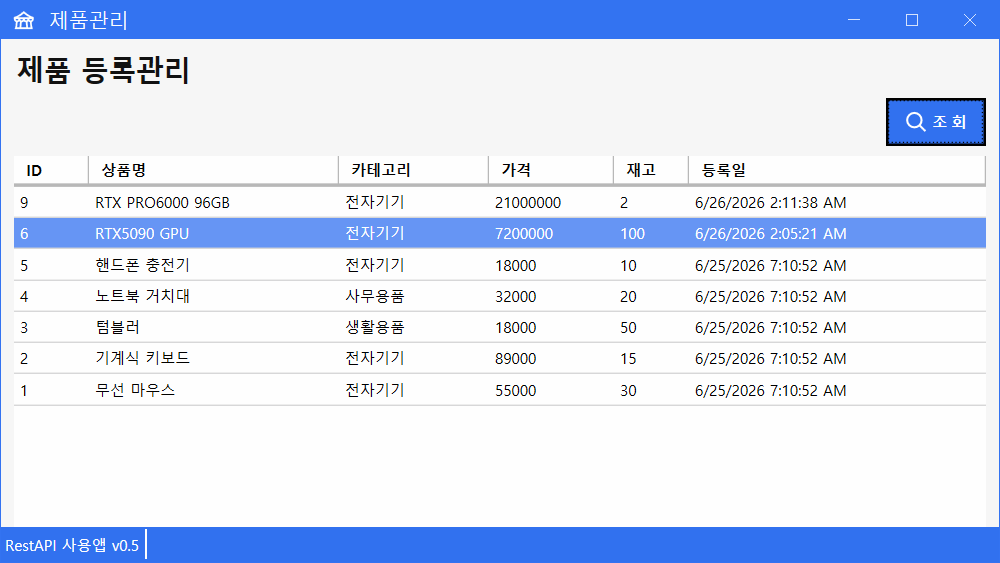

- HTML + Javascript 실행결과 동일

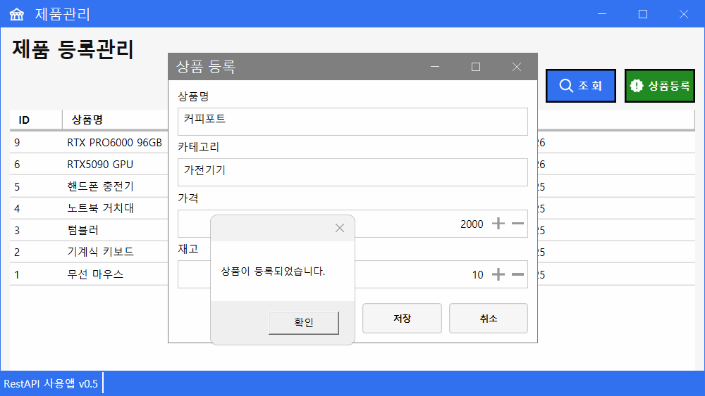

- WPF 등록화면 및 성공메시지

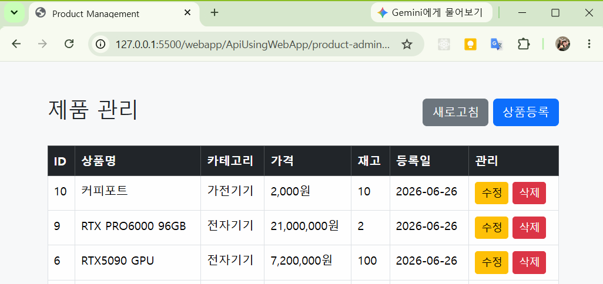

- HTML + Javascript 에서 추가된 데이터 확인 화면


#### 현재 상품등록 문제
- 입력 Validation Check 구현되어 있지 않음

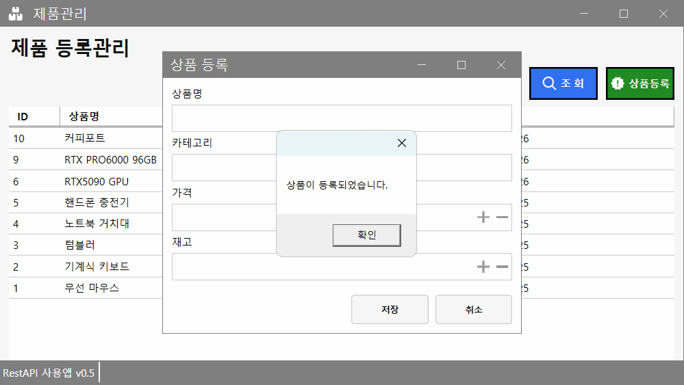

- ""(empty)는 null이 아니기 때문에 데이터 등록됨

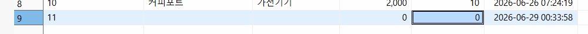

- 데이터베이스에 빈 데이터 입력확인

- 데이터 입력시 무조건(!) 입력 검증 로직 필요


#### WPF 2

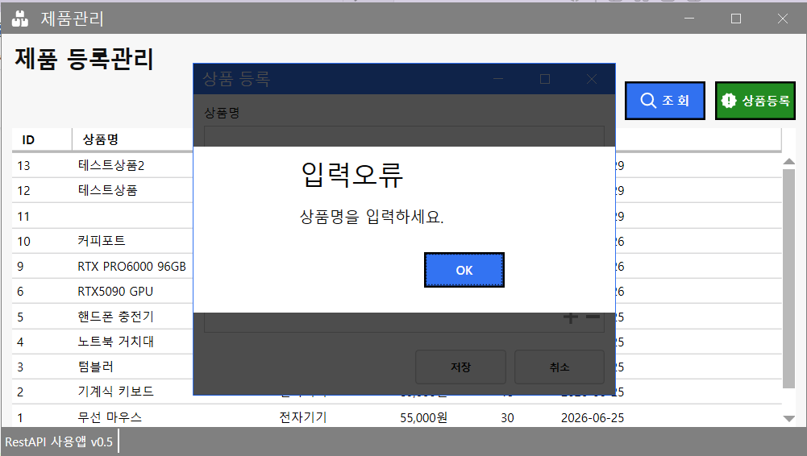

- Validation Check, Exception Handling 추가
- 수정(PUT), 삭제(DELETE) 기능 구현


#### 디자인 렌더링 오류
- xaml 파일 복사한 뒤 클래스명이 중복되어서 발생
- 새로 만든 xaml 파일의 클래스명을 전부 수정

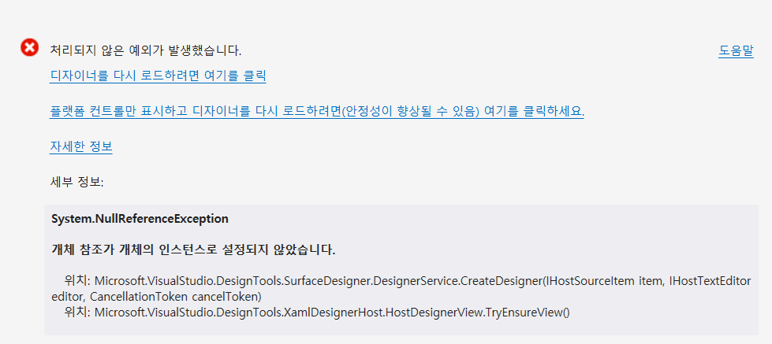


#### 현재 구현의 문제
- ProductCreateWindow.xaml와 ProductEditWindow.xaml가 존재
- DB 설계 상 새로운 컬럼이 추가되면 두 화면을 모두 수정
- 하나의 윈도우로 개발하면 한 화면만 수정의 효율성이 높음
- ProductCreateWindow.xaml, ProductEditWindow.xaml -> ProductWindow.xaml로 통합
- 각 창의 필수 기능, BtnSave

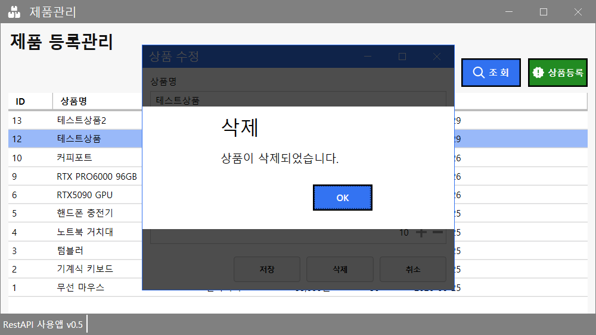


##### 결론

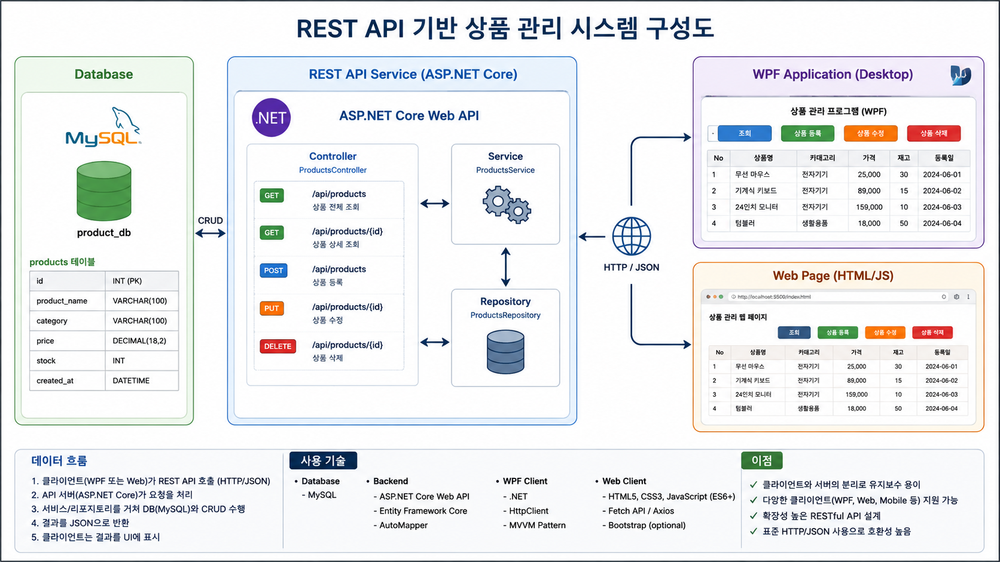

- 기존 방식 - WPF에 DB 핸들링 위해서 SQL 처리, 웹개발(ASP.NET 포함) 때도 DB 핸들링 SQL 처리 필요
- REST API 방식 - DB 핸들링은 REST API 서비스에서 통합개발. 각 클라이언트에서는 서비스URL 호출(요청)으로 데이터를 처리


### Unity + RESTAPI 애플리케이션
- Unity URP 프로젝트 생성

#### Newtonsoft Json 패키지 설치
- Window > Package Manager > + Add package by technical name 
    - `com.unity.nuget.newtonsoft-json` > install

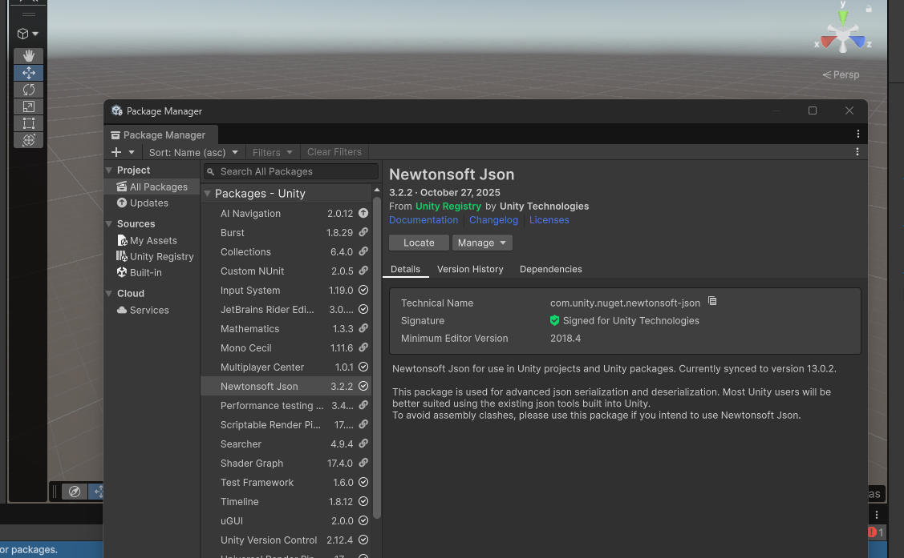


#### Canvas UI 추가
- Canvas 추가. 2D 변경
- Button 추가 -> BtnLoad
- 나눔고딕 폰트 추가. 이전 파일 그대로 사용

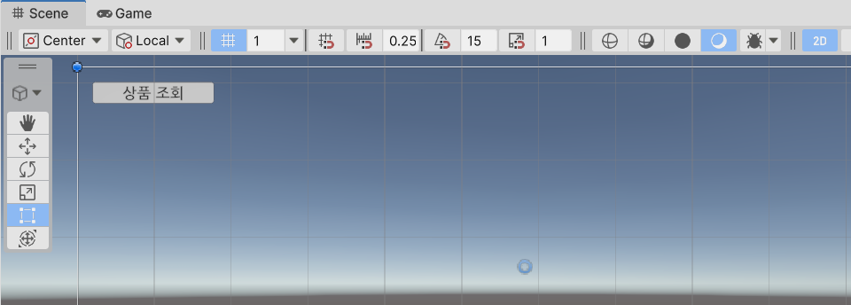

- Text - TextMeshPro 추가 -> Logs

#### Script 작성
- ProductApiClient.cs 생성

```cs
public class ProductApiClient : MonoBehaviour
{
    [SerializeField]
    private TMP_Text txtLog;

    [SerializeField]
    private string serviceUrl = "http://localhost:5276/api/products";

    public void LoadProducts()
    {
        StartCoroutine(GetProducts());
    }

    private IEnumerator GetProducts()
    {
        using UnityWebRequest request = UnityWebRequest.Get(serviceUrl);

        yield return request.SendWebRequest();

        if (request.result != UnityWebRequest.Result.Success)
        {
            txtLog.text = request.error;
            yield break;
        }

        txtLog.text = request.downloadHandler.text;
    }
}
```

#### GameObject 연결
- 빈 객체 -> ProductApiManager 생성
- ProductApiClient 스크립트를 하위 컴포넌트 등록
- TxtLog 변수에 캔버스에 추가한 Logs 텍스트 할당

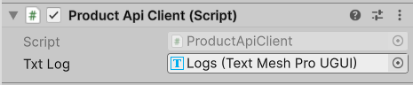

- 스크립트의 부모 객체 ProductApiManager를 기본으로 선택
- 실제 사용함수는 ProductApiClient.LoadProduct() 선택


#### 실행화면

- API 서버 중지시 화면

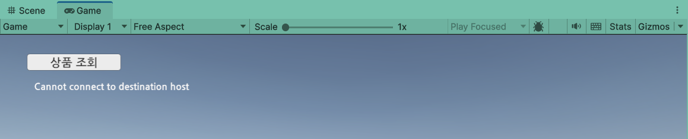

- API 서버 정상동작 화면

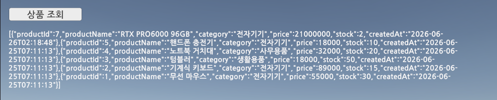

- WPF에서 데이터 등록 후 Unity에서 재확인

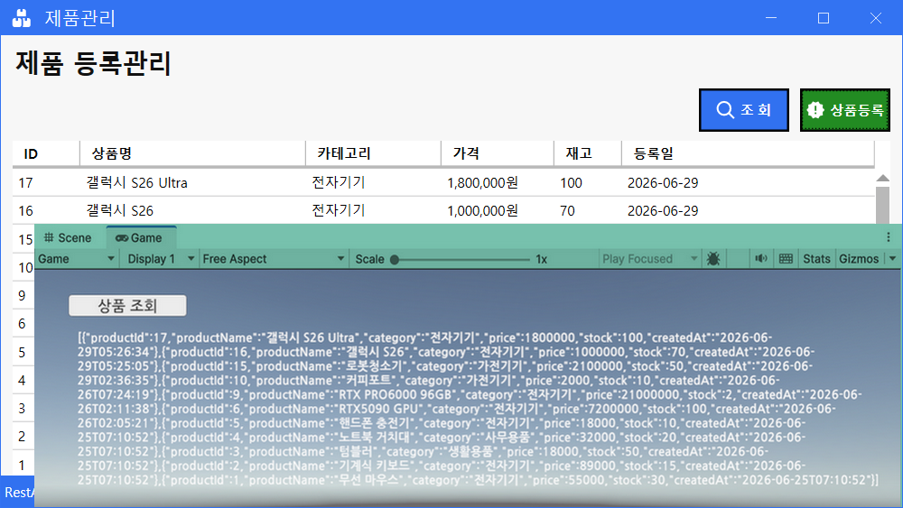


#### 데이터 리스트화면(2D) 만들기
- 화면 구조
- Panel - HeaderPanel, ButtonPanel, DataGridHeader
- TMPro - HeaderTitle, Lbl~ 6개
- Button - BtnLoad
- Scroll View

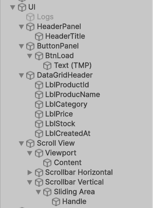

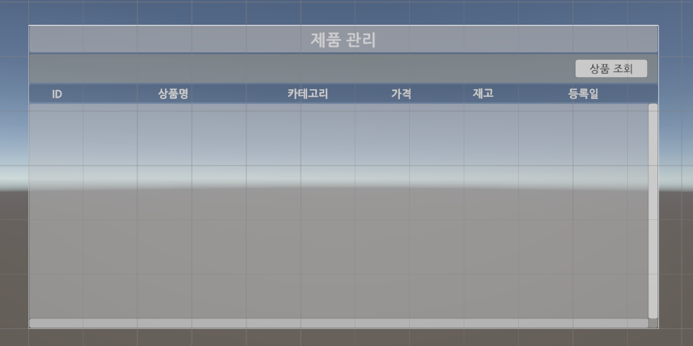

- Product.cs 스크립트 생성 - [소스](./unity/UnityProductApp/Assets/Scripts/Product.cs)


#### ProductRow 프리팹
- ProductRow 객체 생성, UI 구성

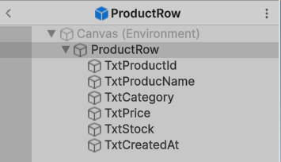

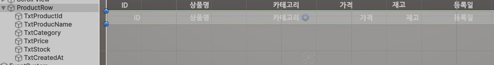

- Prefabs 폴더 드래그, 프리팹 생성
- ProductRowUi.cs 스크립트 생성
- ProductRow 프리팹 더블클릭 > 프리팹 에디터 화면 전환
    - ProductRowUi.cs를 ProductRow root 객체 할당

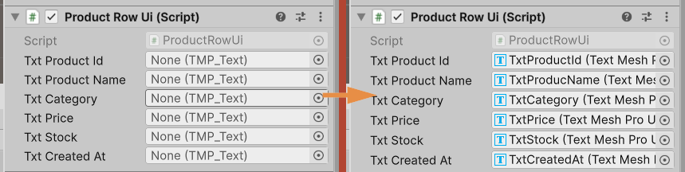


#### ProductApiClient 스크립트 수정
- 스크롤뷰 컨텐츠, ProductRow 프리팹 할당 추가 - [소스](./unity/UnityProductApp/Assets/Scripts/ProductApiClient.cs) 


#### ProductApiManager 아래 스크립트
- ProductApiClient 스크립트에 Content, Product Row 프리팹 할당

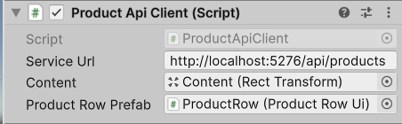


#### 실행결과
- 컨텐츠 아래 첫번째 줄에 모두 겹쳐져서 출력


#### 프리팹 및 컨텐트 수정
- ProductRow 프리팹 오픈
- Add Component > Layout Element
- Min Height, Preferred Height 36 지정
- Flexible Height 0 지정

- View port > content 클릭

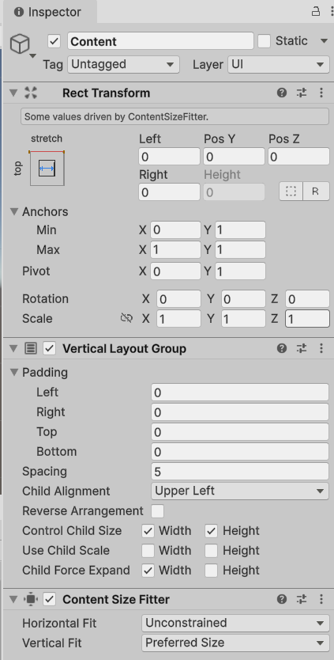


#### 실행결과
- WPF에서 신규 데이터 입력

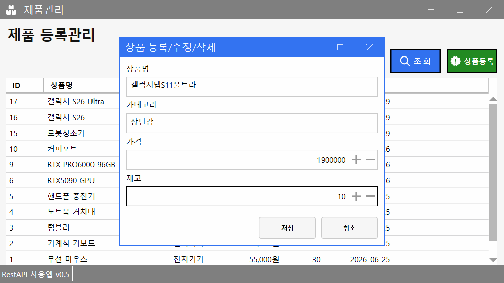

- Unity에서 신규 데이터 확인

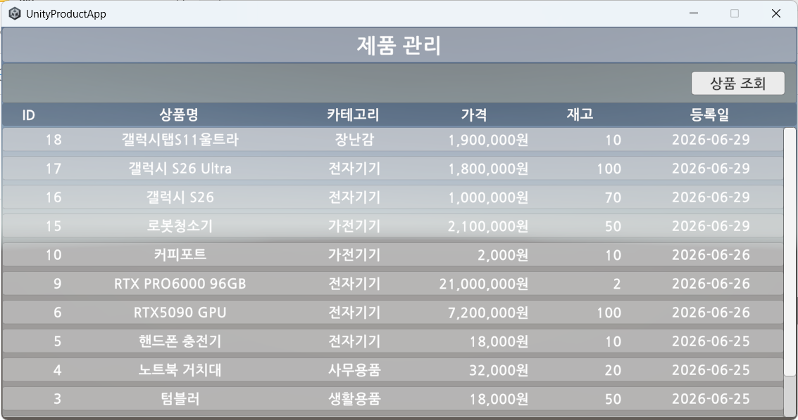

- 시스템 구성도
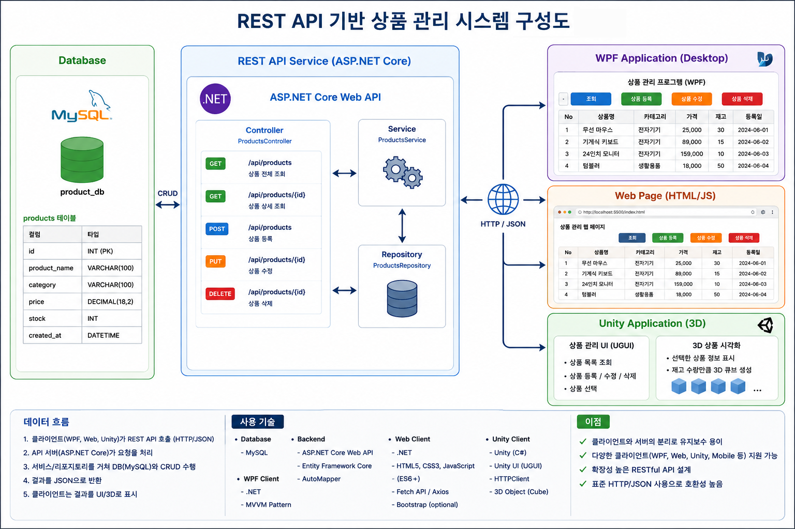

- MQTT 브로커를 접속해서 데이터를 가져오는 것보다 API 웹서비스를 접속해서 데이터 가져오는 것이 훨씬 간편함


### ASP.NET Core 도커
- 웹서비스를 도커 이미지로 만든 뒤 도커에서 실행하는 방법
- MSA(MicroService Architecture) 서비스를 만들 때 효율적

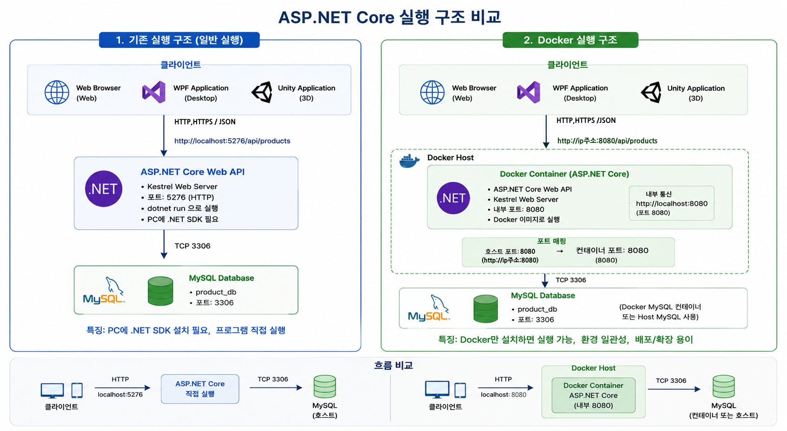


#### 도커
- `Linux 컨테이너(기본)`와 Windows 컨테이너로 구분. 둘 사이 전환 가능
- `Linux 컨테이너 - WSL`(Windows Subsystem for Linux)
- Windows 컨테이너 - Hyper-V 필수

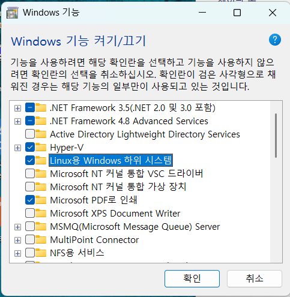


- Windows 컨테이너 상태 - 컨테이너 없음

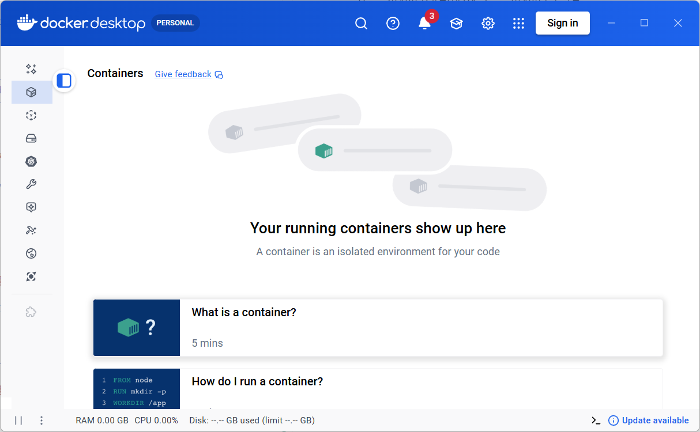

- Linux 컨테이너 상태 - MySQL 컨테이너 확인

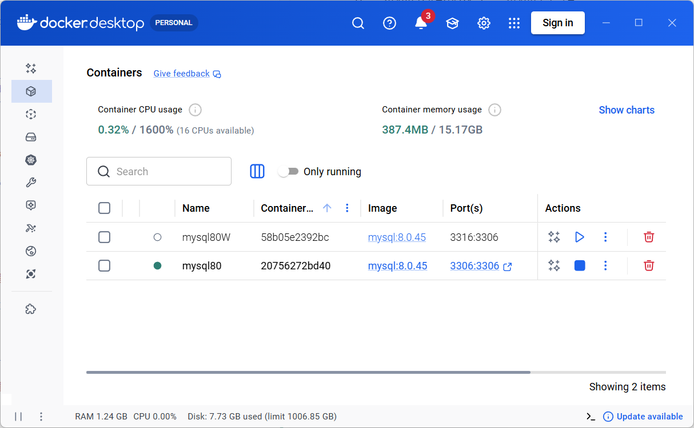

- ASP.NET Core 컨테이너 두 개 모두 지원


#### 기존 프로젝트 Docker 지원 추가
- appsettings.json 오픈. server localhost를 해당 아이피주소로 변경!
- 프로젝트 > Context menu > `컨테이너 지원` 선택

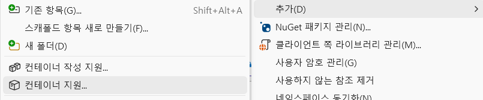

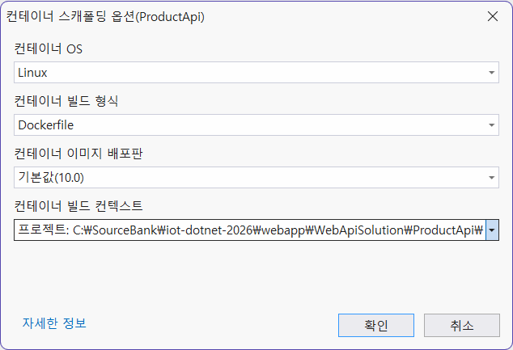

- DockerFile 생성 - 도커 이미지 생성을 위한 구성 파일

```dockerfile
# Base
FROM mcr.microsoft.com/dotnet/aspnet:10.0 AS base
WORKDIR /app
EXPOSE 8080

# Build
FROM mcr.microsoft.com/dotnet/sdk:10.0 AS build
ARG BUILD_CONFIGURATION=Release
WORKDIR /src
COPY . .

# Publish
RUN dotnet publish -c $BUILD_CONFIGURATION -o /app/publish 

# Final
FROM base AS final
WORKDIR /app
COPY --from=build /app/publish .
ENV ASPNETCORE_URLS=http://+:8080
ENTRYPOINT ["dotnet", "ProductApi.dll"]
```

- 이미지 만들기

```powershell
# 이미지명은 소문자로
> docker build -t productapi .
```

- 빌드 진행상황

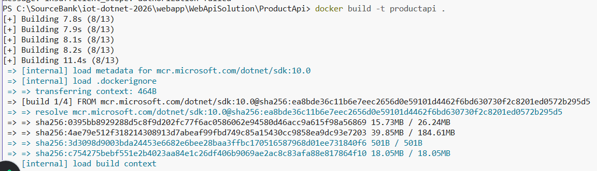

```powershell
> docker run -d --name productapi-container -p 8080:8080 productapi
```
- 컨테이너 실행화면

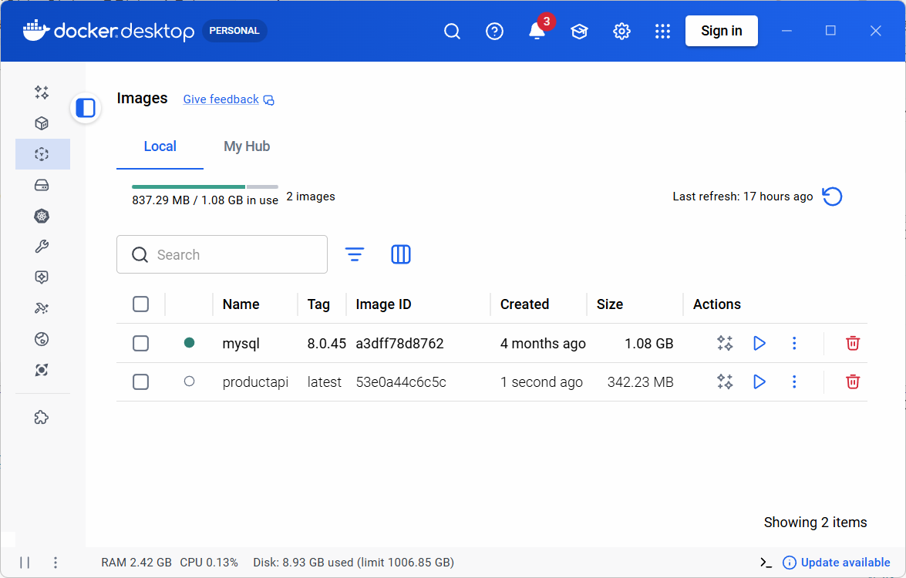

- 도커에서 실행되는 웹서비스 화면

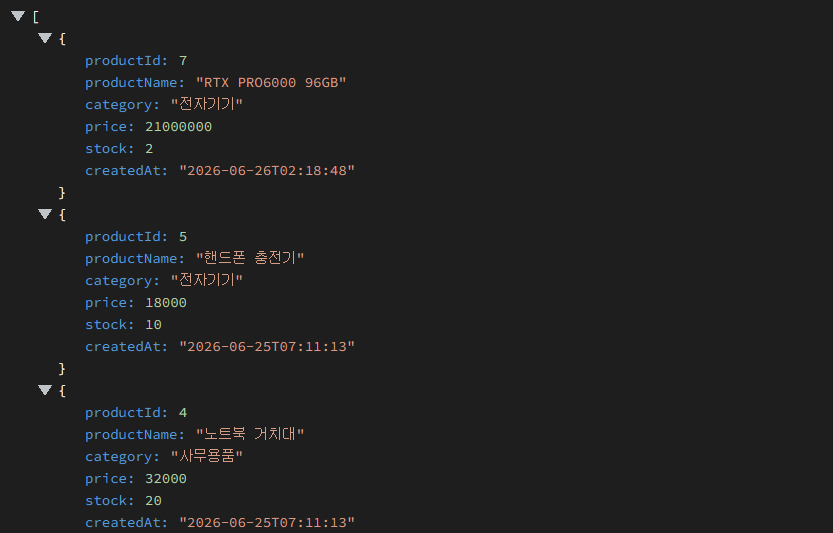

- 디버깅용 도커 설치 확인

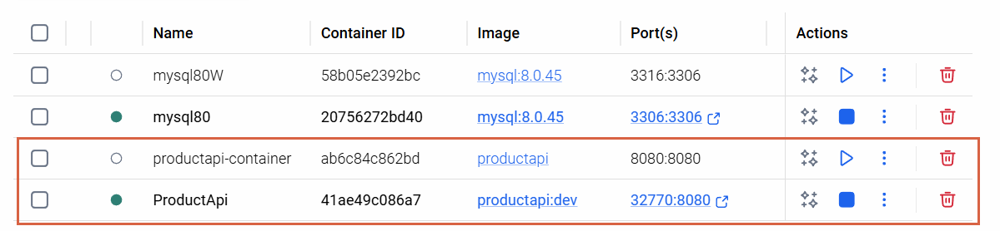

- 주의점!
    - localhost 사용 안 됨. 서비스 중 아이피 주소로 변경
    - 도커 컨테이너 실행 여부 확인
    - Unity의 경우 HTTP 접속 허용
        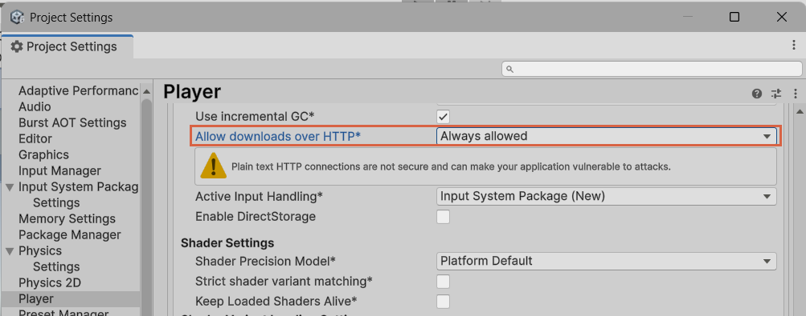


#### DevOps
- Development + Operation - 개발과 운영을 하나의 프로세스로 연결. 소프트웨어 개발과 배포하는 문화 방법론
- 개발 -> Git 저장 -> 자동빌드 -> Docker 이미지(Docker Hub) -> 서버 배포 -> 운영
    - Git, GitHub, GitHub Actions(자동배포) - 소스관리
    - Jenkins(자동배포, 자동빌드) - CI(자동빌드)
    - Docker, Kubernetes - 컨테이너, 컨테이너 관리
    - Azure, AMS, GCP - 클라우드
    - Prometheus, Grafana - 모니터링
    - ELK Stack(엘라스틱서치 스택) - 로그


#### 전체 실행결과
- TODO: 동영상 업로드


[토이프로젝트](./README5.md)