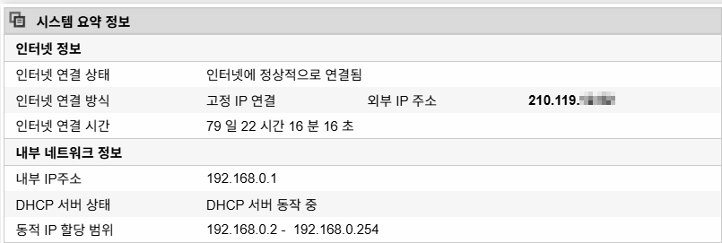
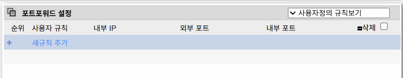
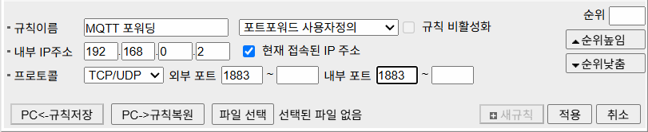
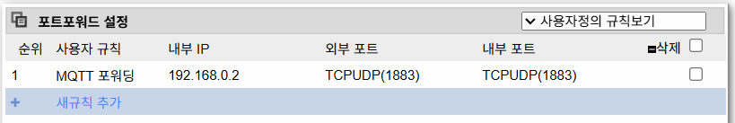
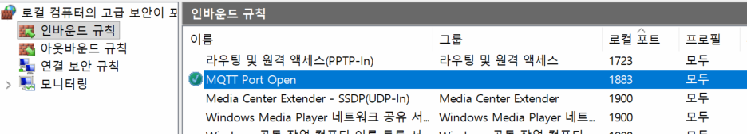

# 2026 닷넷 개발자 토이 프로젝트

## 프로젝트 목록

### 1. 공공데이터 통합 플랫폼
- 공공데이터 OpenAPI를 활용한 지도 기반 정보 조회 시스템
- **기술:** Python · OpenAPI · Folium · PyQt
- 📄 [TOYPROJECT1.md](./TOYPROJECT1.md)

---

### 2. WPF MVVM 패턴 학습 및 도서관리 앱
- MVVM 패턴을 적용한 WPF CRUD 애플리케이션
- **기술:** C# · WPF · MVVM · MySQL
- 📄 [TOYPROJECT2.md](./TOYPROJECT2.md)

---

### 3. GitHub 프로필 꾸미기
- GitHub README 및 프로필 페이지 제작
- **기술:** Markdown · GitHub · Shields.io
- 📄 [TOYPROJECT3.md](./TOYPROJECT3.md)

---

### 4. FastAPI 기반 AI 비전검사 및 실시간 모니터링 시스템
- FastAPI · YOLO · MQTT(WebSocket)를 활용한 AI 객체 인식 시스템
- **기술:** Python · FastAPI · OpenCV · YOLO · MQTT
- 📄 [TOYPROJECT4.md](./TOYPROJECT4.md)

---

### 5. 컨베이어벨트 기반 스마트 공정관리 시스템
- Arduino, Raspberry Pi, MQTT, Unity를 활용한 스마트팩토리 공정관리
- **기술:** Arduino · Raspberry Pi · MQTT · Unity · Python
- 📄 [TOYPROJECT5.md](./TOYPROJECT5.md)

### 6. IoT 스마트홈 통합 플랫폼

- MQTT WPF + WebAPI + Unity 연계

### 7. Unity ProductApp 기능 개선

- 각 상품 클릭시 3D 박스와 연계
- 로봇팔 오브젝트 연계

### 8. 실시간 채팅 시스템 + 챗봇 기능

- Python AI + SignalR API

### (번외) 네트워크 연결 설정

- 여러사람이 같이 한 PC(서버) 공유할 수 있도록 공유기/라우터 설정

- 사용 중 공유기 정보확인

- 현재 포트포워딩 상태

- MQTT 포트포워드 설정 지정

- 이후 설정 저장

- 윈도우(OS) 방화벽 포트 연결 허용 설정

- 외부 아이피로 접속 확인

#### MQTT 브로커 접속

- MQTT Explorer에서 Publish 확인