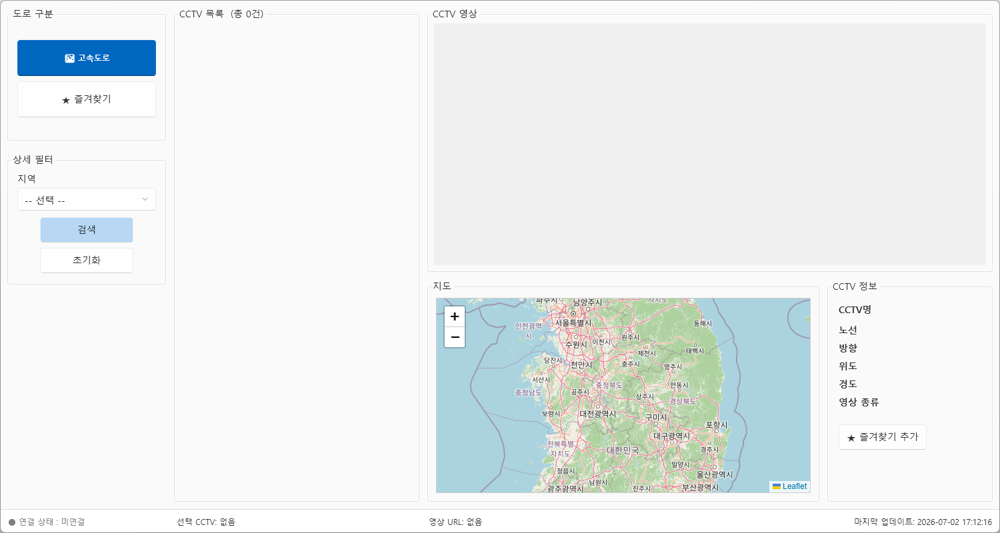
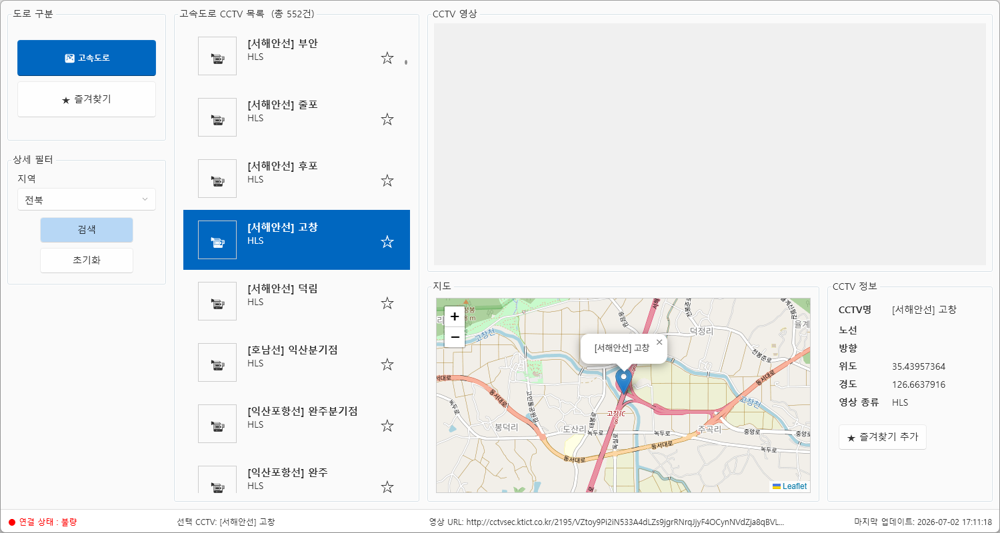
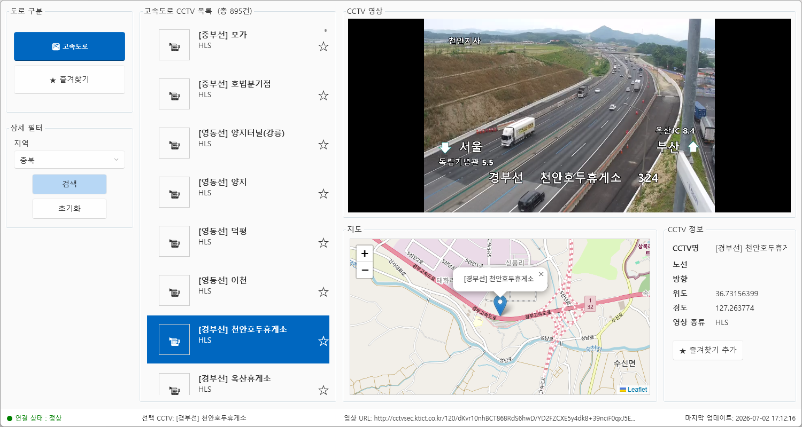

# 토이 프로젝트

# 국가교통정보센터 CCTV 모니터링 시스템

국가교통정보센터의 ITS Open API를 활용하여 전국 고속도로·국도 CCTV를 검색하고, 실시간 영상과 위치 정보를 함께 확인할 수 있도록 구현한 WPF 기반 데스크톱 애플리케이션입니다.

WPF 클라이언트가 외부 Open API를 직접 호출하지 않고, ASP.NET Core Web API로 구현한 브릿지 서버를 통해 데이터를 전달받도록 구성했습니다. 이를 통해 API 인증키를 클라이언트에서 분리하고, 외부 API 요청과 화면 표시 기능의 역할을 구분했습니다.

---

## 프로젝트 개요

| 항목      | 내용                                             |
| ------- | ---------------------------------------------- |
| 프로젝트 유형 | 개인 토이프로젝트                                      |
| 플랫폼     | Windows Desktop                                |
| 클라이언트   | C# · WPF                                       |
| 서버      | ASP.NET Core Web API                           |
| 외부 서비스  | 국가교통정보센터 ITS Open API                          |
| 주요 기능   | 지역별 CCTV 검색, 실시간 영상 재생, 지도 마커 표시, CCTV 상세정보 조회 |

---

## 주요 기능

* 전국 시·도 단위의 위도·경도 범위를 이용한 CCTV 검색
* 고속도로와 국도 CCTV 구분 조회
* LibVLCSharp을 활용한 HLS 실시간 영상 재생
* WebView2와 Leaflet.js를 활용한 CCTV 위치 지도 표시
* 선택한 CCTV의 이름, 좌표, 영상 URL 등 상세정보 제공
* 스트리밍 연결 성공·실패 상태 표시
* 검색 중 ProgressBar를 이용한 진행 상태 표시
* 초기화 버튼을 통한 검색 조건, 목록, 영상 및 지도 초기화
* 영상 재생 실패와 API 키 누락 등에 대한 예외 처리

---

## 시스템 구성

```text
┌──────────────────────┐
│ WpfCctvMonitorApp     │
│ WPF Client            │
│                      │
│ - CCTV 검색 및 목록    │
│ - LibVLCSharp 영상 재생│
│ - WebView2 지도 표시   │
└──────────┬───────────┘
           │ HTTP / JSON
           ▼
┌──────────────────────┐
│ ItsCctvBridgeApi      │
│ ASP.NET Core Web API │
│                      │
│ - API 인증키 관리      │
│ - 외부 API 요청 중계   │
│ - 응답 데이터 변환     │
└──────────┬───────────┘
           │ HTTP
           ▼
┌──────────────────────┐
│ 국가교통정보센터       │
│ ITS Open API          │
└──────────────────────┘
```

### 설계 의도

ITS Open API 인증키가 WPF 클라이언트에 직접 노출되지 않도록 ASP.NET Core 기반 브릿지 서버를 구성했습니다. 클라이언트는 브릿지 서버에 필요한 검색 조건만 전달하고, 서버가 인증키와 외부 API 호출을 담당하도록 역할을 분리했습니다.

---

## 기술 스택

### Client

* C# · WPF
* Wpf.Ui
* LibVLCSharp.WPF
* VideoLAN.LibVLC.Windows
* Microsoft.Web.WebView2
* Newtonsoft.Json
* Leaflet.js

### Server

* ASP.NET Core Web API
* REST API
* HttpClient
* JSON 직렬화 및 역직렬화
* Kestrel Web Server
* appsettings.json

---

## 구현 구조

```text
WpfCctvMonitorApp
├── Common
│   ├── AppCommon.cs
│   └── GeoBound.cs
├── Models
│   ├── CctvInfo.cs
│   ├── CctvRequest.cs
│   ├── CctvResponse.cs
│   └── CctvResultDto.cs
├── Services
│   └── ItsCctvService.cs
├── MainWindow.xaml
└── MainWindow.xaml.cs
```

* `Common`: 공통 설정과 지역별 위도·경도 범위 관리
* `Models`: API 요청 및 응답 데이터 모델
* `Services`: 브릿지 API 호출과 CCTV 데이터 처리
* `MainWindow`: 검색, 영상 재생, 지도 표시 및 상태 관리

---

## 트러블슈팅

### 1. API 키의 클라이언트 노출 문제

초기에는 WPF 클라이언트가 외부 API 주소와 인증키를 직접 사용했습니다. 이후 인증키가 클라이언트 코드에 노출되는 문제를 개선하기 위해 ASP.NET Core 브릿지 API를 추가했습니다.

클라이언트는 검색 조건을 서버에 전달하고, 서버가 인증키를 이용해 ITS Open API를 호출하도록 구조를 변경했습니다.

### 2. 클라이언트와 서버의 데이터 모델 불일치

기존 `CctvInfo` 중심 구조를 `CctvResultDto` 기반 구조로 변경하는 과정에서 이벤트 핸들러와 서비스 메서드의 매개변수 타입이 일치하지 않는 오류가 발생했습니다.

모델을 참조하는 목록 선택, 상세정보 출력, 지도 마커 표시 로직을 함께 점검하고 수정하여 클라이언트와 서버 간 데이터 계약을 일치시켰습니다.

### 3. 서버 포트 불일치

ASP.NET Core 서버의 실행 프로필에 따라 포트가 달라지면서 WPF 클라이언트에서 연결 거부 오류가 발생했습니다.

서버 콘솔의 `Now listening on` 주소와 클라이언트의 Bridge API 주소를 비교하여 포트 불일치를 확인하고 수정했습니다.

### 4. 실시간 영상 재생 실패 처리

일부 CCTV 영상 URL은 중단되거나 접속할 수 없는 경우가 있었습니다. LibVLCSharp 재생 상태를 확인하여 정상, 연결 불량, 미연결 상태를 화면에 구분해 표시하도록 예외 처리를 추가했습니다.

---

## 실행 방법

1. `ItsCctvBridgeApi` 프로젝트의 `appsettings.json`에 ITS Open API 인증키를 설정합니다.
2. `ItsCctvBridgeApi` 서버를 실행합니다.
3. 서버 콘솔에 표시되는 실행 주소와 포트를 확인합니다.
4. WPF 클라이언트의 Bridge API 주소를 서버 포트에 맞게 설정합니다.
5. `WpfCctvMonitorApp`을 실행합니다.
6. 지역과 도로 종류를 선택한 후 검색 버튼을 누릅니다.
7. CCTV 목록에서 항목을 선택하면 영상과 지도 위치가 표시됩니다.

---

## 실행 화면

### 기본 화면



### 스트리밍 연결 불량



### 정상 실행



---

## 배운 점

이 프로젝트를 통해 외부 Open API와 데스크톱 애플리케이션을 연동하는 방법을 익혔습니다. 또한 API 인증키를 서버로 분리하면서 클라이언트와 서버의 역할을 구분하고, 데이터 모델과 API 요청 형식이 변경될 때 관련 코드 전체의 정합성을 점검하는 경험을 했습니다.

특히 연결 거부, 데이터 타입 불일치, 영상 재생 실패 등의 문제를 로그와 실행 상태를 기준으로 분석하며 클라이언트·서버 통합 환경의 디버깅 역량을 키울 수 있었습니다.

---

## 향후 개선 방향

* CCTV 목록 페이징 또는 무한 스크롤 구현
* 영상 연결 실패 시 자동 재시도 기능 추가
* 즐겨찾기 저장 및 불러오기 기능 완성
* API 서버 주소를 설정 파일로 분리
* 검색 결과 캐싱을 통한 반복 요청 감소
* 경찰청 도시교통정보센터 Open API 추가 연동

---

# 개발 과정 및 학습 기록

> 아래 내용은 프로젝트를 구현하면서 진행한 설정, 테스트, 오류 수정 및 리팩터링 과정을 기록한 개발일지입니다.


### 개요
- 국가교통정보센터에서 제공하는 OpenAPI를 통합해서 운영하는 RESTAPI서비스와 모니터링 앱 통합개발
- 국가교통정보센서 OpenAPI, 경찰청 도시교통정보센터 OpenAPI 통합해서 사용 가능

### 사용기술
- C# 14(.NET 10.0)
- WPF
- Wrapping RESTAPI 서비스
- ProgressBar
- Newtonsoft.Json
- LibVLCSharp.WPF
- ITS 국가교통정보센터 OpenAPI - [링크](https://www.its.go.kr/)
- 경찰청 도시교통정보센터 OpenAPI - [링크](https://www.utic.go.kr/guide/newUtisDataWrite.do)
- MahApps.Metro? WPF UI?


### 개발환경 설정


#### 국가교통정보센터 사이트 회원가입


#### 로그인 후 인증키 신청
- 오픈데이터 > 오픈데이터 목록 > CCTV 화상자료 > 인증키 신청


##### 마이페이지 확인


#### Visual Studio

##### WPF 프로젝트 생성


#### 동영상 플레이 라이브러리
- 실시간 스트리밍(HLS), 동영상(mp4) 모두 재생 가능한 라이브러리 필요
- WPF MediaElement - HLS 재생 어려움. mp4 가능. 이미지 별도
- WebView2 - HLS 확인필요. mp4 가능. 이미지 가능
- FFME - HLS, mp4 가능. 이미지 별도
- `LibVLCSharp`.WPF - HLC, mp4 가능. 이미지 별도

##### VLC 
- [링크](https://www.videolan.org/)
- VideoLAN Organization에서 제작한 크로스 플랫폼 멀티미디어 재생 툴
- 스트리밍, 동영상 재생, 이미지 로드 가능


##### NuGet 패키지 설치
- Newtonsoft.Json
- LibVLCSharp.WPF
- VideoLAN.LibVLC.Windows
- Microsoft.Web.WebView2

### 화면 UI


#### 와이어프레임


### 기본 구현


#### 메인화면 디자인


#### 앱 구조 설계
- Common - 공통 함수나 공통 변수 네임스페이스(폴더)
- Models - OpenAPI Json 데이터 구조 모델 클래스 네임스페이스
- Services - API 호출 및 데이터 처리 서비스 동작 클래스 네임스페이스


#### 앱 구조별 구현
- Common/AppCommon.cs - [소스](./toyproject/ToyProjects01/WpfCctvMonitorApp/Common/AppCommon.cs)
- Models/CctvInfo.cs - [소스](./toyproject/ToyProjects01/WpfCctvMonitorApp/Models/CctvInfo.cs)
- Services/ItsCctvService.cs - [소스](./toyproject/ToyProjects01/WpfCctvMonitorApp/Services/ItsCctvService.cs)

##### 화면에 VLC 라이브러리 추가
```xml
<!-- vlc 네임스페이스 추가 -->
<Window x:Class="WpfCctvMonitorApp.MainWindow"
        xmlns="http://schemas.microsoft.com/winfx/2006/xaml/presentation"
        xmlns:x="http://schemas.microsoft.com/winfx/2006/xaml"
        xmlns:d="http://schemas.microsoft.com/expression/blend/2008"
        xmlns:mc="http://schemas.openxmlformats.org/markup-compatibility/2006"
        xmlns:vlc="clr-namespace:LibVLCSharp.WPF;assembly=LibVLCSharp.WPF"
        ...>

...
<!-- CCTV 영상영역 border -->
<vlc:VideoView x:Name="VideoView" />
```

##### 기본 구현
- 로딩 후 스트리밍 테스트


##### 비즈니스 로직에 구현
- type은 `실시간`, 동영상, 정지영상 모두 같은 CCTV를 표현하는 방법만 다름

0. App.config 에서 API key 로드
1. 고속도로/국도 선택
2. 지역 검색 - 지역별 최소/최대 위도, 최소/최대 경도 확인
    - 지역 선택으로 간결화
3. 상세필터 - 시/도로 최소/최대 위도와 경도 확인. (노선, 방향은 삭제)
4. 검색 - OpenAPI URL로 위경도 범위별 CCTV 조회
5. CCTV 목록 - 리스트
6. 리스트아이템 클릭 - CCTV 영상 플레이
7. 지도 영역 - CCTV 위치 지도 위 표시
8. CCTV 정보 - json 결과 추출 표시

##### App.config


- xml로 구성된 파일
- [소스](./toyproject/ToyProjects01/WpfCctvMonitorApp/MainWindow.xaml.cs)

##### UI 변경
- CCTV 목록 페이징 삭제
- 지역 검색 삭제
- 시/도 선택 -> 지역 선택 변경
- 노선, 방향 선택 삭제

##### GeoBound 클래스 생성
- 지역 선택 시 최소, 최대 위도/경도를 할당해주는 클래스 - [소스](./toyproject/ToyProjects01/WpfCctvMonitorApp/Common/GeoBound.cs)
- 지역 선택 콤보박스에 로직 추가

##### 검색 버튼 작성
- BtnSearch 명명 및 로직 추가
- ItsCctvService.cs - [소스](./toyproject/ToyProjects01/WpfCctvMonitorApp/Services/ItsCctvService.cs)
- json 매핑 모델 클래스 - CctvResponse.cs - [소스](./toyproject/ToyProjects01/WpfCctvMonitorApp/Models/CctvResponse.cs)

##### 중간결과 화면
- 도로구분 선택, 지역 선택 후 검색. CCTV 리스트 개수 출력


##### CCTV 목록아이템 템플렛
- ListBox 일반 ListBoxItem을 ListBox.ItemTemplate으로 변경
- 데이터 바인딩 {Binding CctvName}

- 국도 선택, 부산 선택 후 검색 결과


##### 리스트뷰 클릭 스트리밍 재생
- 클릭이벤트 생성 메시지창 출력


- LibVLCsharp.WPF에 전달. 스트리밍 플레이

##### 지도표시
- CefSharp(Chrominum) 웹브라우저는 설치용량이 큼
- WebView2(Edge runtime)이 상대적으로 용량 적음
- 브라우저 기능 전체 사용이 아닌 지도표시만 하면 WebView2가 적합

```xml
<Window x:Class="WpfCctvMonitorApp.MainWindow"
        ...
        xmlns:vlc="clr-namespace:LibVLCSharp.WPF;assembly=LibVLCSharp.WPF"
        xmlns:wv2="clr-namespace:Microsoft.Web.WebView2.Wpf;assembly=Microsoft.Web.WebView2.Wpf"
    ...
    <wv2:WebView2 x:Name="WvwMap" />
    ...
```
- WebView2 초기화 로직


- 리스트뷰 아이템 클릭시 상세지도 마커표시


##### CCTV 상세정보
- CctvInfo 내용을 출력
- TextBlcok에 Text 속성에 할당

##### 상태표시줄 작업
- 연결상태 - 리스트박스아이템 선택 후 스트리밍이 상태따라 변경
    - 스트리밍 안 되면 예외처리
- 선택 CCTV - CCTVName 그대로 사용
- 영상 URL - 전체 표시 -> 생략 + 일부 표시
- 마지막 업데이트 - 제외

##### 종료시 메모리 해제
- 메모리 누수 발생 가능성 제거
- OnClosed() 이벤트 객체 해제로직 추가

##### 예외처리
- 아래 리스트 수정
    - [x] 지역선택없이 검색하면 프로그램 종료
    - [x] API Key 누락되었을 때
    - [x] VLC 재생 실패 감지

##### 실행시 화면 텍스트 초기화
- 아래 리스트 수정
    - [x] CCTV 목록 (총 125건)
    - [x] 연결 상태 : 정상
    - [x] 선택 CCTV : 경부선. ..
    - [x] 영상 URL : ...

##### 리팩토링(Refactoring)
- 프로그램 기능은 그대로 유지하면서 내부 구조를 더 좋게 개선
    - 중복코드 제거
    - 메서드 소스를 하위메서드 생성으로 간결화
    - 하드코딩 제거
    - 로직 효율화

- Visual Studio에서 `Ctrl + .`/ **Alt + Enter**로 리팩토링 쉽게 사용 가능


##### 초기화 버튼 기능
- 지역 선택 초기화
- 고속도로 기본 토글버튼
- CCTV 목록 제거, 건수 초기화
- 상태바 초기화
- 영상정지
- 지도 초기화


### UI 변경
- WPF UI
- Light/Dark theme


### Nuget Package 설치
- 도구 > Nuget Package 관리자 > 패키지 관리자 콘솔

```powershell
PM> Install-Package WPF-UI
```

- App.xaml 태그 코드 추가
- MainWindow.xaml 부모 클래스 FluentWindow로 변경
- Light 테마 적용

##### 변환 결과

##### 추가 수정
- [x] 제목표시줄 추가 - WPF Ui 특성
- [x] 메시지박스 변경

    

    

- [x] CCTV 정보 글자 잘라서 표기

    

- [] 리스트박스 목록 크기, 텍스트, 즐겨찾기 정리

##### 프로그레스바
- 검색 후 리스트박스 항목 다 나오기 전까지 표시
- WPF UI 적용 후 반영

##### 즐겨찾기 읽어오기

---

### OpenAPI 래핑 웹서비스


#### 브릿지 웹서비스 구현


##### ASP.NET Core API 프로젝트

##### WPF 앱 필요 클래스 가져오기
- 네임스페이스 현재 이름으로 변경 필수
    - AppCommon.cs 불필요한 속성 제거
    - CctvInfo.cs
    - CctvResponse.cs
    - ItsCctvService.cs 수정

##### Program.cs에 서비스 등록
- ItsCctvService 등록

##### appsettings.json
- Its서비스키 추가

##### ApiController 추가
- ItsCctvController.cs 클래스 생성

##### 실행결과
- WPF 결과 -> json 구조 변경


#### 이전 WPF 연계작업

##### API 웹서비스 CctvResultDto 가져오기
- WPF로 복사
- 오류 나는 부분들 전체 수정


#### 전체 다이어그램


#### 사용기술

|구분|기술|
|---|---|
|윈앱 UI| WPF(.NET 10), WPF UI Framework|
|통신| HTTP(HTTPS 확장 가능) |
|데이터형식 | JSON, 직렬화, 역직렬화 |
|브릿지서버 | ASP.NET Core Web API |
|웹서버| Kestrel(크로스플랫폼 웹서버) |
|설정관리 | appsettings.json, App.config(XML) |
|서비스호출 | HttpClient |
|외부 API | ITS 국가교통정보센터 OpenAPI |
|API 방식 | REST API |
|웹아키텍처 | Model-Service-Controller Layer |