# 웹 통합 토이프로젝트


## 국가교통정보센터 CCTV 정보앱


### 개요
- 국가교통정보센터에서 제공하는 OpenAPI를 통합해서 운영하는 RESTAPI서비스와 모니터링 앱 통합개발
- 국가교통정보센서 OpenAPI, 경찰청 도시교통정보센터 OpenAPI 통합해서 사용 가능

### 사용기술
- C# 14(.NET 10.0)
- WPF
- Wrapping RESTAPI 서비스
- ProgressBar?
- Newtonsoft.Json
- LibVLCSharp.WPF
- ITS 국가교통정보센터 OpenAPI - [링크](https://www.its.go.kr/)
- 경찰청 도시교통정보센터 OpenAPI - [링크](https://www.utic.go.kr/guide/newUtisDataWrite.do)
- MahApps.Metro? WPF UI?


### 개발환경 설정


#### 국가교통정보센터 사이트 회원가입


#### 로그인 후 인증키 신청
- 오픈데이터 > 오픈데이터 목록 > CCTV 화상자료 > 인증키 신청

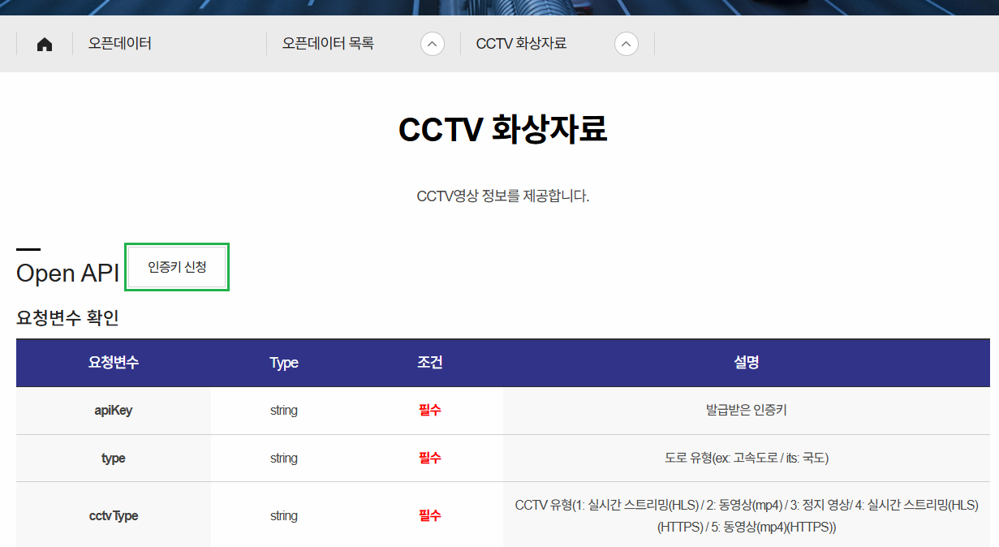


##### 마이페이지 확인

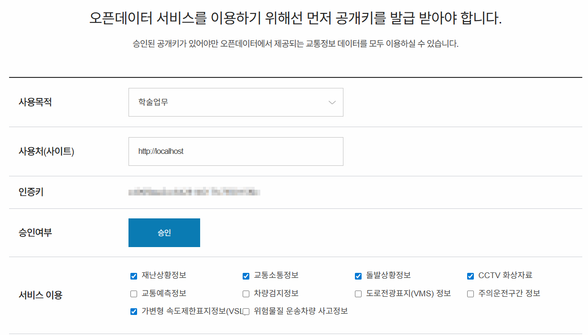


#### Visual Studio

##### WPF 프로젝트 생성


#### 동영상 플레이 라이브러리
- 실시간 스트리밍(HLS), 동영상(mp4) 모두 재생 가능한 라이브러리 필요
- WPF MediaElement - HLS 재생 어려움. mp4 가능. 이미지 별도
- WebView2 - HLS 확인필요. mp4 가능. 이미지 가능
- FFME - HLS, mp4 가능. 이미지 별도
- `LibVLCSharp`.WPF - HLC, mp4 가능. 이미지 별도

##### VLC 
- [링크](https://www.videolan.org/)
- VideoLAN Organization에서 제작한 크로스 플랫폼 멀티미디어 재생 툴
- 스트리밍, 동영상 재생, 이미지 로드 가능

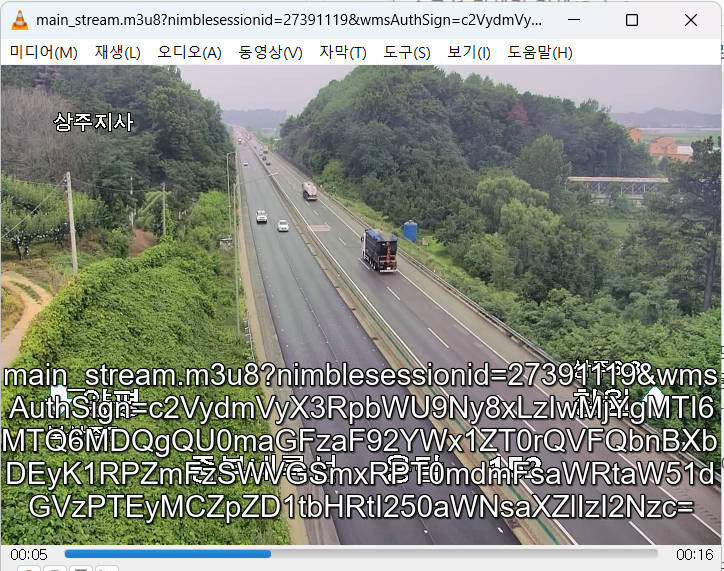

##### NuGet 패키지 설치
- Newtonsoft.Json
- LibVLCSharp.WPF
- VideoLAN.LibVLC.Windows
- Microsoft.Web.WebView2

### 화면 UI


#### 와이어프레임


### 기본 구현


#### 메인화면 디자인

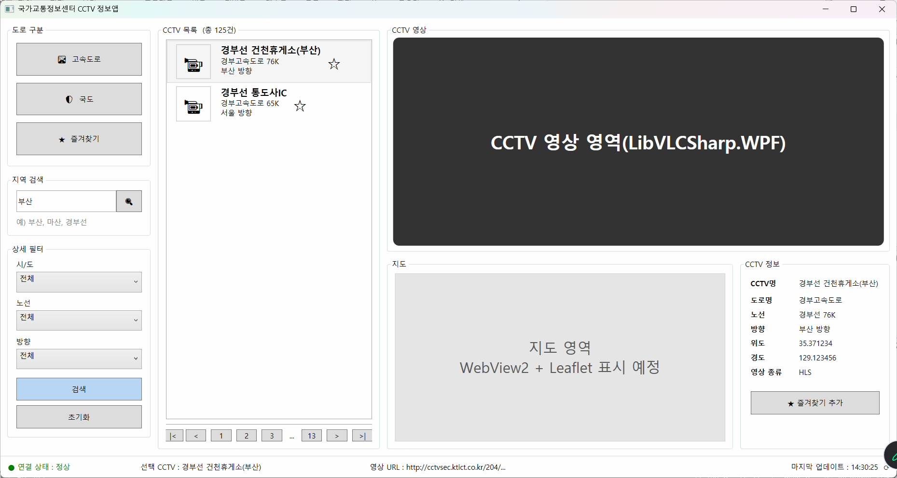


#### 앱 구조 설계
- Common - 공통 함수나 공통 변수 네임스페이스(폴더)
- Models - OpenAPI Json 데이터 구조 모델 클래스 네임스페이스
- Services - API 호출 및 데이터 처리 서비스 동작 클래스 네임스페이스


#### 앱 구조별 구현
- Common/AppCommon.cs - [소스](./toyproject/ToyProjects01/WpfCctvMonitorApp/Common/AppCommon.cs)
- Models/CctvInfo.cs - [소스](./toyproject/ToyProjects01/WpfCctvMonitorApp/Models/CctvInfo.cs)
- Services/ItsCctvService.cs - [소스](./toyproject/ToyProjects01/WpfCctvMonitorApp/Services/ItsCctvService.cs)

##### 화면에 VLC 라이브러리 추가
```xml
<!-- vlc 네임스페이스 추가 -->
<Window x:Class="WpfCctvMonitorApp.MainWindow"
        xmlns="http://schemas.microsoft.com/winfx/2006/xaml/presentation"
        xmlns:x="http://schemas.microsoft.com/winfx/2006/xaml"
        xmlns:d="http://schemas.microsoft.com/expression/blend/2008"
        xmlns:mc="http://schemas.openxmlformats.org/markup-compatibility/2006"
        xmlns:vlc="clr-namespace:LibVLCSharp.WPF;assembly=LibVLCSharp.WPF"
        ...>

...
<!-- CCTV 영상영역 border -->
<vlc:VideoView x:Name="VideoView" />
```

##### 기본 구현
- 로딩 후 스트리밍 테스트

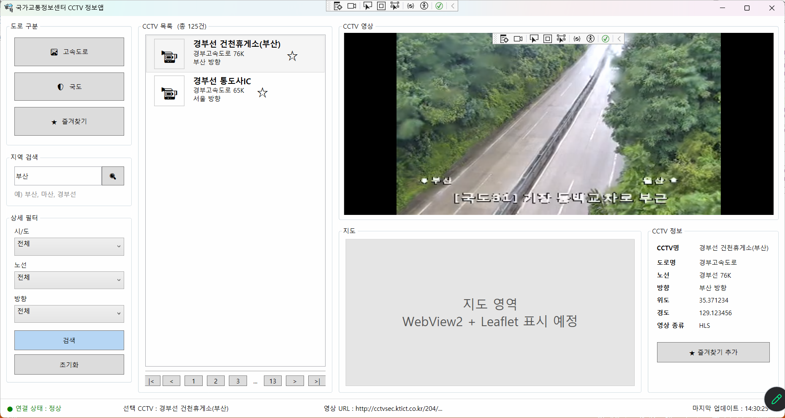


##### 비즈니스 로직에 구현
- type은 `실시간`, 동영상, 정지영상 모두 같은 CCTV를 표현하는 방법만 다름

0. App.config 에서 API key 로드
1. 고속도로/국도 선택
2. 지역 검색 - 지역별 최소/최대 위도, 최소/최대 경도 확인
    - 지역 선택으로 간결화
3. 상세필터 - 시/도로 최소/최대 위도와 경도 확인. (노선, 방향은 삭제)
4. 검색 - OpenAPI URL로 위경도 범위별 CCTV 조회
5. CCTV 목록 - 리스트
6. 리스트아이템 클릭 - CCTV 영상 플레이
7. 지도 영역 - CCTV 위치 지도 위 표시
8. CCTV 정보 - json 결과 추출 표시

##### App.config

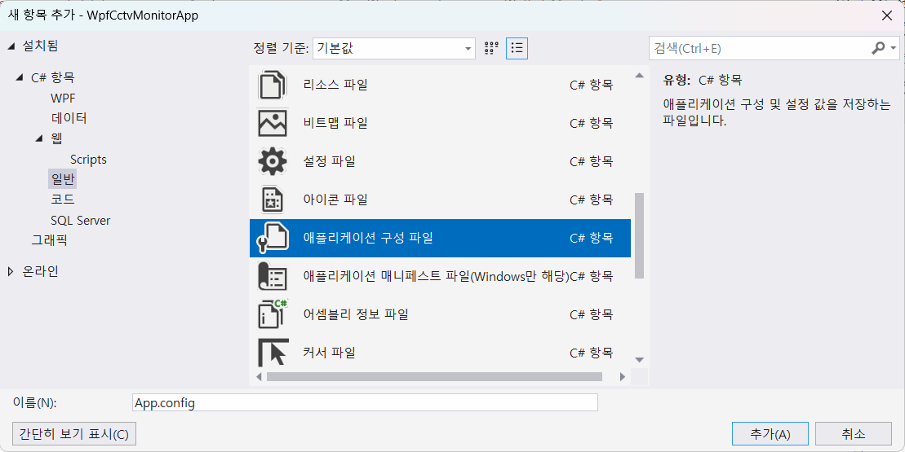

- xml로 구성된 파일
- [소스](./toyproject/ToyProjects01/WpfCctvMonitorApp/MainWindow.xaml.cs)

##### UI 변경
- CCTV 목록 페이징 삭제
- 지역 검색 삭제
- 시/도 선택 -> 지역 선택 변경
- 노선, 방향 선택 삭제

##### GeoBound 클래스 생성
- 지역 선택 시 최소, 최대 위도/경도를 할당해주는 클래스 - [소스](./toyproject/ToyProjects01/WpfCctvMonitorApp/Common/GeoBound.cs)
- 지역 선택 콤보박스에 로직 추가

##### 검색 버튼 작성
- BtnSearch 명명 및 로직 추가
- ItsCctvService.cs - [소스](./toyproject/ToyProjects01/WpfCctvMonitorApp/Services/ItsCctvService.cs)
- json 매핑 모델 클래스 - CctvResponse.cs - [소스](./toyproject/ToyProjects01/WpfCctvMonitorApp/Models/CctvResponse.cs)

##### 중간결과 화면
- 도로구분 선택, 지역 선택 후 검색. CCTV 리스트 개수 출력

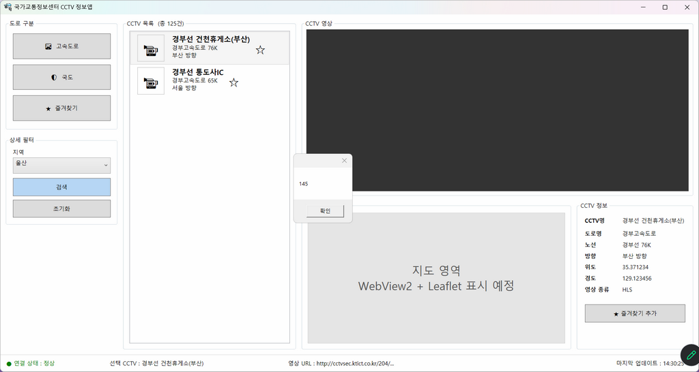

##### CCTV 목록아이템 템플렛
- ListBox 일반 ListBoxItem을 ListBox.ItemTemplate으로 변경
- 데이터 바인딩 {Binding CctvName}

- 국도 선택, 부산 선택 후 검색 결과

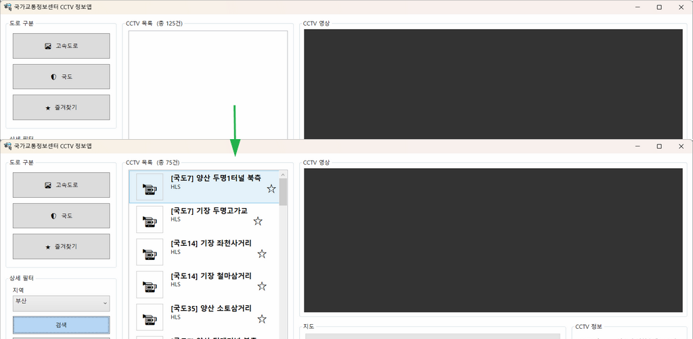

##### 리스트뷰 클릭 스트리밍 재생
- 클릭이벤트 생성 메시지창 출력

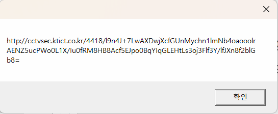

- LibVLCsharp.WPF에 전달. 스트리밍 플레이

##### 지도표시
- CefSharp(Chrominum) 웹브라우저는 설치용량이 큼
- WebView2(Edge runtime)이 상대적으로 용량 적음
- 브라우저 기능 전체 사용이 아닌 지도표시만 하면 WebView2가 적합

```xml
<Window x:Class="WpfCctvMonitorApp.MainWindow"
        ...
        xmlns:vlc="clr-namespace:LibVLCSharp.WPF;assembly=LibVLCSharp.WPF"
        xmlns:wv2="clr-namespace:Microsoft.Web.WebView2.Wpf;assembly=Microsoft.Web.WebView2.Wpf"
    ...
    <wv2:WebView2 x:Name="WvwMap" />
    ...
```
- WebView2 초기화 로직

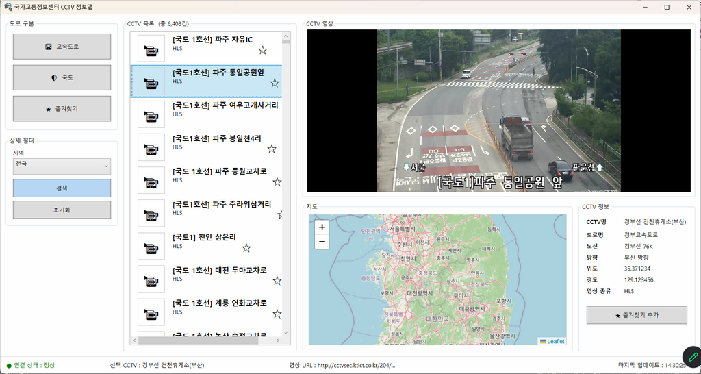

- 리스트뷰 아이템 클릭시 상세지도 마커표시

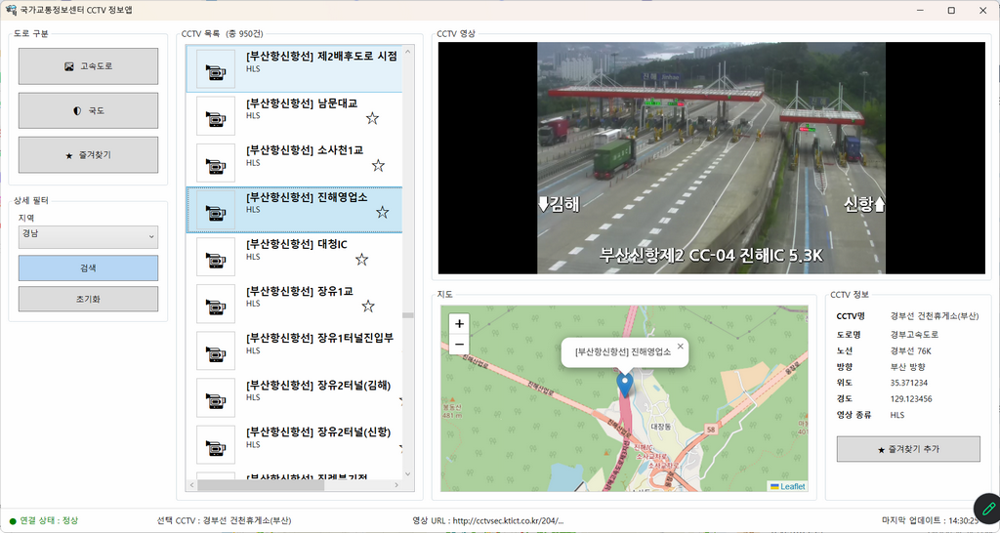

##### CCTV 상세정보
- CctvInfo 내용을 출력
- TextBlcok에 Text 속성에 할당

##### 상태표시줄 작업
- 연결상태 - 리스트박스아이템 선택 후 스트리밍이 상태따라 변경
    - 스트리밍 안 되면 예외처리
- 선택 CCTV - CCTVName 그대로 사용
- 영상 URL - 전체 표시 -> 생략 + 일부 표시
- 마지막 업데이트 - 제외

##### 종료시 메모리 해제
- 메모리 누수 발생 가능성 제거
- OnClosed() 이벤트 객체 해제로직 추가

##### 예외처리
- 아래 리스트 수정
    - [x] 지역선택없이 검색하면 프로그램 종료
    - [x] API Key 누락되었을 때
    - [x] VLC 재생 실패 감지

##### 실행시 화면 텍스트 초기화
- 아래 리스트 수정
    - [x] CCTV 목록 (총 125건)
    - [x] 연결 상태 : 정상
    - [x] 선택 CCTV : 경부선. ..
    - [x] 영상 URL : ...

##### 리팩토링(Refactoring)
- 프로그램 기능은 그대로 유지하면서 내부 구조를 더 좋게 개선
    - 중복코드 제거
    - 메서드 소스를 하위메서드 생성으로 간결화
    - 하드코딩 제거
    - 로직 효율화

- Visual Studio에서 `Ctrl + .`/ **Alt + Enter**로 리팩토링 쉽게 사용 가능

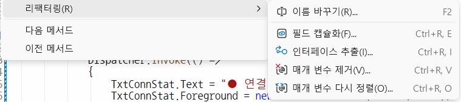

##### 초기화 버튼 기능
- 지역 선택 초기화
- 고속도로 기본 토글버튼
- CCTV 목록 제거, 건수 초기화
- 상태바 초기화
- 영상정지
- 지도 초기화


### UI 변경
- WPF UI
- Light/Dark theme


### Nuget Package 설치
- 도구 > Nuget Package 관리자 > 패키지 관리자 콘솔

```powershell
PM> Install-Package WPF-UI
```

- App.xaml 태그 코드 추가
- MainWindow.xaml 부모 클래스 FluentWindow로 변경
- Light 테마 적용

##### 변환 결과

##### 추가 수정
- [x] 제목표시줄 추가 - WPF Ui 특성
- [x] 메시지박스 변경

    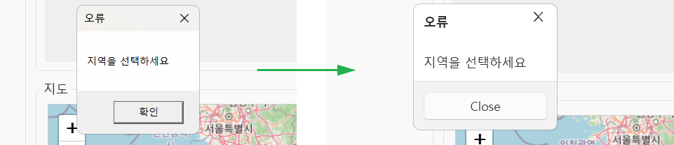

    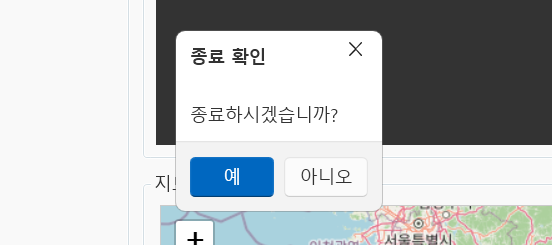

- [x] CCTV 정보 글자 잘라서 표기

    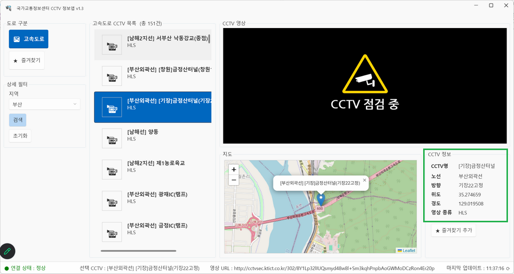

- [] 리스트박스 목록 크기, 텍스트, 즐겨찾기 정리

##### 프로그레스바
- 검색 후 리스트박스 항목 다 나오기 전까지 표시
- WPF UI 적용 후 반영

##### 즐겨찾기 읽어오기

---

### OpenAPI 래핑 웹서비스


#### 브릿지 웹서비스 구현


##### ASP.NET Core API 프로젝트

##### WPF 앱 필요 클래스 가져오기
- 네임스페이스 현재 이름으로 변경 필수
    - AppCommon.cs 불필요한 속성 제거
    - CctvInfo.cs
    - CctvResponse.cs
    - ItsCctvService.cs 수정

##### Program.cs에 서비스 등록
- ItsCctvService 등록

##### appsettings.json
- Its서비스키 추가

##### ApiController 추가
- ItsCctvController.cs 클래스 생성

##### 실행결과
- WPF 결과 -> json 구조 변경

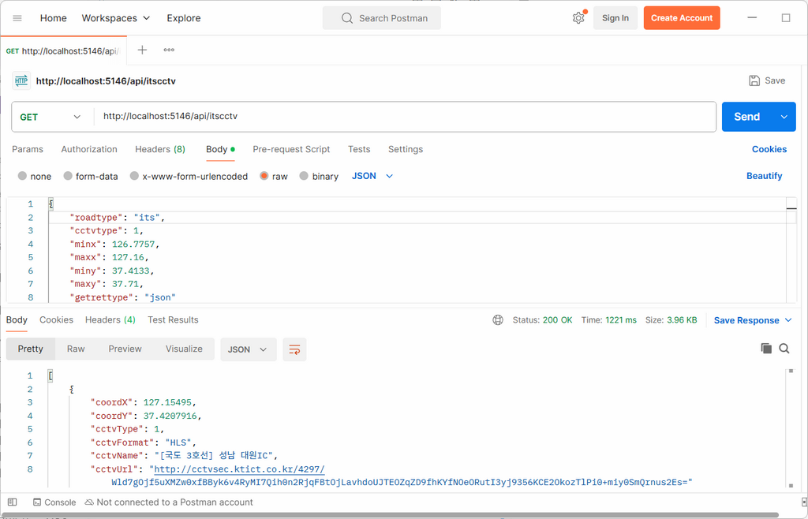


#### 이전 WPF 연계작업

##### API 웹서비스 CctvResultDto 가져오기
- WPF로 복사
- 오류 나는 부분들 전체 수정


#### 전체 다이어그램

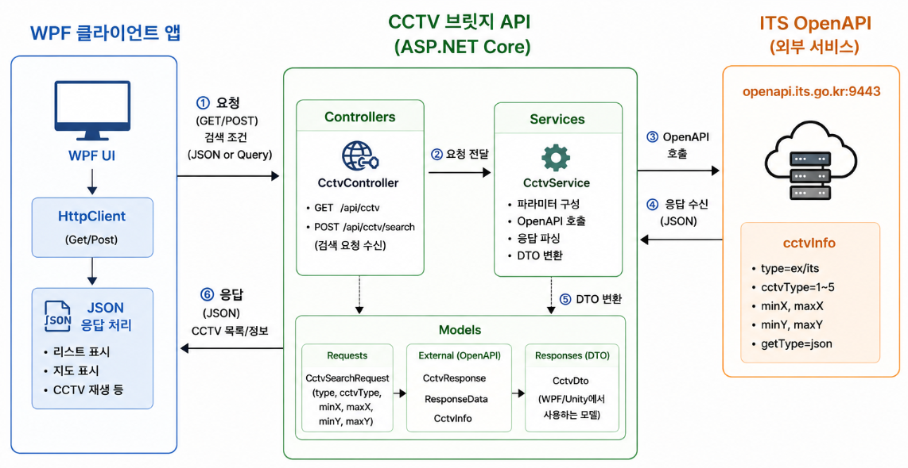


#### 사용기술

|구분|기술|
|---|---|
|윈앱 UI| WPF(.NET 10), WPF UI Framework|
|통신| HTTP(HTTPS 확장 가능) |
|데이터형식 | JSON, 직렬화, 역직렬화 |
|브릿지서버 | ASP.NET Core Web API |
|웹서버| Kestrel(크로스플랫폼 웹서버) |
|설정관리 | appsettings.json, App.config(XML) |
|서비스호출 | HttpClient |
|외부 API | ITS 국가교통정보센터 OpenAPI |
|API 방식 | REST API |
|웹아키텍처 | Model-Service-Controller Layer |


# [정리1]🚦 WpfCctvMonitorApp

**국가교통정보센터(ITS) Open API 기반 실시간 CCTV 모니터링 데스크톱 애플리케이션**

> C# / WPF 기반으로 전국 고속도로·국도 CCTV 스트리밍 영상을 지도와 함께 실시간으로 조회할 수 있는 트래픽 모니터링 툴입니다.

---

## 📌 프로젝트 개요

| 항목 | 내용 |
|---|---|
| 개발 기간 | 2026 (개인 프로젝트) |
| 플랫폼 | Windows Desktop (WPF, .NET) |
| 아키텍처 | Client(WPF) ↔ Bridge API(ASP.NET Core) ↔ ITS Open API |
| 주요 기능 | 지역별 CCTV 검색, 실시간 HLS 스트리밍 재생, 지도 마커 표시 |

---

## 🖥️ 주요 기능

- **지역별 CCTV 검색**: 전국 17개 시/도 단위로 위경도 범위(Bounding Box)를 설정해 고속도로/국도 CCTV 목록 조회
- **실시간 영상 스트리밍**: LibVLCSharp을 이용한 HLS(m3u8) 라이브 영상 재생
- **지도 연동**: WebView2 + Leaflet.js 기반으로 선택한 CCTV 위치를 지도에 마커로 표시
- **연결 상태 모니터링**: 스트리밍 연결 성공/실패를 실시간 UI로 표시 (정상/불량/미연결)
- **도로 타입 필터링**: 고속도로(ex) / 국도(its) 토글 스위치

---

## 🏗️ 아키텍처

```
┌─────────────────────┐     HTTP GET      ┌──────────────────────┐     HTTP GET      ┌─────────────────────┐
│  WpfCctvMonitorApp   │ ───────────────▶  │  ItsCctvBridgeApi     │ ───────────────▶  │  국가교통정보센터    │
│  (WPF Client)        │                   │  (ASP.NET Core)       │                   │  ITS Open API        │
│  - LibVLCSharp        │ ◀───────────────  │  - API Key 서버 보관  │ ◀───────────────  │                       │
│  - WebView2 + Leaflet │     JSON 응답      │  - 요청/응답 중계     │     XML/JSON       │                       │
└─────────────────────┘                   └──────────────────────┘                   └─────────────────────┘
```

**설계 의도**: ITS Open API 인증키를 클라이언트(WPF)에 노출시키지 않기 위해, 별도의 ASP.NET Core 브릿지 서버(`ItsCctvBridgeApi`)를 두어 API 키 관리와 외부 요청을 서버 단에서 전담하도록 분리했습니다.

---

## 🛠️ 기술 스택

**Client (WpfCctvMonitorApp)**
- C# / WPF (.NET)
- LibVLCSharp — HLS 영상 스트리밍 재생
- WebView2 — Leaflet.js 지도 렌더링
- Wpf.Ui — Fluent Design UI, 다크/라이트 테마
- Newtonsoft.Json — JSON 직렬화/역직렬화

**Server (ItsCctvBridgeApi)**
- ASP.NET Core Web API
- 국가교통정보센터(ITS) Open API 연동

---

## 🧩 트러블슈팅 & 배운 점

프로젝트 진행 중 겪은 대표적인 이슈와 해결 과정입니다.

1. **API 응답 구조 변경 대응**
   초기에는 서버가 문자열 URL(`GetCctvListAsync(string apiUrl)`)을 직접 호출하는 방식이었으나, API 키를 서버로 이전하며 요청 파라미터를 `CctvRequest` 객체로 캡슐화하는 방식(`GetBridgeApiAsync(CctvRequest request)`)으로 리팩터링. 이 과정에서 클라이언트-서버 간 메서드 시그니처 불일치로 인한 타입 변환 오류를 다수 디버깅.

2. **포트/엔드포인트 불일치 디버깅**
   개발 환경에서 서버 실행 포트가 launch profile에 따라 달라지는 문제를 겪으며, 클라이언트의 `baseUrl` 상수값과 서버 콘솔 로그(`Now listening on...`)를 대조하여 연결 거부(Connection Refused) 원인을 추적.

3. **XAML 파싱 오류 / 필드 선언 누락**
   불완전한 필드 선언으로 인한 XAML 파서 오류를 코드 비하인드와 XAML 간 바인딩 대조를 통해 원인 규명 및 수정.

4. **모델 리팩터링에 따른 연쇄 수정**
   `CctvInfo` → `CctvResultDto`로 데이터 모델을 교체하며, 이를 참조하는 모든 이벤트 핸들러(선택 이벤트, 상세정보 표시, 지도 마커 표시 등)의 타입을 일괄 점검·수정.

> 💡 이 프로젝트를 통해 **클라이언트-서버 간 계약(Contract) 변경 시 발생하는 연쇄적 영향을 추적하고 정합성을 맞추는 디버깅 역량**과, **민감정보(API Key)를 서버 사이드로 격리하는 아키텍처 설계 감각**을 기를 수 있었습니다.

---

## 🚀 실행 방법

1. `ItsCctvBridgeApi` 서버 프로젝트 실행 (콘솔에 표시되는 포트 확인)
2. `WpfCctvMonitorApp/Common/AppCommon.cs`의 `baseUrl`을 서버 포트에 맞게 설정
3. `WpfCctvMonitorApp` 실행
4. 지역 선택 → 도로 타입(고속도로/국도) 선택 → 검색 버튼 클릭
5. CCTV 목록에서 항목 선택 시 실시간 스트리밍 및 지도 마커 표시

---

## 📷 스크린샷

> _(포트폴리오 제출 시 실행 화면 캡처 삽입 예정)_

---

## 📝 향후 개선 방향

- [ ] CCTV 목록 페이징/무한스크롤 처리
- [ ] 스트리밍 재연결 로직 고도화 (자동 재시도)
- [ ] 브릿지 API 응답 캐싱으로 반복 조회 성능 개선
- [ ] 단위 테스트 추가 (Bridge API 서비스 레이어)


# [open api 없는 버전] ToyProjects01 - ITS CCTV 모니터링 앱

공공 ITS 교통정보 OpenAPI를 활용해 지역별 CCTV를 검색하고, 선택한 CCTV의 실시간 영상을 재생하며, 지도에서 위치와 상세 정보를 함께 확인할 수 있는 WPF 기반 데스크톱 애플리케이션입니다.

## 주요 기능

- 지역별 CCTV 검색
- 고속도로 / 국도 전환
- CCTV 목록 표시
- 선택한 CCTV 실시간 영상 재생
- WebView2 + Leaflet 기반 지도 마커 표시
- CCTV 상세 정보 표시
- 로딩창 및 연결 상태 표시

## 화면 구성

- 좌측
  - 도로 구분 선택
  - 지역 선택
  - 검색 / 초기화 버튼

- 중앙
  - CCTV 목록
  - CCTV 영상 재생 영역

- 우측 하단
  - 지도
  - CCTV 상세 정보

- 하단
  - 연결 상태
  - 선택한 CCTV 이름
  - 영상 URL
  - 마지막 업데이트 시간

## 동작 흐름

1. 사용자가 지역과 도로 구분을 선택합니다.
2. 검색 버튼을 누르면 해당 조건에 맞는 CCTV 목록을 조회합니다.
3. CCTV 목록이 화면에 표시됩니다.
4. 사용자가 목록에서 CCTV를 선택하면 영상이 재생됩니다.
5. 동시에 지도 마커와 상세 정보, 상태바가 함께 갱신됩니다.

## 기술 스택

- `WPF`
- `LibVLCSharp`
- `WebView2`
- `Leaflet`
- `Newtonsoft.Json`
- `.NET 10`, `C#`

## 구현 포인트

- `GeoBound`와 지역 목록을 이용해 검색 범위를 관리
- CCTV 이름을 정규식으로 분리해 노선명, CCTV명, 방향을 표시
- 선택한 CCTV URL을 `LibVLCSharp`으로 재생
- `WebView2` 내부의 Leaflet 지도로 CCTV 위치를 시각화
- 로딩창과 상태바를 넣어 사용자 피드백을 강화

## 포트폴리오 소개 문구

공공 ITS CCTV OpenAPI를 연동한 WPF 기반 모니터링 앱입니다. 지역 및 도로 구분별로 CCTV를 조회하고, 선택한 CCTV의 실시간 영상과 지도 위치, 상세 정보를 함께 확인할 수 있도록 구현했습니다.
