# 토이 프로젝트2

# WPF MVVM 기반 책 대여 관리 시스템

## 프로젝트 소개

WPF와 MVVM 패턴을 기반으로 도서, 장르, 회원 및 대여 정보를 관리하는 데스크톱 애플리케이션을 구현하였다.

`CommunityToolkit.Mvvm`을 활용하여 View와 ViewModel을 분리하고, 데이터 바인딩과 Command 방식으로 화면 동작을 처리하였다. 또한 MySQL과 연동하여 데이터 조회, 등록, 수정, 삭제 기능을 구현하고, 입력값 검증과 예외 처리를 적용하였다.

## 주요 기능

* 도서, 장르, 회원 및 대여 정보 관리
* MySQL 기반 데이터 조회·등록·수정·삭제
* MVVM 패턴 기반 View와 로직 분리
* `ContentControl`을 활용한 관리 화면 전환
* `ObservableProperty`를 활용한 데이터 변경 알림
* `RelayCommand`를 활용한 사용자 명령 처리
* MahApps.Metro 다이얼로그 적용
* 입력값 검증 및 예외 처리
* 데이터 선택 여부에 따른 삭제 버튼 활성화 제어

## 기술 스택

`C#` · `WPF` · `MVVM` · `CommunityToolkit.Mvvm` · `MahApps.Metro` · `MySQL` · `MySqlConnector` · `NLog`

> [책 대여 시스템 구현 내용 바로가기](#책-대여-시스템-mvvm)

---

## WPF MVVM 패턴 활용

### MVVM 패턴 개요

* MVC 패턴을 확장한 구조

  * 기존에는 C++, C#, WinForms 등에서 MVC 패턴을 주로 사용하였다.
  * 팀 개발 시 디자인 작업과 개발 작업을 분리하여 협업 효율을 높일 수 있다.
  * 유지보수 시 구분된 계층만 수정할 수 있다는 장점이 있다.
  * 구조가 복잡해져 초기 구현 난도가 높아질 수 있다.

* MVVM은 `Model-View-ViewModel`로 구성된다.

  * ViewModel은 단순히 MVC의 Controller를 대체하는 요소가 아니다.
  * 사용자의 동작은 View에서 시작되지만, 실제 처리는 ViewModel에서 수행한다.
  * View에 해당하는 `.xaml.cs` 파일에는 가능한 한 화면 로직을 작성하지 않는다.
  * 버튼 클릭이나 키보드 입력 등의 이벤트는 `Command`를 통해 ViewModel로 전달한다.
  * 데이터 바인딩 상태에 따라 디버깅이 어려울 수 있다.

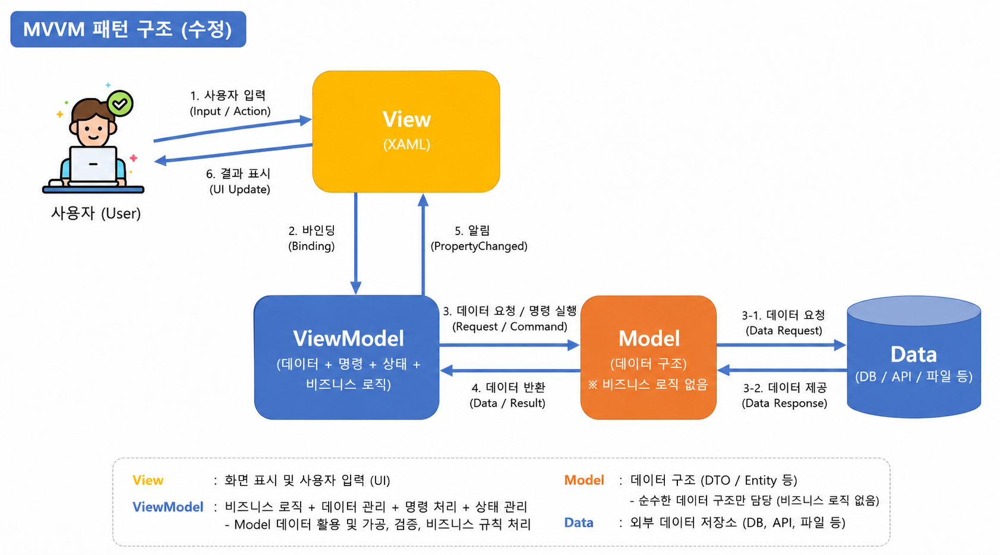

### MVVM 라이브러리

MVVM 라이브러리는 속성 변경 알림과 Command 구현 등을 간단하게 처리할 수 있도록 도와준다.

* `CommunityToolkit.Mvvm`

  * Microsoft에서 개발
  * 일반적으로 많이 사용
  * 학습 난도가 낮은 편

* `Prism`

  * Microsoft 관련 생태계에서 사용
  * 중대형 비즈니스 애플리케이션에 적합
  * 학습 난도가 높은 편

* `Caliburn.Micro`

  * 비교적 간단한 MVVM 프레임워크
  * 학습 난도가 낮은 편

* `Avalonia`

  * 크로스 플랫폼 UI 프레임워크
  * Windows, Linux, macOS 등을 지원
  * 학습 난도가 중간 정도

---

### MVVM 초간단 예제

* `CommunityToolkit.Mvvm` 패키지 설치
* `Models`, `Views`, `ViewModels` 폴더 생성

#### Model 작성

```cs
namespace WpfMvvm01.Models
{
    public class Person
    {
        public string Name { get; set; }
    }
}
```

#### ViewModel 작성

```cs
using CommunityToolkit.Mvvm.ComponentModel;

namespace WpfMvvm01.ViewModels
{
    // ObservableObject를 통해 객체 속성 변경 추적
    // partial 키워드를 사용하여 자동 생성 코드와 결합
    public partial class MainViewModel : ObservableObject
    {
        [ObservableProperty]
        private string message = "안녕하세요.";
    }
}
```

#### View 생성

* `Views/MainView.xaml` 생성

#### App.xaml 수정

* `StartupUri` 속성 삭제
* `App.xaml.cs`에 생성자 추가

```cs
public App()
{
    MainView view = new MainView();

    // View의 전체 데이터를 관리하는 DataContext에 ViewModel 할당
    view.DataContext = new MainViewModel();
    view.Show();
}
```

#### MainView.xaml 수정

```xml
<TextBox
    FontSize="30"
    Text="{Binding Message}" />
```

* `INotifyPropertyChanged` 인터페이스의 `PropertyChanged` 이벤트를 통해 속성 변경 내용이 화면에 반영된다.

#### 실행 결과

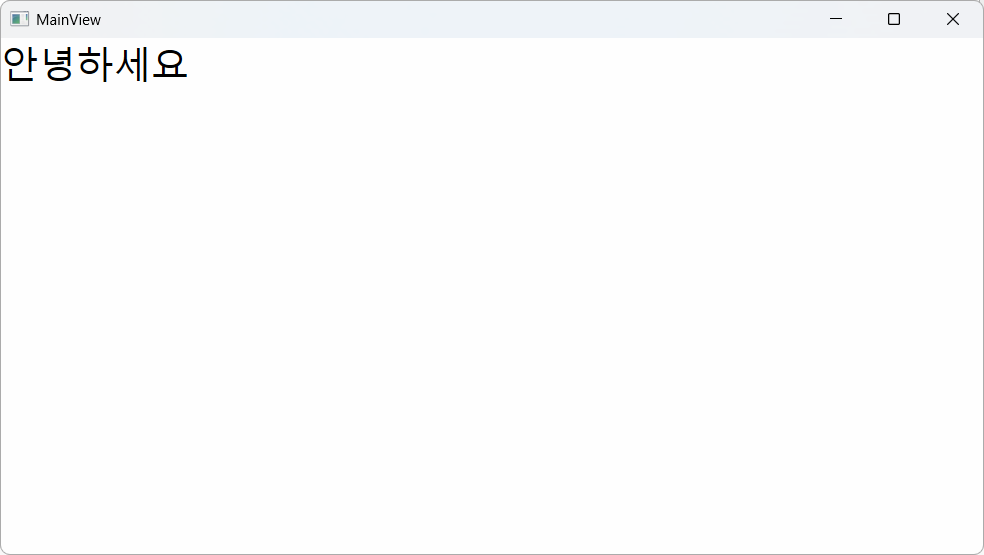

#### ViewModel에 버튼 클릭 로직 추가

MVVM에서는 View의 `Click` 이벤트 대신 `Command`를 사용하여 사용자 동작을 처리한다.

```cs
public partial class MainViewModel : ObservableObject
{
    // 기존 속성 코드 생략

    [RelayCommand]
    private void ChangeMessage()
    {
        Message = "버튼 클릭!!!";
    }
}
```

#### View에 버튼 추가

* ViewModel의 `RelayCommand` 메서드 이름 뒤에 `Command`를 붙여 바인딩한다.
* 비동기 메서드 이름의 `Async`는 생성되는 Command 이름에서 생략된다.

```text
ChangeMessageAsync → ChangeMessageCommand
```

```xml
<Button
    Content="변경"
    Command="{Binding ChangeMessageCommand}" />
```

#### 실행 결과

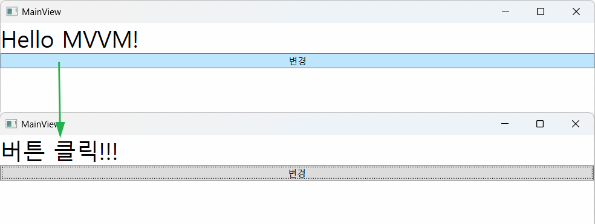

* View는 UI 설계에 따라 속성과 Command를 바인딩한다.
* ViewModel은 화면에 표시할 속성과 사용자의 명령을 처리한다.
* 속성은 `ObservableProperty`, 명령은 `RelayCommand`를 활용하여 작성한다.

#### 양방향 바인딩

View에서 입력한 데이터를 ViewModel로 전달하고, 다시 다른 View에 표시하기 위해 양방향 바인딩을 사용한다.

```xml
<TextBox
    FontSize="30"
    Text="{Binding Message,
           UpdateSourceTrigger=PropertyChanged}" />

<TextBlock
    FontSize="30"
    Foreground="Blue"
    Text="{Binding Message}" />
```

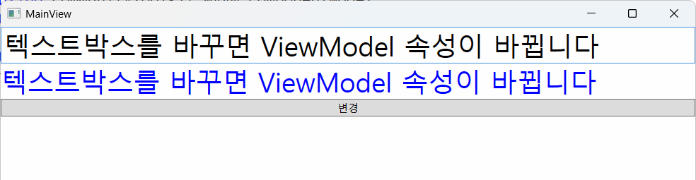

#### ListView 데이터 바인딩

ViewModel에 `ObservableCollection`을 사용하여 목록 데이터를 구성하였다.

```cs
public ObservableCollection<Person> People { get; } =
[
    new Person { Name = "홍길동" },
    new Person { Name = "가나디" },
    new Person { Name = "고먀미" },
    new Person { Name = "박소영" },
];
```

View에 `ListView` 컨트롤을 추가하고 `People` 속성을 바인딩하였다.

```xml
<ListView ItemsSource="{Binding People}">
    <ListView.ItemTemplate>
        <DataTemplate>
            <TextBlock
                Text="{Binding Name}"
                FontSize="20" />
        </DataTemplate>
    </ListView.ItemTemplate>
</ListView>
```

ViewModel에 선택된 항목을 저장할 속성을 추가하였다.

```cs
[ObservableProperty]
private Person? selectedPerson;
```

`ListView`에서 선택한 항목을 `SelectedPerson`에 바인딩한다.

```xml
<ListView
    ItemsSource="{Binding People}"
    SelectedItem="{Binding SelectedPerson}" />
```

선택한 사람의 이름을 화면에 표시한다.

```xml
<TextBlock
    FontSize="20"
    Foreground="CadetBlue"
    Text="{Binding SelectedPerson.Name}" />
```

#### 실행 화면

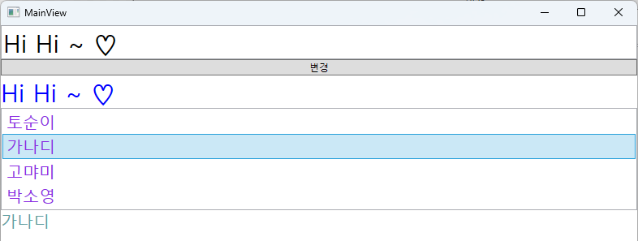

---

## 책 대여 시스템 MVVM

[맨 위로 이동](#토이-프로젝트)

### 필요 패키지

* `CommunityToolkit.Mvvm`
* `MahApps.Metro`
* `MahApps.Metro.IconPacks`
* `MySqlConnector`
* `NLog`

### MahApps.Metro 디자인 적용

* `App.xaml`에 MahApps.Metro 리소스 추가
* 애플리케이션의 기본 디자인을 Metro 스타일로 설정

### 패턴 폴더 생성

```text
Models
Views
ViewModels
```

### MVVM 패턴에서 다이얼로그 처리

MVVM 패턴에서는 ViewModel에서 MahApps.Metro의 `this.ShowMessageAsync()` 메서드를 직접 사용할 수 없다.

이를 해결하기 위해 `DialogCoordinator`를 ViewModel에 전달하여 다이얼로그를 호출하였다.

#### App.xaml.cs 수정

`MainViewModel` 객체 생성 시 `DialogCoordinator.Instance`를 전달한다.

```cs
view.DataContext =
    new MainViewModel(DialogCoordinator.Instance);
```

#### MainViewModel 생성자 추가

```cs
private readonly IDialogCoordinator _coordinator;

public MainViewModel(IDialogCoordinator coordinator)
{
    title = "BookRentalShop v1.1";
    _coordinator = coordinator;
}
```

#### ViewModel에서 다이얼로그 호출

```cs
[RelayCommand]
public async Task AppExitAsync()
{
    await _coordinator.ShowMessageAsync(
        this,
        "종료 확인",
        "종료하시겠습니까?");
}
```

#### MainView.xaml 설정

`mah:MetroWindow` 태그에 `DialogParticipation.Register` 속성을 추가한다.

```xml
<mah:MetroWindow
    x:Class="WpfMvvm02.Views.MainView"
    Title="{Binding Title}"
    Height="550"
    Width="1000"
    mah:DialogParticipation.Register="{Binding}">
```

#### 실행 결과

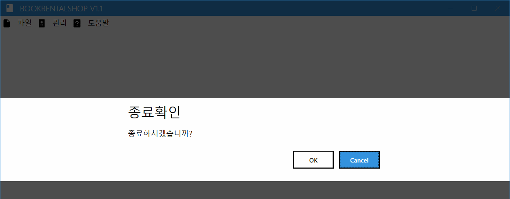

---

### 메인 영역 화면 전환

WPF에서는 화면 구성 방식에 따라 다른 컨트롤을 사용할 수 있다.

* `Page` 화면 전환: `Frame` 사용
* `UserControl` 화면 전환: `ContentControl` 사용

책 대여 관리 시스템에서는 `UserControl`로 각각의 관리 화면을 만들고, `ContentControl`을 이용하여 화면을 전환하였다.

#### MainView 화면

```xml
<!-- 메인 영역: 장르 관리, 도서 관리, 회원 관리, 대여 관리 -->
<ContentControl
    Grid.Row="1"
    Content="{Binding CurrentView}" />
```

#### MainViewModel 클래스

```cs
[ObservableProperty]
private UserControl currentView;
```

`ObservableProperty`를 통해 `CurrentView` 속성이 자동 생성된다.

#### MainView 메뉴 Command 추가

```xml
<MenuItem
    Header="책장르"
    Command="{Binding ShowDivisionCommand}" />
```

#### MainViewModel 화면 전환 메서드

```cs
[RelayCommand]
public void ShowDivision()
{
    var view = new DivisionView
    {
        DataContext =
            new DivisionViewModel(DialogCoordinator.Instance)
    };

    CurrentView = view;
}
```

#### 실행 결과

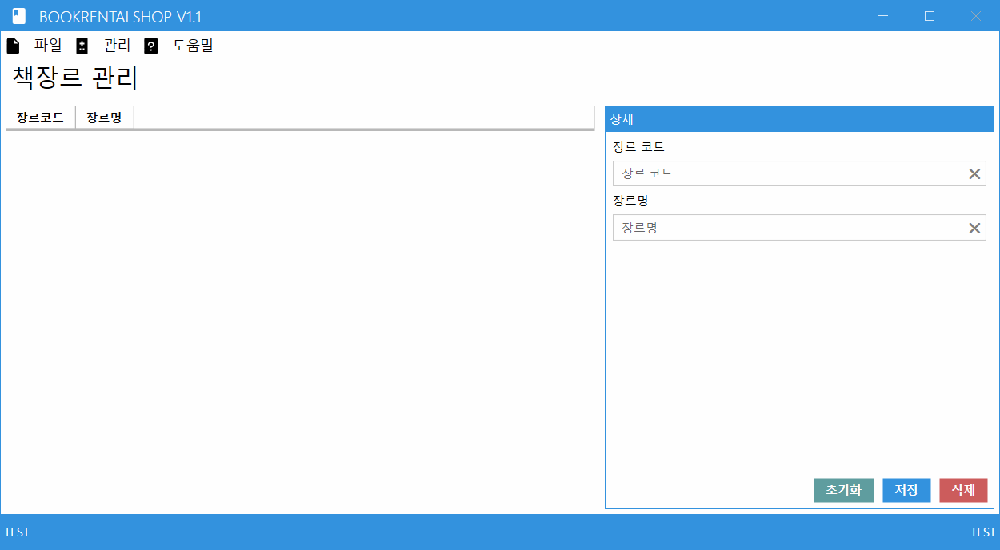

---

### 관리 화면 추가

기존 View와 ViewModel의 구조를 활용하여 장르, 도서, 회원 및 대여 관리 화면을 추가하였다.

1. View XAML 파일 복사
2. 파일명과 클래스명 변경
3. ViewModel 클래스 복사
4. ViewModel 파일명과 클래스명 변경
5. MainView에 메뉴 Command 추가
6. MainViewModel에 화면 전환 메서드 추가

```text
DivisionView
BookView
MemberView
RentalView
```

---

### 데이터 수정 후 화면에 변경 내용이 표시되지 않는 오류

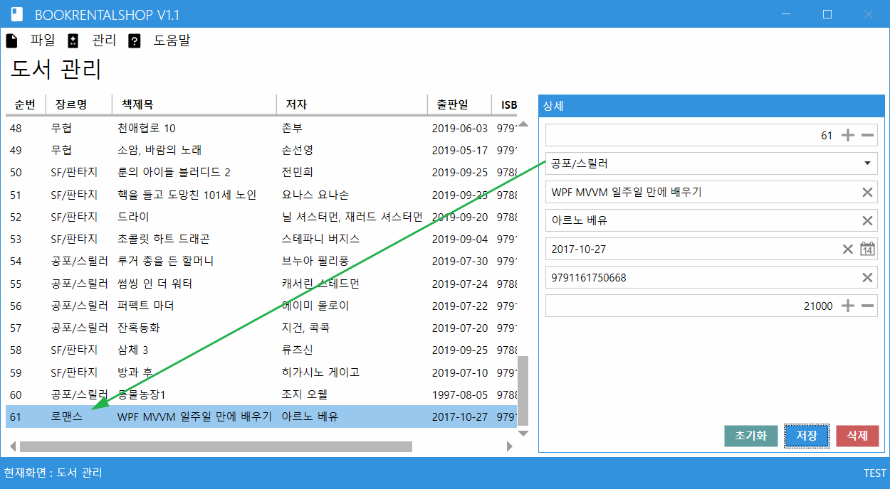

#### 문제 상황

도서 데이터를 수정한 후 저장했지만, 변경된 내용이 화면에 즉시 반영되지 않는 문제가 발생하였다.

#### 원인

* ComboBox에 바인딩된 데이터 선택 시 바인딩 모드 확인 필요
* ViewModel의 `ObservableCollection` 초기화 시점 오류
* DB 데이터를 불러오기 전에 컬렉션을 잘못 초기화함
* 저장 이후 목록 데이터 갱신이 정상적으로 수행되지 않음

#### ComboBox 데이터 바인딩

```xml
<ComboBox
    Grid.Row="1"
    Margin="3"
    mah:TextBoxHelper.Watermark="장르명"
    ItemsSource="{Binding Divisions}"
    SelectedValuePath="DivCode"
    DisplayMemberPath="DivName"
    SelectedValue="{Binding SelectedBook.DivCode,
                            UpdateSourceTrigger=PropertyChanged}" />
```

* `SelectedValue`의 기본 바인딩 모드는 `TwoWay`이다.
* 상황에 따라 `UpdateSourceTrigger=PropertyChanged`는 생략할 수 있다.
* TextBox의 `Text` 속성도 기본적으로 `TwoWay` 방식으로 값을 전달한다.

#### 해결

* `ObservableCollection` 초기화 시점 수정
* DB 데이터 조회 이후 컬렉션 구성
* 저장 이후 목록 데이터 재조회
* 선택 객체와 입력 컨트롤의 바인딩 상태 점검

---

### 등록 및 삭제 기능 추가

#### 데이터 저장

`BookIdx` 값을 기준으로 신규 등록과 수정을 구분하였다.

```text
BookIdx == 0 → 신규 데이터 등록
BookIdx > 0  → 기존 데이터 수정
```

#### 초기화 기능

새로운 도서를 입력할 수 있도록 `SelectedBook` 객체를 초기화하였다.

```cs
SelectedBook = new Book();
```

#### 입력값 검증

잘못된 데이터가 저장되는 것을 방지하기 위해 저장 전에 입력값을 검증하였다.

* 장르 선택 여부
* 도서명 입력 여부
* 저자 입력 여부
* 가격 범위 확인

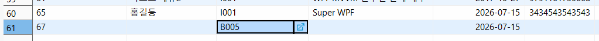

---

### 삭제 기능

삭제 전 사용자에게 확인 메시지를 표시하고, 다이얼로그 버튼의 문구를 변경하였다.

```cs
var settings = new MetroDialogSettings
{
    AffirmativeButtonText = "삭제",
    NegativeButtonText = "취소"
};
```

선택된 도서가 없을 때는 삭제 버튼 자체를 비활성화하도록 구현하였다.

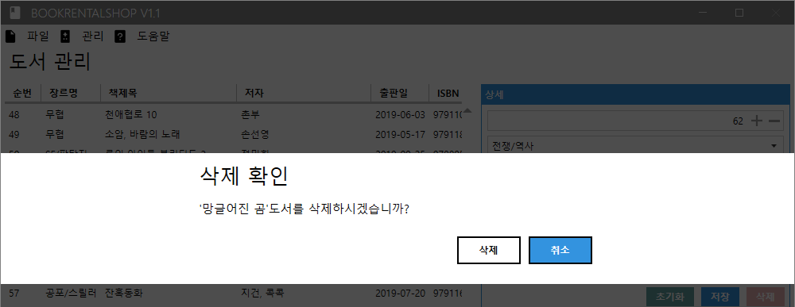

#### 삭제 Command 활성화 조건

```cs
[ObservableProperty]
[NotifyCanExecuteChangedFor(nameof(DeleteCommand))]
private Book selectedBook;

[RelayCommand(CanExecute = nameof(CanDelete))]
public async Task DeleteAsync()
{
    // 삭제 처리
}

private bool CanDelete()
{
    return SelectedBook is { BookIdx: > 0 };
}
```

* `SelectedBook`이 변경되면 `DeleteCommand`의 실행 가능 여부를 다시 확인한다.
* 실제 DB에 저장된 도서가 선택된 경우에만 삭제 버튼이 활성화된다.

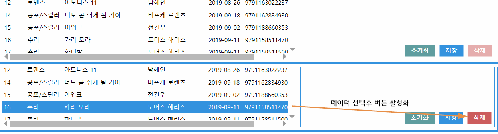

---

### 예외 처리

다음 문제에 대한 예외 처리를 적용하였다.

* 저장 버튼만 클릭했을 때 프로그램이 종료되는 문제
* 입력 검증 시 컨트롤마다 메시지창이 반복해서 표시되는 문제

#### 저장 버튼 클릭 시 종료되는 문제

* `SelectedBook`이 초기화되지 않은 상태에서 속성에 접근
* 입력 데이터가 없는 상태에서 DB 저장 로직 실행
* Null 객체에 대한 예외 처리 부족

다음과 같이 개선하였다.

* `SelectedBook` 기본 객체 생성
* 저장 전 Null 여부 확인
* 입력 검증 메서드 추가
* DB 처리 로직에 예외 처리 적용

#### 입력 검증 메시지 중복 문제

각 항목마다 메시지창이 연속으로 표시되지 않도록 첫 번째 오류가 발생하면 즉시 검증을 종료하였다.

```cs
private bool ValidateBook()
{
    if (string.IsNullOrWhiteSpace(SelectedBook.DivCode))
    {
        _coordinator.ShowMessageAsync(
            this,
            "입력 확인",
            "책 장르를 선택하세요.");

        return false;
    }

    if (string.IsNullOrWhiteSpace(SelectedBook.BookName))
    {
        _coordinator.ShowMessageAsync(
            this,
            "입력 확인",
            "책 제목을 입력하세요.");

        return false;
    }

    if (string.IsNullOrWhiteSpace(SelectedBook.Author))
    {
        _coordinator.ShowMessageAsync(
            this,
            "입력 확인",
            "저자를 입력하세요.");

        return false;
    }

    if (SelectedBook.Price <= 0)
    {
        _coordinator.ShowMessageAsync(
            this,
            "입력 확인",
            "가격은 0원보다 커야 합니다.");

        return false;
    }

    return true;
}
```

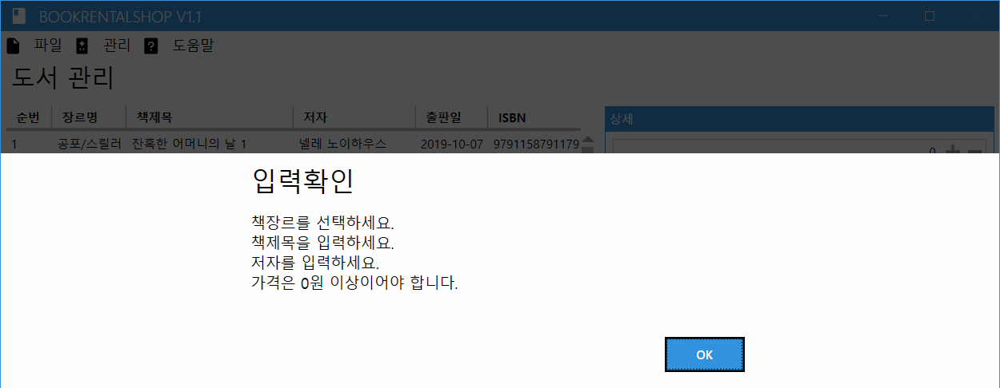

---

## 학습 결과

* MVVM 패턴에서 Model, View, ViewModel의 역할을 구분하였다.
* View의 이벤트 대신 Command를 이용하여 사용자 동작을 처리하였다.
* 데이터 바인딩을 활용하여 View와 ViewModel의 데이터를 연결하였다.
* `ObservableProperty`와 `ObservableCollection`을 활용하여 데이터 변경을 화면에 반영하였다.
* `ContentControl`을 이용해 여러 관리 화면을 전환하였다.
* MahApps.Metro의 `DialogCoordinator`를 ViewModel에 적용하였다.
* MySQL과 연동하여 조회, 등록, 수정, 삭제 기능을 구현하였다.
* `CanExecute`를 활용하여 현재 상태에 따라 버튼 활성화 여부를 제어하였다.
* 입력값 검증과 예외 처리를 통해 프로그램의 안정성을 개선하였다.

[맨 위로 이동](#토이-프로젝트)