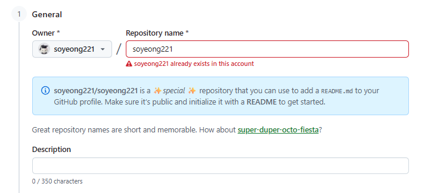

# 토이 프로젝트 3

## GitHub 프로필 꾸미기

### 프로젝트 소개

GitHub 프로필을 구성하기 위해 프로필 저장소를 생성하고, README를 활용하여 자기소개와 기술 스택을 정리하였다. 또한 다양한 오픈소스 배지와 아이콘을 적용하여 가독성과 시각적인 완성도를 높였다.

### 주요 내용

* GitHub 프로필(README) 저장소 생성
* Capsule Render를 활용한 프로필 배너 제작
* 기술 스택 아이콘 및 배지 적용
* Markdown을 활용한 프로필 레이아웃 구성
* GitHub 통계 및 배지 활용

### 사용 사이트

| 구분            | 사이트                                 |
| ------------- | ----------------------------------- |
| 프로필 배너        | https://capsule-render.vercel.app   |
| 기술 아이콘        | https://icons8.com                  |
| Shields Badge | https://img.shields.io              |
| Simple Icons  | https://simpleicons.org             |
| GitHub 배지     | https://github.com/Younesfdj/gitfut |

---

### GitHub 프로필 저장소 생성

* GitHub 아이디와 동일한 이름의 Repository 생성
* `README.md`를 작성하면 프로필 메인 화면에 표시

### Capsule Render

* Capsule Render를 활용하여 프로필 배너 제작
* 색상, 폰트, 애니메이션 등을 설정하여 헤더 구성

### 기술 스택 구성

* Icons8, Simple Icons, Shields.io를 활용하여 기술 스택 아이콘 및 배지 적용
* Markdown과 HTML을 함께 사용하여 레이아웃 구성

### GitHub 배지

* GitHub 활동을 시각적으로 표현하는 배지를 적용
* GitFut(World Cup Style Badge)를 활용하여 프로필을 꾸밈
