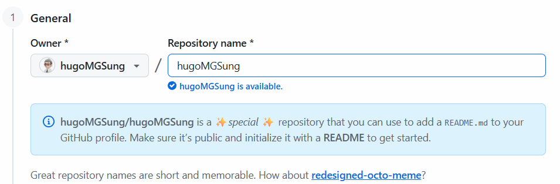

# 토이 프로젝트 3

## 깃허브 대문 작성

### 깃허브 리포지토리 생성
- 자신의 아이디와 동일한 이름으로 생성

### 캡슐 렌더 제너레이터 사용
- https://capsule-render.vercel.app/

### 기본 프로필 작성
- 생략

### 기술스택 아이콘

#### 방법 1
- https://icons8.com/   사용 언어, 기술에 대한 아이콘 겁색

#### 방법 2
- https://img.shields.io/docs/logos
- https://simpleicons.org/

#### 기술명세
- 테이블로 생성

### 월드컵 스타일 뱃지
- https://github.com/Younesfdj/gitfut