# 토이 프로젝트 4

출처 : 자바 스프링부트 프로젝트와 파이썬 AI 프로젝트 연결하기(허진경 / 부크크)

## FastAPI 기반 AI 비전검사 및 실시간 모니터링 시스템

### 프로젝트 소개

FastAPI 기반 AI 서버와 ASP.NET Core 웹 서버를 연동하여 이미지 및 실시간 영상 객체 인식 시스템을 구현하였다.

YOLO 기반 객체 인식 모델을 활용하여 이미지, 웹캠, 동영상의 객체를 인식하고, MQTT(WebSocket)를 이용해 객체 인식 결과를 실시간으로 웹에 스트리밍하였다. 또한 화재·연기 감지 모델을 적용하여 실시간 모니터링 및 알람 시스템을 구현하였다.

### 주요 기능

- FastAPI 기반 AI REST API 서버 구축
- ASP.NET Core와 Python AI 서버 연동
- YOLO 기반 이미지 객체 인식
- 웹캠 및 동영상 실시간 객체 인식
- MQTT(WebSocket) 기반 실시간 스트리밍
- 객체 인식 결과 실시간 웹 모니터링
- 화재·연기 감지 및 알람 시스템 구현

### 기술 스택

`Python` · `FastAPI` · `YOLO` · `OpenCV` · `PyTorch` · `ASP.NET Core` · `MQTT` · `WebSocket` · `Uvicorn`

### 프로젝트 구조

```text
ASP.NET Core Web
        │
 REST API 요청
        ▼
 FastAPI
        │
YOLO + OpenCV
        │
객체 인식 결과 반환
        ▼
 MQTT(WebSocket)
        │
실시간 스트리밍
        ▼
웹 모니터링 / 화재·연기 감지
```

### 빠른 이동

- [Python WebAPI 서비스](#python-webapi-서비스)
- [Python AI 물체인식](#python-ai-물체인식)
- [ASP.NET Core WebSite](#aspnet-core-website)
- [동영상·웹캠 실시간 객체인식](#동영상-웹캠-실시간-객체인식)
- [화재·연기 감지 알람시스템](#화재연기-감지-알람시스템)

---

## AI 비전검사 시스템

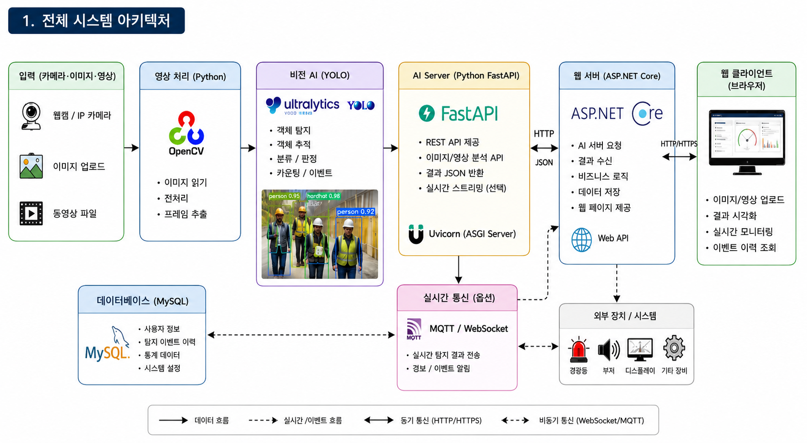

### Python WebAPI 서비스

- Python 웹 라이브러리/프레임워크
    - Flask - 가볍고 필요한 기능만 제공하는 소규모 프로젝트용 웹. 난이도 중
    - `FastAPI` - REST API에 최적화 된 웹. 매우 빠름, 난이도 중
    - Django - 모든 기능을 제공하는 대형 프레임워크. 난이도 상
    - Pyramid - 중대형 프로젝트용 프레임워크. 난이도 상
    - Falcon - REST API 전용
    - Bottle - 초경량. 난이도 하

- 웹 서버(실행 서버)
    - `Uvicorn` - FastAPI 실행 서버

#### 파이썬 가상환경 설치

- 프로젝트 루트 폴더(디렉토리)에 가상환경 설치

```powershell
> python -m venv venv
> .\venv\Scripts\activate.ps1
```

- .gitignore에 python 관련 설정 추가

#### 기본 패키지 설치

```powershell
> pip install fastapi uvicorn
```

#### FastAPI 기본

- 기본 서버 : [소스](./toyproject/ToyProjects04/pythonAi/main01.py)

- 서버실행 1

```powershell
> fastapi dev main01.py
```

- `서버실행 2`

```powershell
> uvicorn main01:app --reload [--port 8000]
```

- `서버실행 3` - 디버깅까지 가능함. 파이썬 소스에 main 엔트리 로직 추가

```powershell
> python main01.py
```

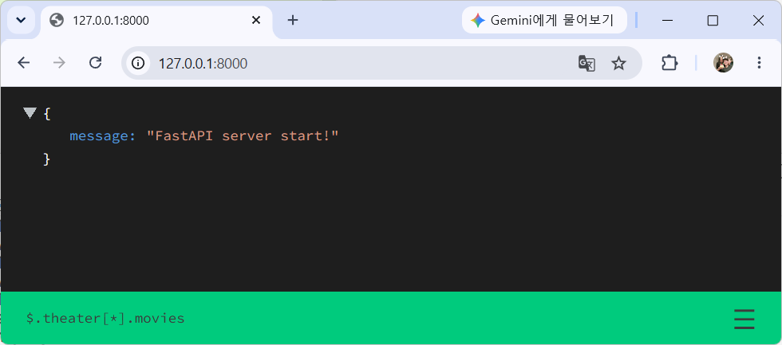

#### FastAPI docs

- Swagger UI - PostMan과 동일한 기능 웹페이지
- http://127.0.0.1:8000/docs
    
#### Get Method 처리 API 

- Get method : [소스](./toyproject/ToyProjects04/pythonAi/main02.py)

#### FastAPI 디버그모드

- 아래 코드 추가 후 디버깅 시작으로 실행
- 디버깅 가능

```python
import uvicorn

if __name__ == '__main__':
    uvicorn.run('main02:app', host='127.0.0.1', port=8000, reload=True)
```

#### 쿼리스트링

- URL 뒤 ?변수명=값&변수명=값 : [소스](./toyproject/ToyProjects04/pythonAi/main03.py)

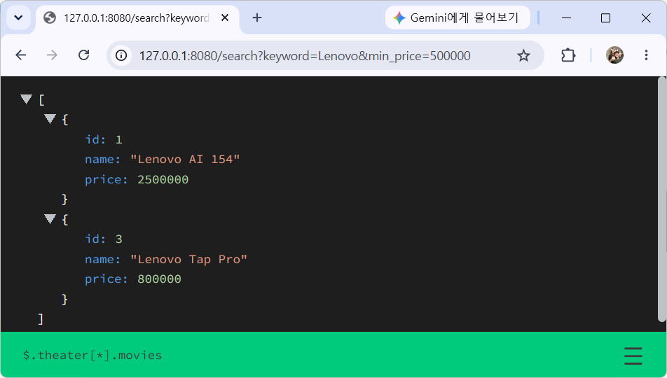

#### Pydantic 모델 사용

- POST 요청으로 JSON을 데이터를 받을때 사용하는 모델 패키지. C# Newtonsoft.Json과 동일한 역할 : [소스](./toyproject/ToyProjects04/pythonAi/main04.py)


- 데이터 입력시 Validation 체크 

```json
{
  "id": 4,
  "name": "Test",
  "price": 1000
}
```

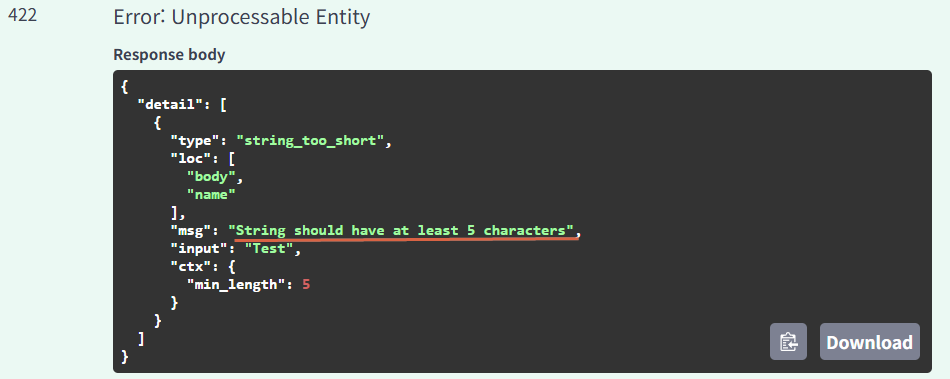

- products 배열(리스트)에 제품 등록


#### Put/Delete 메서드 처리 API

- 나중에...

### Python AI 물체인식

- OpenCV + PyTorch + YOLO

```powershell
(venv) PS > pip install opencv-python
(venv) PS > nvidia-smi
----------------------------------------+
...              CUDA Version: 13.1     |
-----------------+----------------------+

(venv) PS > pip install torch torchvision --index-url https://download.pytorch.org/whl/cu130
(venv) PS > pip install ultralytics
(venv) PS > pip install python-multipart
```

#### 기본 API 서비스 

- 비전용 FastAPI 서비스 - [소스](./toyproject/ToyProjects04/pythonAi/main05.py)

#### 기본 이미지 출력

```python
@app.get('/')
async def root():
    image = Image.open('./test01.png')  # PILLOW 패키지로 이미지오픈 메모리업로드

    return FileResponse('./test01.png', media_type='image/png')
```


#### Pillow 오픈 뒤 전송

```python
@app.get('/')
async def root():
    image = Image.open('./test01.png')  # PILLOW 패키지로 이미지오픈 메모리 업

    buffer = BytesIO()
    image.save(buffer, format='PNG')
    buffer.seek(0)

    return StreamingResponse(buffer, media_type='image/png')
```

#### YOLO 물체인식

- detectObjects() : [소스](./toyproject/ToyProjects04/pythonAi/main05.py)


- 신뢰도 표시

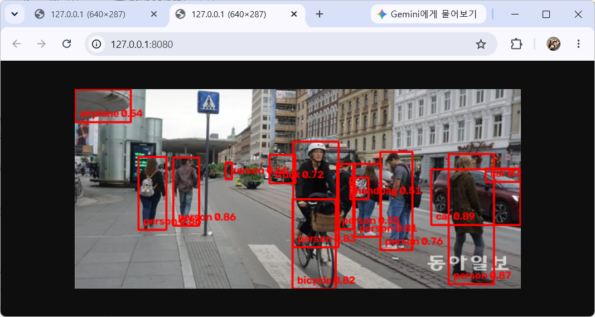

#### 결과이미지 타서버 요청및 인식결과 응답

- Post 함수 : [소스](./toyproject/ToyProjects04/pythonAi/main05.py)
- 타 서버에서 이미지 객체 인식을 요청해서, 인식된 결과를 돌려주는 작업

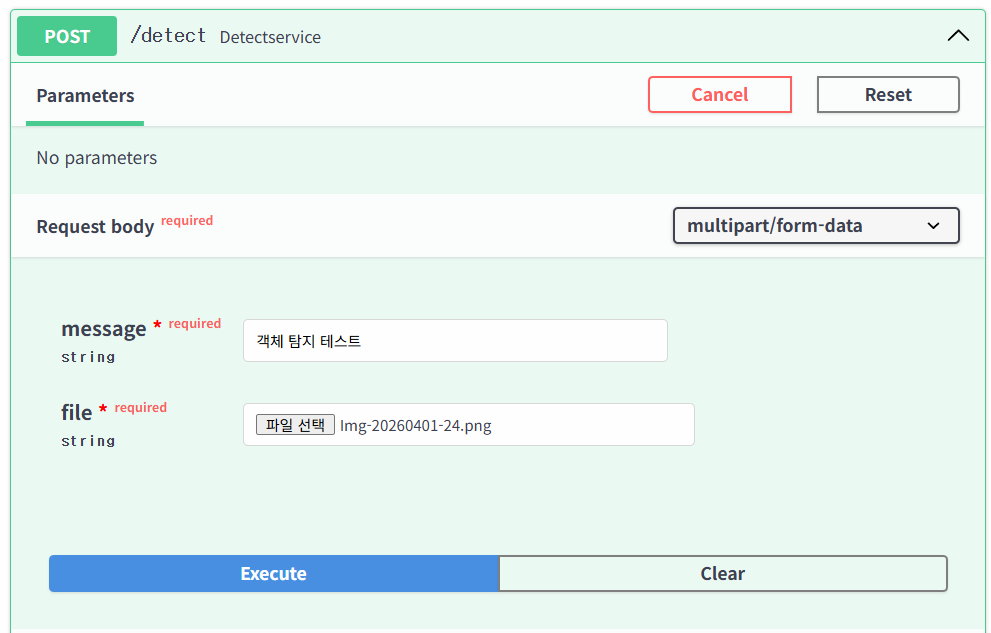

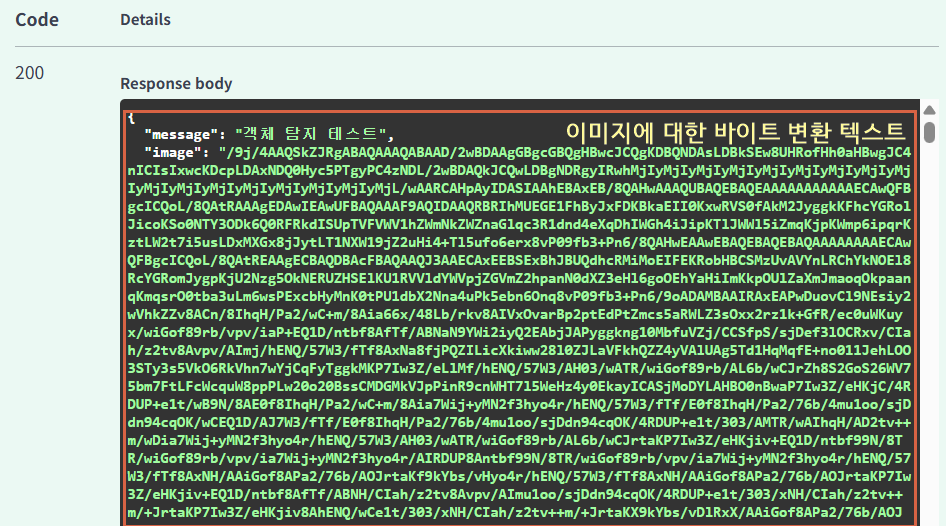

### ASP.NET Core WebSite

- 백엔드 RestAPI형태 + 프론트엔드 일반 HTML
    - 프론트엔드 React, WPF 등 확장 가능

- ASP.NET Core웹앱(MVC) 프로젝트 생성
    - Model, Views 폴더 삭제
    - wwwroot 아래 폴더 모두 삭제

- Program.cs 수정

- NetServiceController.cs 추가 - [소스](./toyproject/ToyProjects04/BackendCs/ResponseAiServer/Controllers/NetServiceController.cs)

- index.html 작성 - [소스](./toyproject/ToyProjects04/BackendCs/ResponseAiServer/wwwroot/index.html)

- 실행결과

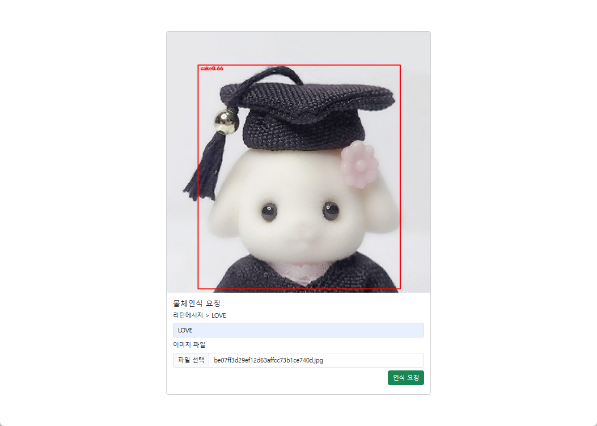

### 동영상, 웹캠 실시간 객체인식

- MQTT(WebSocket) 사용해서 동영상 전달

```powershell
(venv) PS > pip install paho-mqtt
```

- 웹서비스 불필요 

- 웹캠, 동영상 물체인식 - [소스](./toyproject/ToyProjects04/pythonAi/main06.py)

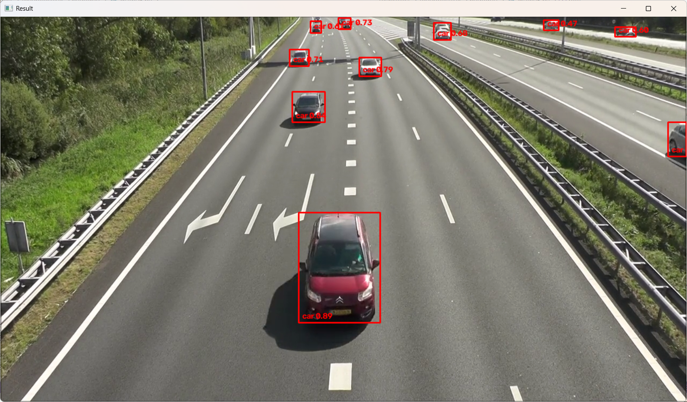

#### MQTT 전송

- MQTT 브로커 설정 수정 - WebSocket 사용 위해 설정 추가
- 윈도우 서비스(services.msc) 에서 mosquitto broker 실행 중지
- `mosquitto.conf` 파일 수정

```conf
## 기본 MQTT 설정 - 그대로 사용
listener 1883
protocol mqtt

## WebSocket 설정 - 스트리밍용 추가
listener 9001
protocol websockets
```

|포트|프로토콜|주 사용처|
|---|---|---|
|1883|MQTT| Python, C#, JAVA, ESP32, RaspberryPi 등 MQTT 클라이언트 |
|9001|WebSocket| Javascript, Unity WebGL, Streaming |

- Python에서 paho.mqtt로 웹소켓 스트리밍 전달


- 데이터 전달확인


- ASP.NET 웹페이지 객체인식결과 스트리밍 

https://github.com/user-attachments/assets/90497b96-f081-4a47-a52e-3dc3be9547a1

- 클래스별로 색상다르게 표시

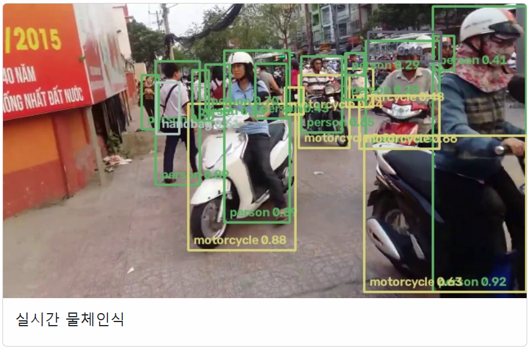

### 프로젝트 리스트

- 현재까지
    - 웹 이미지 객체 탐지
    - 웹캠/동영상 객체 탐지
    - 사람 모자이크 처리

- 난이도 하
    - 탐지된 객체수 집계
    - 진행방향별 차량 통과수 집계
    - 반려동물 감지 시스템

- 난이도 중
    - 매장 방문객 분석
    - 진행방향별 차량 통행량 분석
    - 주차장 차량관리    
    - 칩입 감지시스템
    - 장기 체류자 감지
    - 사람 쓰러짐 감지 

- 난이도 상
    - 안전모 착용 감지
    - 운전중 졸음 감지
    - 불량품 검출
    - 제품 수량 검사, 포장 누락 검사
    - 공정 위치 이탈 감지
    - `화재/연기 감지`
    - 위험구역 접근 감지
    - 공장 라인 생산량 집계
    - AI 스마트 경광등, 도어, 쓰레기통, 농장 동물 감지


### 화재/연기 감지 알람시스템

- Python에서 진행한 화재/연기 감지 소스 활용
- firedetect-11s.pt 사전학습 모델 활용

- MQTT Broker로 화재감지 데이터 전달

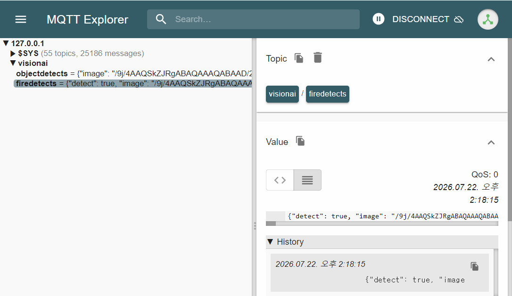

- 화재감지 모니터링 - [firedetect.html](./toyproject/ToyProjects04/BackendCs/ResponseAiServer/wwwroot/firedetect.html)

- 실핼결과

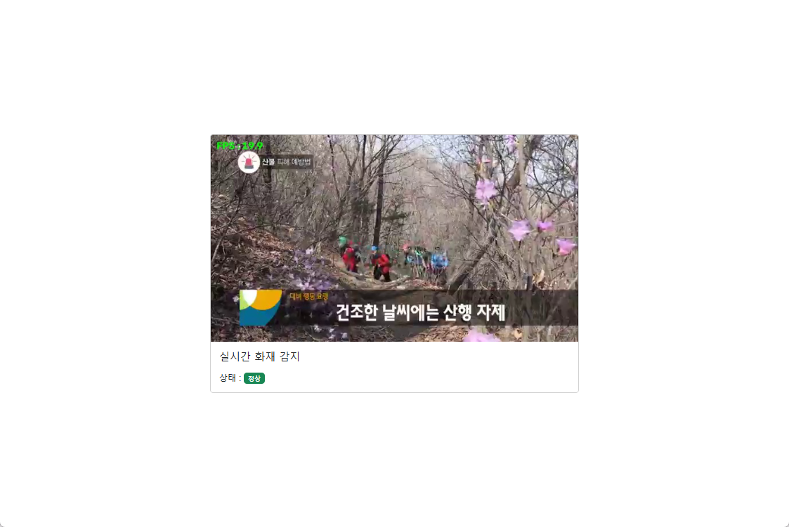

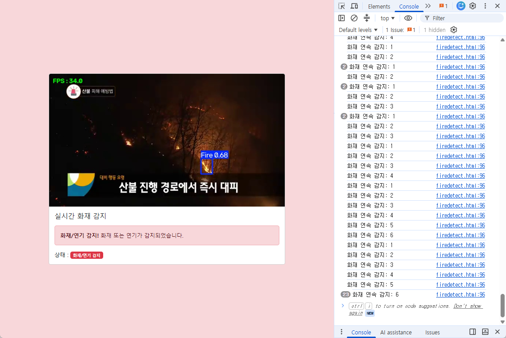