# 토이 프로젝트 5

## 컨베이어벨트 기반 스마트 공정관리 시스템

### 프로젝트 소개

아두이노, 라즈베리파이, MQTT, Unity를 활용하여 컨베이어벨트 기반 스마트 공정관리 시스템을 구현하였다.

공정에서 제품을 감지하고 센서 데이터를 수집하여 MQTT를 통해 실시간으로 전송하였으며, Unity 디지털 트윈과 연동하여 공정 현황을 시각화하였다. 또한 라즈베리파이와 시리얼 통신을 통해 아두이노 제어 및 데이터 수집을 수행하고, 스마트팩토리 공정관리 시스템의 전체 구조를 학습하였다.

### 주요 기능

- 컨베이어벨트 및 DC 모터 제어
- 적외선(IR) 센서를 이용한 제품 감지
- 서보모터를 이용한 제품 분류
- RGB LED 및 컬러센서를 활용한 상태 표시
- Arduino ↔ Raspberry Pi 시리얼 통신
- MQTT 기반 실시간 데이터 송수신
- Unity 디지털 트윈 모니터링
- 공정 데이터 실시간 시각화

### 기술 스택

`Arduino` · `C/C++` · `Raspberry Pi` · `Python` · `MQTT` · `Serial` · `Unity` · `C#` · `NeoPixel` · `Servo`

### 시스템 구성

```text
IR Sensor / Color Sensor
            │
      Arduino UNO
            │
      Serial Communication
            │
     Raspberry Pi (Python)
            │
          MQTT Broker
      ┌─────┴─────┐
      ▼           ▼
 Unity Digital   Monitoring
      Twin        System
```

### 빠른 이동

- [스마트팩토리](#스마트팩토리)
- [전체 시스템 구조](#전체-시스템-구조)
- [아두이노 컨베이어벨트](#아두이노-컨베이어벨트)
- [라즈베리파이 연결](#라즈베리파이-연결)
- [Unity 디지털트윈 시스템](#unity-디지털트윈-시스템)
- [WPF 모니터링 시스템](#wpf-모니터링-시스템)

---

## 컨베이어벨트 사용 공정관리 시스템

### 스마트팩토리

- 공장 내 모든 설비와 시스템을 연결, 데이터를 기반으로 생산을 최적화하는 제조 시스템

### 공장시스템 종류

- 회사내 다양한 종류 시스템(SW) 구성, 사용 중

|시스템명|역할|사용자|
|:--:|:--|:--|
|SCM(공급체인관리)|원자재 구매, 협력업체, 물류관리|구매팀, 물류팀|
|`ERP(전사적자원관리)`|회사 전체 업무 관리(결과위주)|경영지원, 회계, 영업, 인사...|
|MES(생산계획관리)|생산 현장 관리|생산관리자|
|PLC(생산로직제어)|기계 제어|설비|
|SCADA|설비모니터링|생산현장|
|HMI(사람-기게 인터페이스)|작업자 화면(터치패널)|작업자|
|WMS(창고관리)|창고관리,재고관리|물류|
|QMS(품질관리)|품질관리,품질계획관리|품질팀|
|CMMS(유지보수관리)|설비 유지보수|설비팀|


- 공정관리
    - MES의 한 파트인 공정(MRP:자재 소요 계획)을 실시간으로 모니터링, 제어
    - 스마트팩토리로 실시간으로 양품,불량을 선별 데이터 생성
    - Vision, IoT센서(적외선, X-ray, 스캐너...)

- IIoT - Industrial IoT. 대규모, 높은 정밀도, 고가...

### 전체 시스템 구조


### 아두이노 컨베이어벨트

#### 구성 요소

##### L298P 쉴드(HAT)

- 모터 드라이버를 포함한 아날로그 PWM, 디지털 GPIO를 구성한 쉴드
- 모터 드라이버 : 서보, DC등 모터를 쉽게 제어할 수 있도록 모듈화
- 모터 제어시 9V까지 전원 추가 - 아두이노 전원 불필요

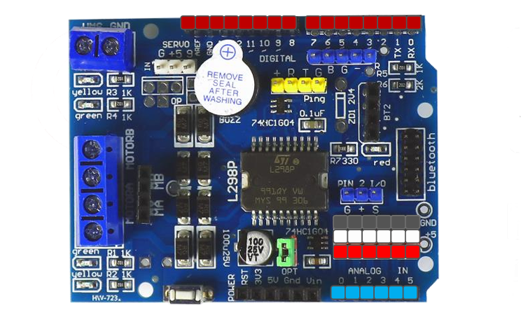

- A - 디지털핀 13개
- B - 아날로그 확장 5개
- C - 아날로그핀 6개

- 확장핀 1 - PWM 확장핀, 5V, D6, D5, GND, D3(A와 공유)
- 확장핀 2 - 초음파센서 확장핀, 5V, D8, D7, GND
- 확장핀 3 - 서보모터 확장핀, GND, 5V, D9
- 확장핀 4 - 피에조 능동 부저, D4
- 확장핀 5 - 모터제어 포트, D13, D11, D12, D10 순

##
## 테스트


- Arduino IDE로 진행


- 부저 테스트

```cpp
int buzzer = 4;

void setup() {
  Serial.begin(9600);
  pinMode(buzzer, OUTPUT);
}

void loop() {
  digitalWrite(buzzer, HIGH);
  delay(1000);
  digitalWrite(buzzer, LOW);
  delay(2000);
}
```

- 기어드 DC 모터 컨베이어 테스트
    - L298P 쉴드에 최소 9V 전원(최대 24V)인가
    - 2A 넘기지 말 것

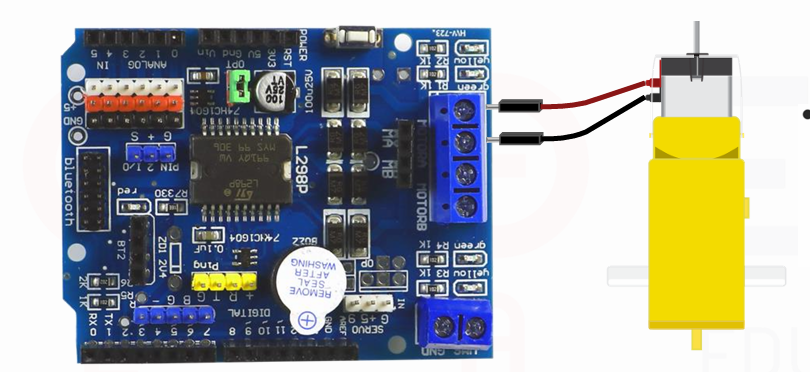
```cpp
int motorSpeedPin = 10;
int motorDirectionPin = 12;
int value;

void setup() {  
  pinMode(motorDirectionPin, OUTPUT);
  noTone(4);
}

void loop() {
  // 정방향
  digitalWrite(motorDirectionPin, HIGH);
  for (value = 0; value <= 255; value += 5) {
    analogWrite(motorSpeedPin, value);
    delay(30);
  }
  delay(1000);

  // 역방향
  digitalWrite(motorDirectionPin, LOW);
  for (value = 0; value <= 255; value += 5) {
    analogWrite(motorSpeedPin, value);
    delay(30);
  }
  delay(1000);
}
```

- 기어드 DC 모터 제어 - [소스](./toyproject/ToyProjects05/arduino_part/sample01/sample01.ino)
    - 모터 스피드 값 0 ~ 255 사이에서 제어, 실제 50이하는 동작안함
    - Default 80
    - 10부터 시작하면 60에서도 동작안함. 255에서 부터 줄여가면 50에서도 동작

- Serial Monitor 사용 주의점
    - 시리얼 입력에서 New Line, Carriage Return 선택, 입력하면 값 이외에 다른 데이터 전달됨

    

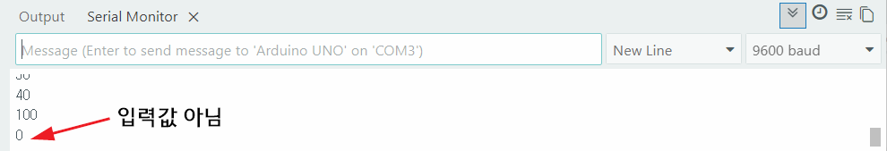

- 적외선 IR 송수신 센서

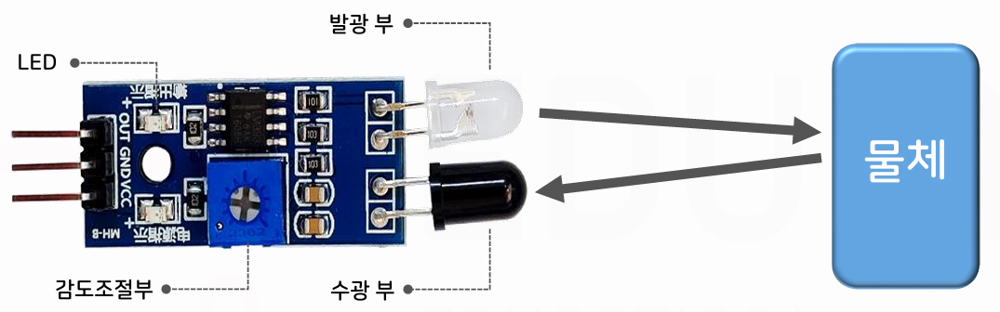

```cpp
// 적외선 IR 센서
int sensor = A0;
int val;

void setup() {
  Serial.begin(19200);
  pinMode(sensor, INPUT);
  Serial.println("Arduino start!");
}

void loop() {
  val = digitalRead(sensor);
  if (val == LOW) {
    Serial.println("Detected");
    delay(300);
  } else {
    Serial.println("0");
    delay(300);
  }
}
```

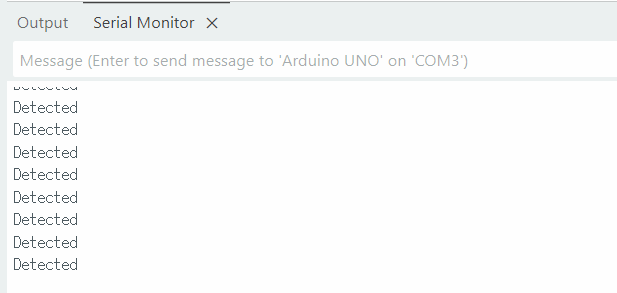

- 서보모터 SG-90 
    - 확장핀 3 연결, 시그널 D9 전달
    - 각초 초기화 한 다음에 바를 연결

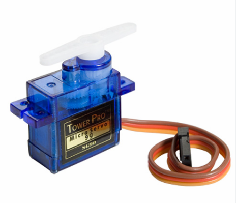

```cpp
// 서보모터
#include <Servo.h>
#define SERVO_PIN 9  // Digital 9
Servo servo;

void setup() {
  Serial.begin(19200);
  servo.attach(SERVO_PIN);  // 서보모터 연결
  servo.write(0);  // 0도로 초기화(!)
  delay(500);
}

void loop() {
  if (Serial.available()) {
    int value = Serial.parseInt();
    servo.write(value);
    Serial.println(value);
    delay(100);
  }
}
```

동영상 나중에

- RGB LED 네오픽셀
    - Adafruit NeoPixel 라이브러리 설치    

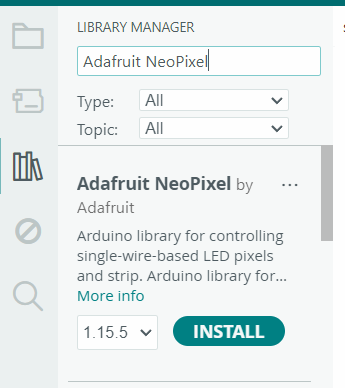

```cpp
// NeoPixel LED 
#include <Adafruit_NeoPixel.h>
#define PIN 5
#define NUMPIXELS 3

Adafruit_NeoPixel pixels(NUMPIXELS, PIN, NEO_GRB + NEO_KHZ800);

void setup() {
  pixels.begin();
  pixels.setBrightness(50);
}

void loop() {
  for (int i=0; i < NUMPIXELS; i++) {
    pixels.setPixelColor(i, pixels.Color(255, 0, 0));
    pixels.show();
  }
  delay(1000);
  for (int i=0; i < NUMPIXELS; i++) {
    pixels.setPixelColor(i, pixels.Color(0, 255, 0));
    pixels.show();
    delay(10);
  }
  delay(1000);
  for (int i=0; i < NUMPIXELS; i++) {
    pixels.setPixelColor(i, pixels.Color(0, 0, 255));
    pixels.show();
    delay(10);
  }
  delay(1000);
}
```

- 1초당 RGB 색상 변경 확인

- 컬러센서(TCS34725) 모듈
    - RGB 색상 감지
    - Adafruit TCS34725 라이브러리 설치
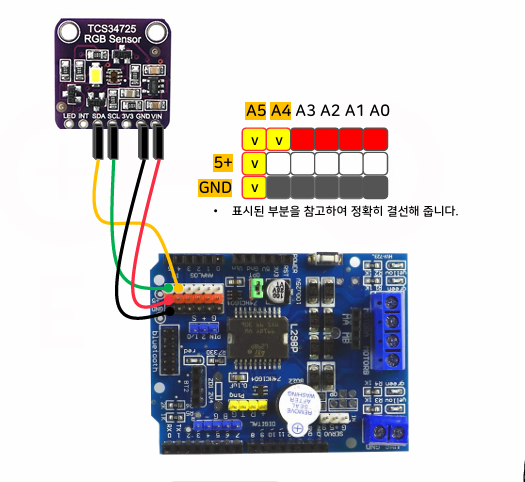


```cpp
// Color Sensor
#include <Wire.h>
#include <Adafruit_TCS34725.h>

Adafruit_TCS34725 TCS = Adafruit_TCS34725(TCS34725_INTEGRATIONTIME_50MS, TCS34725_GAIN_4X);

void setup() {
  Serial.begin(19200);
  TCS.begin();  
}

void loop() {
  uint16_t clear, red, green, blue;
  delay(100);
  TCS.getRawData(&red, &green, &blue, &clear);

  int r = map(red, 0, 21504, 0, 2000);
  int g = map(green, 0, 21504, 0, 2000);
  int b = map(blue, 0, 21504, 0, 2000);

  Serial.print("    R: ");
  Serial.print(r);
  Serial.print("    G: ");
  Serial.print(g);
  Serial.print("    B: ");
  Serial.println(b);
}
```
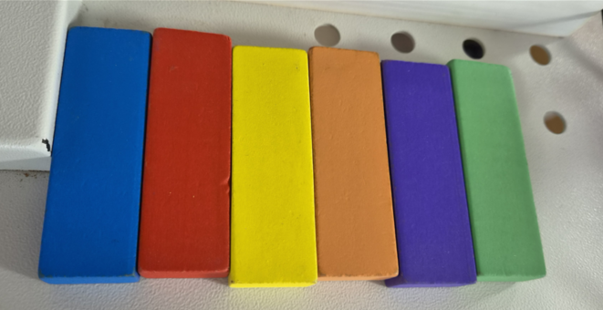

- 색상 테스트
    - 초기상태 : RGB(4,3,3)
    - 파란색 물체 : RGB(8, 11, 15)
    - 녹색 물체 : RGB(14, 18, 10)    
    - 빨간색 물체 : RGB(21, 6, 6)


#### 컨베이어벨트 조립

- 조립중간 단계


- 완성 단계

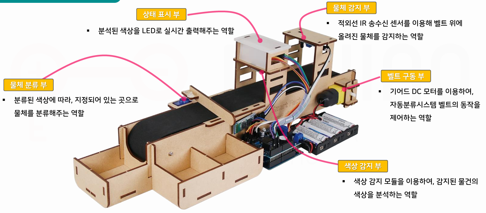

#### 통합로직 구현

- [전체소스](./toyproject/ToyProjects05/arduino_part/sortingmachine/sortingmachine.ino)

#### Arduino 교체 테스트

- [Arduino UNO R3](https://www.devicemart.co.kr/goods/view?no=34404) 에서 [Arduino UNO R4](https://www.devicemart.co.kr/goods/view?no=15088648)로 교체 테스트
- 결론 - `Adafruit` 등 라이브러리 UNO R4에서 사용불가

#### IR 적외선 센서팁

- 레일에 파란색, 검은색 전기테이프도 인식됨

#### 기본 동작

https://github.com/user-attachments/assets/f117f601-f956-414d-b6cc-8c420a34f4f7

### 라즈베리파이 연결

- 아두이노 + 라즈베리파이 5

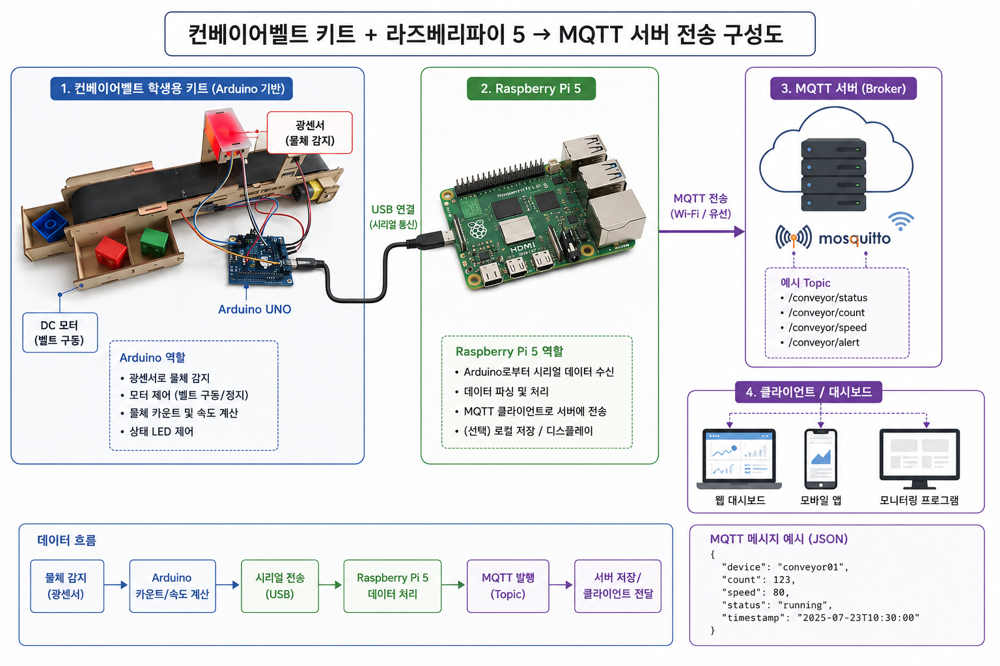

#### MQTT 통신 구현

- Raspbian -> Windows MQTT 통신
- Python MQTT 기본통신 - [소스](./toyproject/ToyProjects05/raspberrypi_part/test_mqtt.py)

- 라즈베리파이 파이썬 실행상태

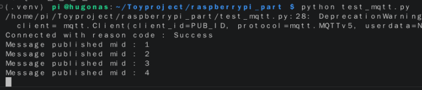

- 윈도우 MQTT 브로커 상태

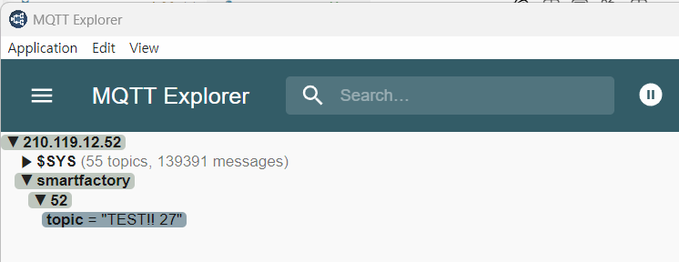

#### 아두이노와 라즈베리파이 간 데이터 전달

1. 블루투스
2. `시리얼통신`
3. LAN 실드로 LAN선 연결

- 시리얼통신, 컨베이어 인식결과를 시리얼통신으로 전달 파이썬에서 확인

- 라즈베리파이에 연결된 시리얼 포트번호
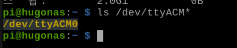

- Python 시리얼 라이브러리 설치

```bash
> pip install pyserial
```

- 아두이노 시리얼 연결 테스트 - [소스](./toyproject/ToyProjects05/raspberrypi_part/test_serial.py)

- 시리얼 데이터 확인
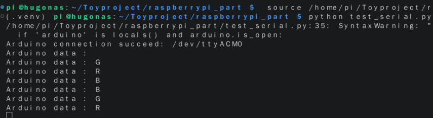

- MQTT 소스 + 시리얼통신 소스 + 양방향 통신 - [소스](./toyproject/ToyProjects05/raspberrypi_part/data_interface.py)

- 통신 테스트 
  - Arduino 컨베이어벨트 시작
  - RPi, Python 실행
  - MQTT Explorer

- 라즈베리파이

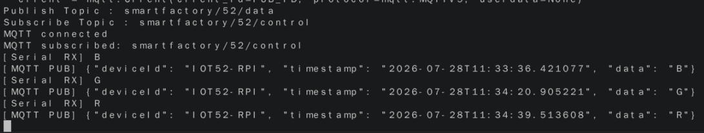

- Windows MQTT Explorer

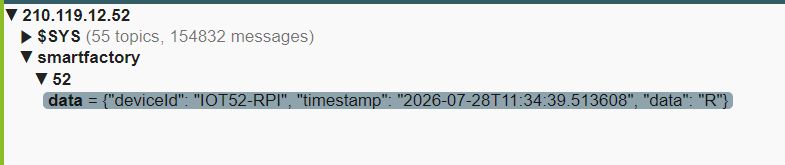

### Unity 디지털트윈 시스템

- Unity 학습 시 사용한 ProductLine 재사용

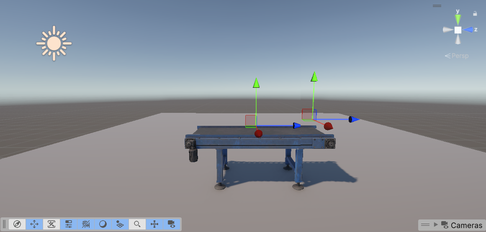

- M2MqttUnity 설치
  - [Github](https://github.com/gpvigano/M2MqttUnity) 코드 다운로드
  - 압축해제 한 Assets 폴더를 Unity 프로젝트 Assets에 복사

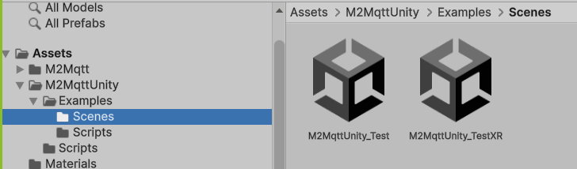

- M2MqttUnity_Test 신 사용 테스트

- 접속 확인

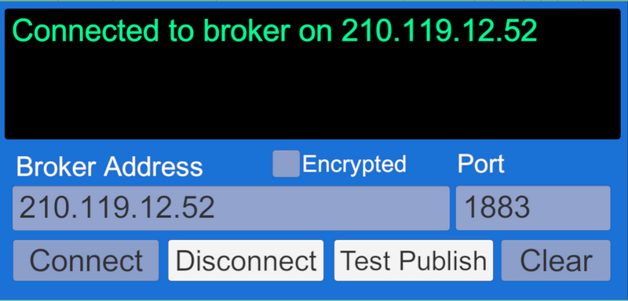

- MQTT 데이터 Subscribe 로직 작성 - TOPIC에 맞춰서

#### Script 생성

- SmartFactoryMqttClient.cs 생성 및 작성

#### 빈 오브젝트 생성

- MqttClient
- Script 컴포넌트로 연결
- SensorTrigger.cs 의 로그 주석처리

#### 유니티 MQTT 토픽메시지 확인

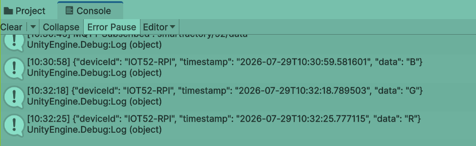

#### Newtonsoft.Json 라이브러리 설치

- Window > Package Management > Package Manager
- `+` > Install Package by technical name 클릭
- `com.unity.nuget.newtonsoft-json` 설치

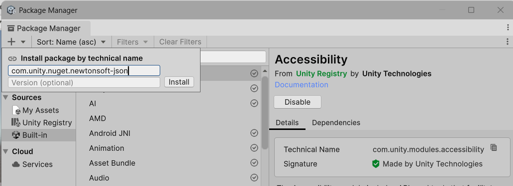

#### MQTTClient 스크립트 Json 처리

- Newtonsoft.Json 사용
- ProductResult.cs 스크립트 생성

#### Canvas 객체 추가

- 기본 2D를 3D로 변경 
  - Canvas 컴포넌트 Render Mode를 `World Space`로 변경

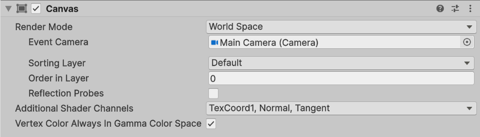

- Rect Transform 조정

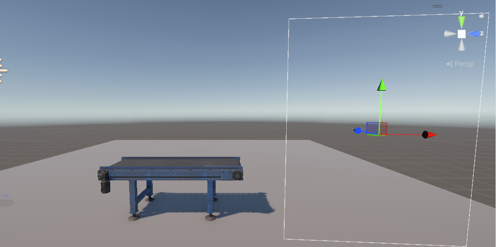

#### Panel 추가

- Rect Transform을 `Reset`
- Background 색상 변경

#### TMP 추가

- NanumGothic 폰트 임포트

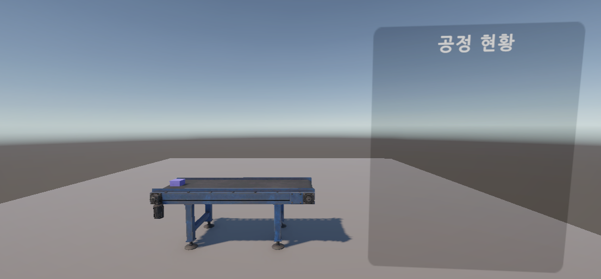

#### 공정현황 텍스트들 추가

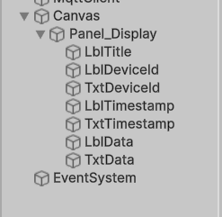

#### MQTTClient 스크립트 텍스트 바인딩

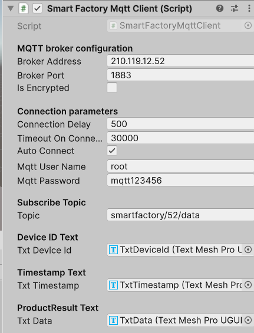

#### 실행결과

https://github.com/user-attachments/assets/49c4e7b5-6bfb-4b68-80e9-94a0d02e8349

- 미니프로젝트 3에서 진행

### 센싱결과 색상 표시

- Unity에서 제품 변경된 색상 표시

### ESP32-CAM 연동

### Database 데이터 저장

### ...


### WPF 모니터링 시스템

### 벨트 제어

- 모니터링 시스템에서 비상정지 기능
