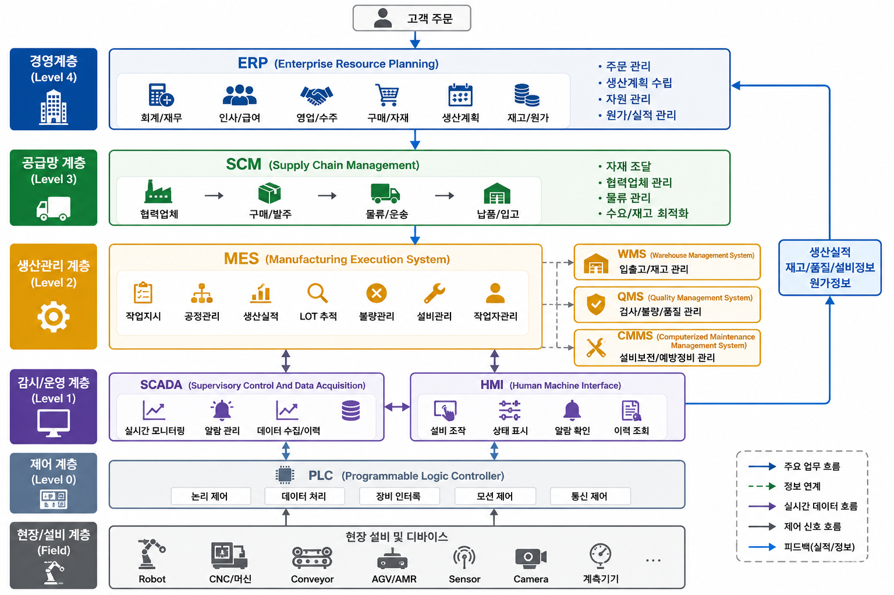
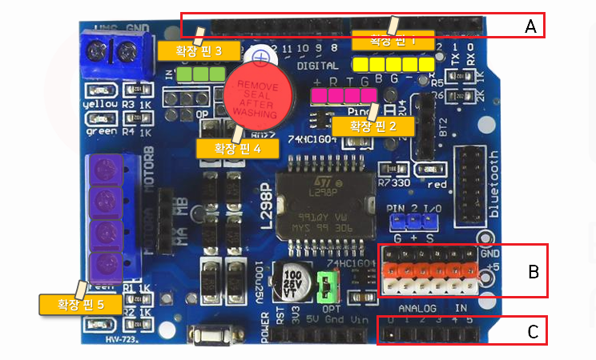
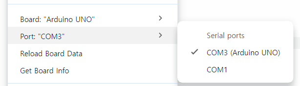

# 토이 프로젝트5

## 컨베이어벨트 사용 공정관리 시스템

### 스마트팩토리
- 공장 내 모든 설비와 시스템을 연결, 데이터를 기반으로 생산을 최적화하는 제조 시스템

### 공장시스템 종류
- 회사 내 다양한 종류 시스템(SW) 구성, 사용 중

|시스템명|역할|사용자|
|:---:|:--:|:----:|
|SCM(공급체인관리)|원자재 구매, 협력업체/물류 관리|구매팀, 물류팀|
|`ERP(전사적자원관리)`|회사 전체 업무 관리(결과 위주)|경영지원, 회계, 영업, 인사 ..|
|MES(생산계획관리)|생산 현장 관리|생산관리자|
|PLC(생산로직제어)|기계 제어|설비
|SCADA|설비 모니터링|생산현장|
|HMI(사람-기계 인터페이스)|작업자 화면(터치패널)|작업자|
|WMS(창고관리)|창고관리, 재고관리|물류팀|
|QMS(품질관리)|품질관리, 품질계획관리|품질팀|
|CMMS(유지보수관리)|설비 유지보수|설비팀|



- 공정관리
    - MES의 한 파트인 공정(MRP: 자재 소요 계획)을 실시간으로 모니터링, 제어
    - 스마트팩토리로 실시간으로 양품, 불량을 선별 -> 데이터 생성
    - Vision, IoT 센서(적외선, X-ray, 스캐너, ..)

- IIOT(Industrial IoT) - 대규모/높은 정밀도/고가

### 전체 시스템 구조


### 아두이노 컨베이어벨트

#### 구성요소

##### L298P 쉴드(HAT)
- 모터 드라이버를 포함한 아날로그 PWM, 디지털 GPIO를 구성한 쉴드
- 모터 드라이버: 서보, DC 등 모터를 쉽게 제어할 수 있도록 모듈화
- 모터 제어시 9v까지 전원 추가 - 아두이노 전원 불필요



- A: 디지털 핀 13개
- B: 아날로그 확장 핀 5개
- C: 아날로그 핀 6개

- 확장핀 1 - pwm 확장판, 5V, D6, D5, GND, D3(A와 공유)
- 확장핀 2 - 초음파센서 확장판, 5V, D8, D7, GND
- 확장핀 3 - 서보모터 확장판, GND, 5V, D9
- 확장핀 4 - 피에조 능동 부저, D4
- 확장핀 5 - 모터제어 포트, D13, D11, D12, D10 순 

#### 테스트

- Arduino IDE로 진행


- 부저 테스트



```cpp
int buzzer = 4;

void setup() {
  Serial.begin(9600);
  pinMode(buzzer, OUTPUT);
}

void loop() {
  digitalWrite(buzzer, HIGH);
  delay(1000);
  digitalWrite(buzzer, LOW);
  delay(2000);
}
```

- 기어드 DC 모터 컨베이어 테스트
    - L298P 쉴드에 최소 9v 전원인가
    - 2A 넘기지 말 것

```cpp
int motorSpeedPin = 10;
int motorDirectionPin = 12;
int value;

void setup() {  
  pinMode(motorDirectionPin, OUTPUT);
  noTone(4);
}

void loop() {
  // 정방향
  digitalWrite(motorDirectionPin, HIGH);
  for (value = 0; value <= 255; value += 5) {
    analogWrite(motorSpeedPin, value);
    delay(30);
  }
  delay(1000);

  // 역방향
  digitalWrite(motorDirectionPin, LOW);
  for (value = 0; value <= 255; value += 5) {
    analogWrite(motorSpeedPin, value);
    delay(30);
  }
  delay(1000);
}
```

- 기어드 DC 모터 제어 - [소스](./toyproject/ToyProjects05/arduino_part/sample01/sample01.ino)
    - 모터 스피드 값 0 ~ 255 사이에서 제어, 실제 50 이하는 동작 안 함
    - Default 80
    - 10부터 시작하면 60에서도 동작 안 함. 255에서부터 줄여가면 50에서도 동작

- Serial Monitor 사용 주의점
    - 시리얼 입력에서 New Line, Carriage Return 선택, 입력하면 값 이외에 다른 데이터 전달됨


### MQTT 통신 시스템
- 


### Unity 디지털트윈 시스템

### WPF 모니터링 시스템