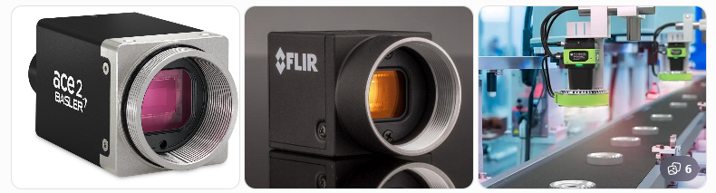
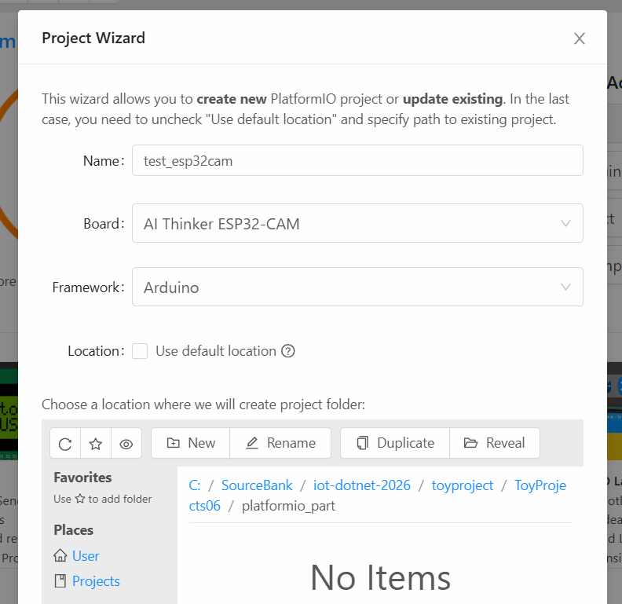
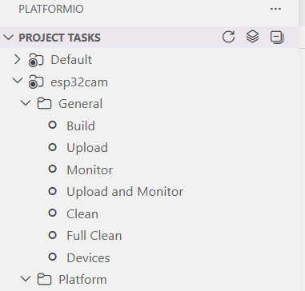
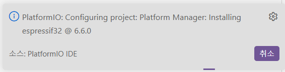
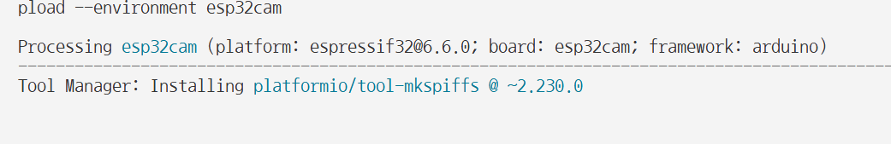

# 토이 프로젝트 6

## 컨베이어벨트 공정관리 시스템 2

### ESP32-CAM

#### 개요


**Ai-Thinker ESP32-CAM**

ESP32 기반 프로세서 사용, WiFi, 블루투스를 지원하는 아두이노 호한보드


업로드 모듈을 사용 안 할 경우, 위와 같이 브레드보드, USB 모듈을 직접 연결해야 함

##### 기본사용 일부

- Bluetooth 4.2 + BLE
- WiFi 802.11 전부 가능
- USB b타입 지원
- microSD 4G까지 지원 - 사진 및 데이터 저장
- 외부 안테나 연결 가능

##### 활용처

- 카메라 촬영
- 실시간 영상 스트리밍
- Wi-Fi 통신
- 자체 웹 서버 기능
- 간단한 영상/물체 감지 - Arduino TinyML
- IoT 기능도 포함
- UART - Arduino, Raspberry Pi와 시리얼 통신

#### ESP32-CAM 사용이유

- 라즈베리파이 직접 카메를 장착하려면 = RPi Camera 또는 USB 웹캠 가능
- 컨베이어벨트 등 산업장비에 설치, 독립적으로 스트리밍을 가능하게 하기 위해서 사용
- 저사양으로 테스트용으로 사용. 실체 산업현장용은 고비용 고사양



#### 개발환경 설정

Arduino IDE or Visual Studio Code - Platform IO 확장으로 사용등 여러 방법 존재


##### VS Code - PlatformIO IDE

- VS Code 확장 > `PlatformIO IDE` 검색
- Install
- Python 설치되어 있지 않으면 병행 설치됨
- 새로 리로드 필요

##### PlatformIO IDE 프로젝트 생성

1. PlatformIO 아이콘 클릭(pio)
2. Quick Access에서 New Project 선택



##### PlatformIO 프로젝트 구조

```
- include: 헤더파일 위치
- lib: 외부라이브러리 저장
- src: cpp파일 위치
- test: 단위테스트용
- platformio: 
```


- 프로젝트 테스트 구조
  - Build: 빌드 컴파일
  - Upload: 보드 업로드
  - Monitor: 시리얼 모니터
  - Upload and Monitor: 업로드 후 시리얼 모니터 오픈
  - Clearn / Full Clearn: 소스 정리
  - Devices: 보드 정보 확인



- 윈도우 장치관리자에서 시리일포트 확인, 라즈베리파이에서는 /dev/ttyUSB*

##### ESP32-CAM 동작확인



- [platformio.ini](./toyproject/ToyProjects06/platformio_part/test_esp32cam) 작성 - 버전 변경후 저장, 프로젝트 재구성 시간소요
- 기본동작 소스 작성

```cpp
#include <Arduino.h>

void setup() {
  Serial.begin(115200);

  delay(2000);

  Serial.println();
  Serial.println("ESP32-CAM START");
}

void loop() {
  Serial.println("ESP32 alive!");

  delay(1000);
}
```

- PlatformIO 프로젝트 태스크 > Build 클릭
- 빌드 성공하면 [SUCCESS] 출력
- Upload 클릭, 최초 업로드시 Tool Manager 다운로드 설치 시간 소요
- 
- 업로드 %가 표시
- 
- 프로젝트 태스크 > Monitor 클릭
- ESP32-CAM 보드 > RST 버튼 클릭 초기화
- 

##### 기본 명령어

- 빌드: `platformio run`
- 실제:
- 빌드 + 업로드:
- 시리얼 모니터:
- Clean:

##### ESP32-CAM 웹서버 예제

-[소스]

-------

#### ESP32-CAM 전원만 인가


- ESP32-CAM 동작 확인

#### 라즈베리파이 + ESP32-CAM
- 윈도우에서 ESP32-CAM 빌드, 업로드한 보드가 라즈베리파이에서 동작 실패(!)
- 컬러센서에서 인식하는 부분에 카메라 위치
- 
