# 토이 프로젝트 7

## AI 문서검색·질의응답 시스템

### 개요


기업 문서를 기반으로 한 AI 지식검색 시스템 개발
- 사내 PDF 문서를 등록해 두고, 사용자가 자연어로 질문을 하면 관련 문서를 찾아서 근거와 함께 답변을 해주는 WPF 윈앱 프로그램을 구현

사용 기술
|구분|기술|
|:--:|:---|
|화면|C# WPF|
|서버|Python FastAPI|
|PDF 처리|Python|
|벡터 DB|ChromaDB|
|AI 모델|Ollama 또는 OpenAI|
|통신|REST API / JSON|
|DB 저장|-|

#### RAG
Retrieval Augmented Generation: 검색(Retrieval) + AI 답변생성(Generation)
- 내가 제공한 문서를 먼저 검색한 뒤 그 내용을 참고해서 답변하는 방식
- 구글 노트북이 대표적인 사이트 https://notebook.google.com/

### 프로젝트 구성
```plaintext
ToyProjects07(AIKnowledgeSystem)
│
├─ Client(WPFClient) - 사용자 화면
│
└─ Server(AIServer) - FastAPI + Python Functions
```

### 클라이언트 구현

- [화면 소스 - MainWindow.xaml](./toyproject/ToyProjects07/Client/AIKnowledgeSolution/AIKnowledgeApp/MainWindow.xaml)
- [기능 소스 - MainWindow.xaml.cs](./toyproject//ToyProjects07/Client/AIKnowledgeSolution/AIKnowledgeApp/MainWindow.xaml.cs)

#### Visual Studio WPF 프로젝트 생성

WPF 애플리케이션 프로젝트 생성 - .NET 10.0 (LTS) 선택

##### MainWindow.xaml 디자인


##### 파일 선택 구현
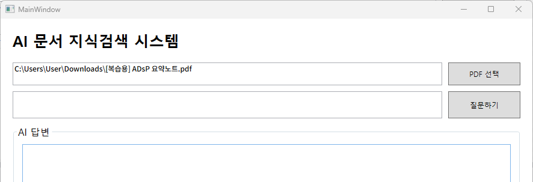

##### 서버로 데이터 전송

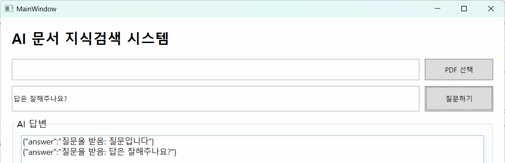

##### 문서 등록 버튼 추가


##### PDF 전송 기능

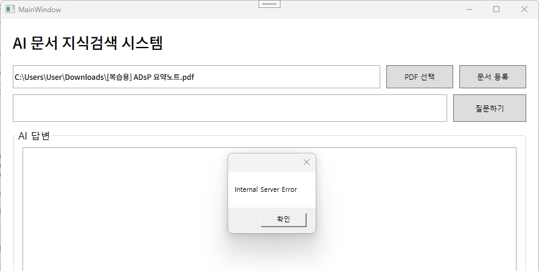
- 파일명에 공백이 있으면 업로드 실패
- 한글파일 인코딩 문제
  - `[국가교통정보센터] Open_API_매뉴얼.pdf` 파일 업로드 시
  - 파일명이 `=?utf-8?B?W+q1reqwgOq1kO2GteygleuztOyEvO2EsF0gT3Blbl9BUElf66ek64m07Ja8LnBkZg==?=` 형태로 변경
  - 영문 파일명은 문제없음
- 동일명의 파일이 올라가면 이전 파일 삭제, 새로 업로드

##### 추가 작업 1
- 질문 텍스트박스에서 엔터시 버튼 클릭 이벤트 발생 시키기
- 질문하기 완료 전까지 버튼 비활성화

##### 추가 작업 2 - WPF JSON 파싱처리

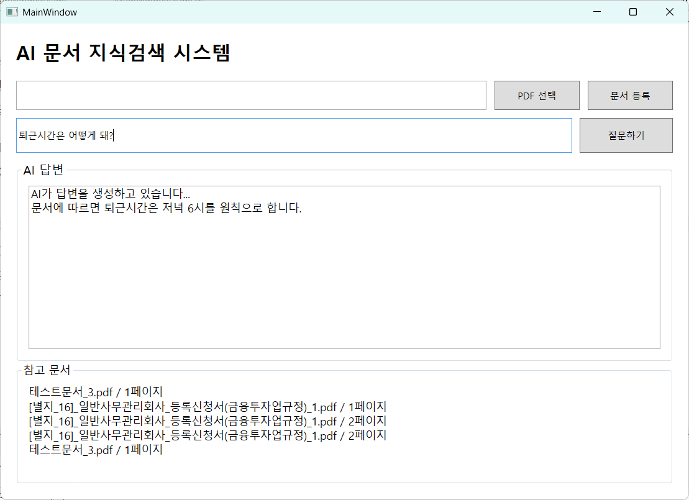

#### 서버(Python) 구현
- [서버 소스 - main.py](./toyproject/ToyProjects07/Server/main.py)

##### 필요 패키지 설치

- 가상환경에 FastAPI용 패키지 설치(이미 설치됨)
```powershell
> pip install fastapi uvicorn
```

##### FastAPI 서버 구현
- 기본 서버 구현
```python
from fastapi import FastAPI

app = FastAPI()

@app.get('/')
def index():
    return {
        'message': 'AI Knowledge Server'
    }

@app.get('/health')
def health():
    return {
        'status': 'OK'
    }
```

- 실행
```powershell
> uvicorn main:app --reload
```

- Swagger UI에서 확인 - [http://localhost:8000/docs](http://localhost:8000/docs)

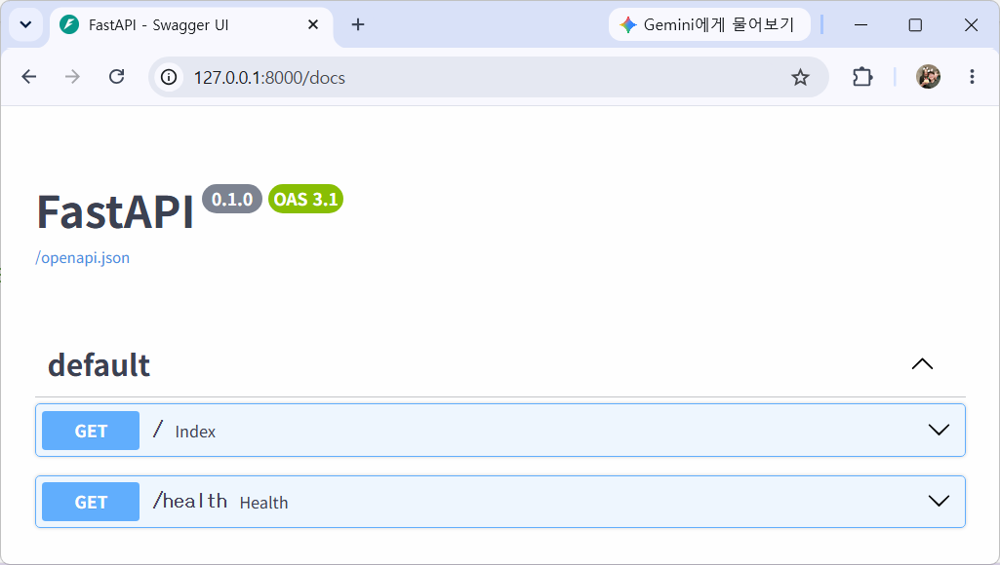

##### 질문받기 Post API 추가

```python
from pydantic import BaseModel # API로 전달할 기본 모델

# json과 dictionary로 쉽게 처리하기 위해서
# 속성값을 규칙에 맞게 할당받기 위해서
class QuestionRequest(BaseModel):
    question: str

@app.post('/ask')
def ask(request: QuestionRequest):
    return {
        'answer': f'질문을 받음: {request.question}'
    }
```

##### 파일업로드 Post 기능 추가
```powershell
> pip install python-multipart
```

```python
from fastapi import FastAPI, UploadFile, File
import os
import shutil

UPLOAD_DIR = 'uploads'
os.makedirs(UPLOAD_DIR, exist_ok=True)

@app.post('/upload')
async def upload(file: UploadFile = File(...)):
    save_path = os.path.join(UPLOAD_DIR, file.filename)

    with open(save_path, 'wb') as buffer:
        shutil.copyfileobj(file.file, buffer)

    return {
        'message': '업로드 완료',
        'filename': file.filename
    }
```
##### 한글 인코딩 문제 해결

- WPF에서 전달된 한글 인코딩으로 변환된 파일명을 다시 한글파일명으로 디코딩해야 함

```python
from email.header import decode_header

## 내부 함수 3 - UTF8 인코딩으로 전달된 한글문서명 디코딩 함수
def decode_filename(filename: str):
    decoded_parts = decode_header(filename)

    result = ""

    for part, encoding in decoded_parts:
        if isinstance(part, bytes):
            result += part.decode(encoding or "utf-8")
        else:
            result += part

    return result
```

##### PDF 내 텍스트 추출
- 업로드한 PDF를 읽어서 실제 글자를 가져올 수 있는지 확인
- PyMuPDF 패키지

```powershell
> pip install pymupdf
```

- PDF 텍스트 추출 함수

```python
import pymupdf

## 내부 함수 4 - PDF 로드 함수
def extract_pdf_text(pdf_path:Path):
    doc = pymupdf.open(pdf_path)
    pages = []

    for page_number, page in enumerate(doc):
        text = page.get_text()

        pages.append({
            'page': page_number + 1,
            'text': text
        })

    doc.close()
    return pages
```

- 업로드된 PDF 텍스트 추출 확인 - PDF 원본

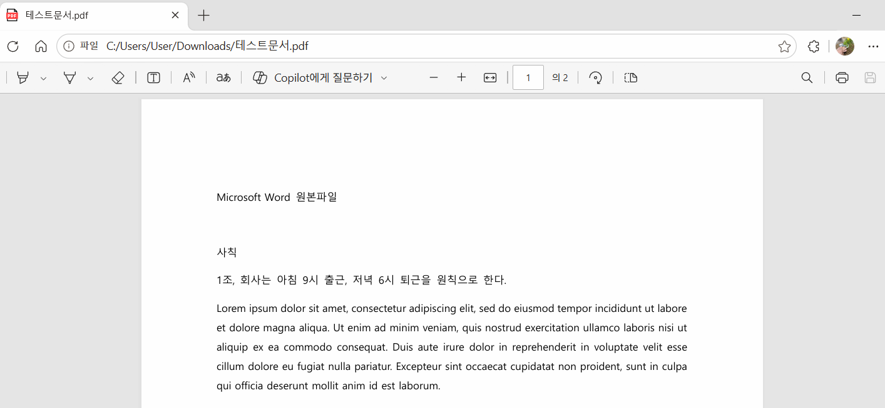

- 업로드된 PDF 텍스트 추출 확인 - Python에서 추출 확인

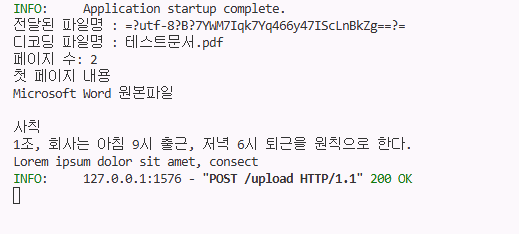

##### PDF 내용 Chunk 단위 분리
- RAG는 PDF 전체를 한번에 검색하지 않음. 작은 텍스트 조각으로 나눠서 검색

```python
## 내부 함수 5 - Chunk 분리 함수
def split_into_chunk(pages, chunk_size=50, overlap=10):
    chunks = []
    for page in pages:
        text = page['text']
        start = 0
        chunk_index = 0

        while start < len(text):
            end = start + chunk_size
            chunk_text = text[start:end]

            if chunk_text.strip():
                chunks.append({
                    'page': page['page'],
                    'chunk_index': chunk_index,
                    'text': chunk_text
                })

            start += chunk_size - overlap
            chunk_index += 1

    return chunks
```

- Chunk 분리(길이 50, 오버랩 10) 결과

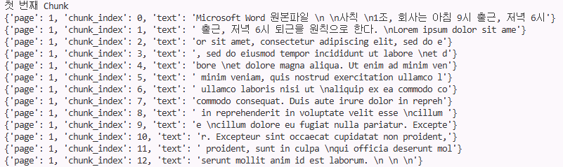

##### Embedding
- Chunk 문장을 숫자 배열로 바꾸는 작업. 숫자 벡터로 추후 질문과 문서 Chunk 간의 의미가 얼마나 비슷한지 비교
- Sentence Transformers 패키지 설치
    - 텍스트를 고정 길이 벡터로 변환하는 라이브러리
    - 트랜스포머: 자연어 처리시 기존 문제를 해결한 새 메커니즘. BERT, GPT
    - Transformer 신경망 사용해서 문장의 의미를 숫자 벡터로 표현하는 모델

```powershell
> pip install sentence-transformers
```

- 임베딩 함수

```python
from sentence_transformers import SentenceTransformer

# 임베딩모델 선언 - 다국어(한국어 포함)용 트랜스포머 모델 필요
embedding_model = SentenceTransformer(
    "sentence-transformers/paraphrase-multilingual-MiniLM-L12-v2"
)

## 내부 함수 6 - Embedding(임베딩) 함수
def create_embedding(chunks):
    texts = [
        chunk['text'] for chunk in chunks
    ]

    embeddings = embedding_model.encode(
        texts,
        convert_to_numpy=True
    )
    return embeddings
```

- 업로드 후 PDF 변환, Chunk 작업 후 Embedding
- 트랜스포머 모델 다운로드 경로 : `C:\Users\User\.cache\huggingface\hub\`
- 최초 트랜스포머 모델 다운로드 시 시간이 소요됨

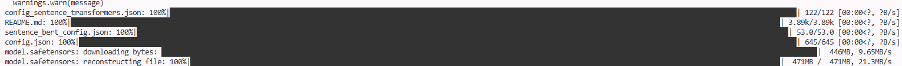

- Embedding 변환결과

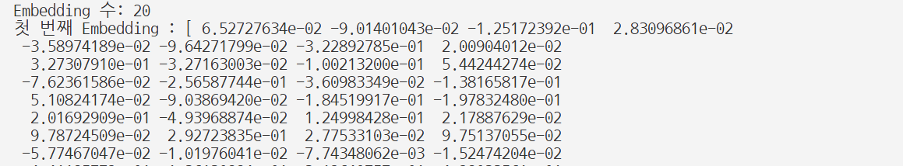

##### ChromaDB에 Embedding 저장
- ChromaDB: 벡터 데이터베이스. RAG에서 관련자료 찾아주는 검색엔진 역할의 DB
- SQLite 베이스

```powershell
> pip install chromadb
```

- ChromaDB 저장 함수

```python
def save_chunk_to_chroma(chunks, embeddings, filename):
    ids = []
    documents = []
    metadatas = []
    embedding_list = []

    for i, chunk in enumerate(chunks):
        ids.append(
            f'{filename}_{chunk["page"]}_{chunk["chunk_index"]}'
        )

        documents.append(chunk['text'])

        metadatas.append({
            'filename': filename,
            'page': chunk['page'],
            'chunk_index': chunk['chunk_index']
        })

        embedding_list.append(embeddings[i].tolist())

    collection.add(
        ids=ids,
        documents=documents,
        metadatas=metadatas,
        embeddings=embedding_list
    )
```

- 서버 실행 후 DB 생성

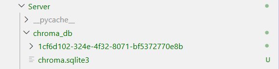

- PDF 업로드 후 DB 현황. 벡터 검색용 테이블들이 구성되어 있음

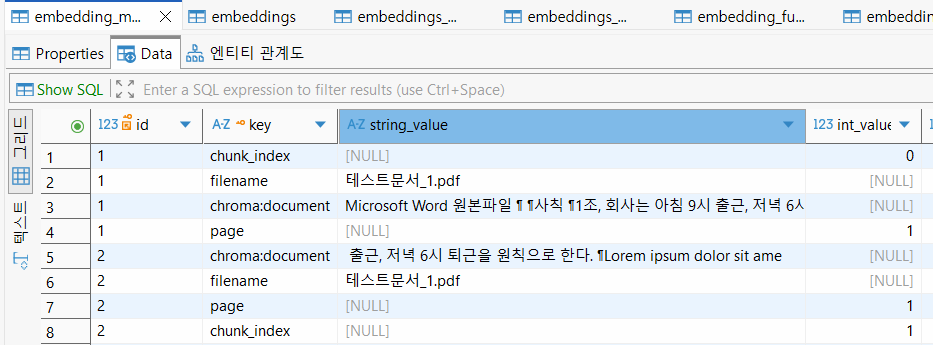

- ChromaDB는 기본 SQLite. 실무에서 사용할 DB로는 `PostgreSQL`로 변경

##### 벡터 검색으로 관련 Chunk 찾기

- 검색 함수

```python
### 내부 함수 8 - Chunk 검색함수
### top_k : 관련있는 값을 몇개까지 가져올것인지
def search_documents(question: str, top_k=3):
    # 질문을 Embegging으로 변환
    question_embedding = embedding_model.encode(
        question,
        convert_to_numpy=True        
    )

    # ChromaDB 검색
    results = collection.query(
        query_embeddings=[
            question_embedding.tolist()
        ],
        n_results=top_k
    )

    return results
```

- `/ask` post 함수 수정

```python
@app.post('/ask')
def ask(request: QuestionRequest):
    # DB에서 관련어 검색하고
    results = search_documents(        
        request.question
    )

    # 결과 리턴
    return {
        'question': request.question,
        'documents': results['documents'][0],
        'metadatas': results['metadatas'][0],
        'distances': results['distances'][0]
    }
```

- 결과 화면

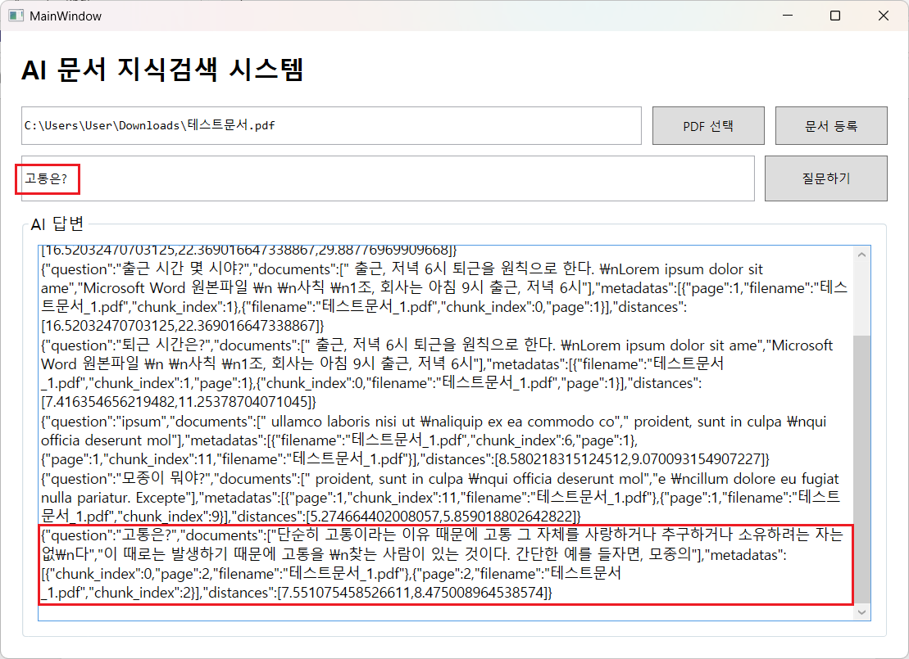

- 텍스트 대신 이미지를 PDF로 변환한 파일인 경우 - 변환불가. OCR 등을 사용해서 텍스트 추출

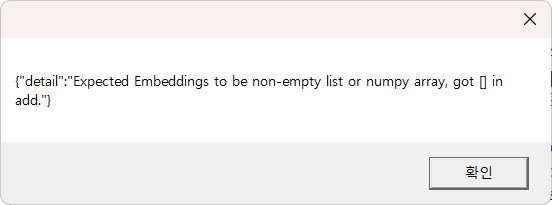

##### Ollama LLM 연결
- https://ollama.com/ 설치
- Ollama 동작

```powershell
> ollama list
> ollama run qwen3.5:2b
```

- Ollama 패키지 설치

```powershell
> pip install ollama
```

- Ollama 답변 함수

```python
import ollama

### 내부 함수 9 - Ollama 프롬프트생성 함수
def generate_answer(question: str, documents: list):
    context = "\n\n".join(documents)

    prompt = f"""
다음 문서 내용을 참조해서 질문에 답변하세요.
문서에 없는 내용은 추측하지 말고 모른다고 답변하세요.

[문서]
{context}

[질문]
{question}

[답변]
    """

    response = ollama.chat(
        model='qwen3.5:2b',
        messages=[
            {
                'role': 'user',
                'content': prompt
            }
        ]
    )

    return response['message']['content']
```

- /ask post 함수 수정

```python
@app.post('/ask')
def ask(request: QuestionRequest):
    # DB에서 관련어 검색하고
    results = search_documents(        
        request.question,
        top_k=3
    )

    documents = results['documents'][0]
    metadatas = results['metadatas'][0]
    distances = results['distances'][0]

    # 검색된 결과를 Ollama(LLM)에 전달
    answer = generate_answer(request.question, documents)

    # 결과 반환
    return {
        'question': request.question,
        'answer': answer,
        'sources': metadatas,
        'distances': distances
    }
```

- Ollama 사용 결과 화면 

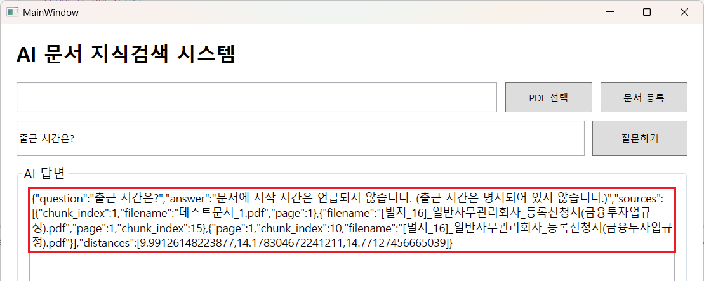

- Ollama, Local LLM에 질문을 보내고 응답받는 시간이 오래 걸림. 최소 20초
- OpenAI나 Gemini 등의 상용 LLM을 사용하면 사라질 현상
- setx로 등록 시, OPENAI_API_KEY 또는 OPENAI_ADMIN_KEY
    - `setx OPENAI_API_KEY "발급 받은_Key"`

- ChatGPT(OpenAI)로 변경했을 때 결과 화면 - 같은 벡터 검색결과로 LLM 실행결과가 다르게 나옴. 결과 도출시간 5초 정도

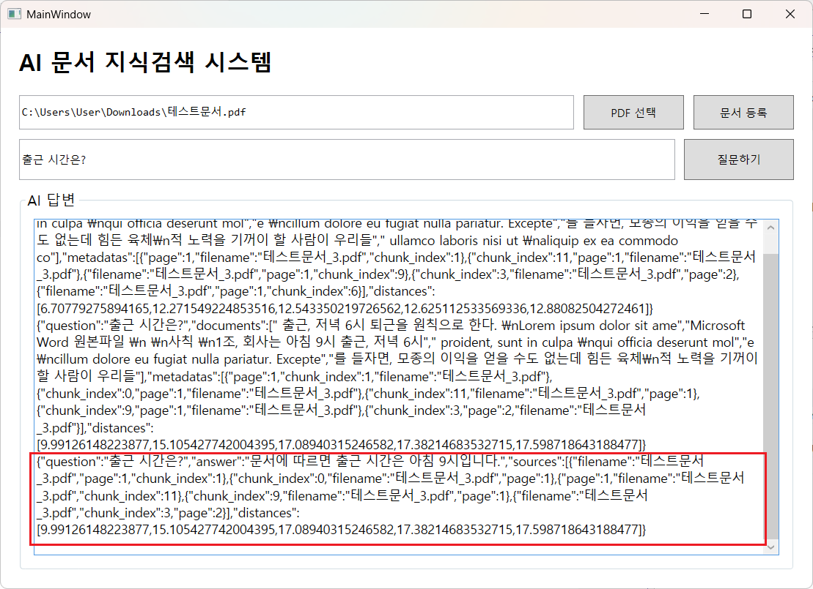

#### 추가 작업
- 프로그레스바(서클) LLM 처리 시간동안 진행상태 표시
- 예외처리(서버 꺼짐, WPF 앱 꺼짐)
- UI 스타일 변경(MahApps. UI Framework 등...)

#### 문제점 - 추후 개선사항

- 중복 등록 방지
    - 같은 문서를 여러 번 업로드하면 Chunk와 Embedding이 ChromaDB에 중복 저장되는 문제
    - 동일 문서가 서로 다른 filename과 id로 저장되어 `top_k` 검색 결과에서 관련 문서가 밀려날 수 있음
    - 중복 데이터로 인해 RAG 검색 품질이 저하될 수 있음
    - 추후 파일 내용을 `SHA-256 해시`로 비교하여 동일 문서의 중복 등록 방지 예정

- Embedding 및 검색 성능 개선
    - 현재 고정된 Chunk 크기와 Embedding 모델을 사용
    - 추후 Chunk 크기 및 overlap 조정, Embedding 모델 비교를 통해 검색 정확도 개선

- 이미지 기반 PDF 지원
    - 현재 PyMuPDF를 이용한 텍스트 기반 PDF만 처리 가능
    - 스캔 문서 등 이미지로 구성된 PDF는 텍스트 추출이 어려움
    - 추후 OCR을 적용하여 이미지 기반 PDF의 텍스트 인식 기능 추가
    
##### DevExpress 적용
- WPF 앱을 윈폼 앱처럼 UI 화면을 구성하기 위해서 사용하는 UI 컴포넌트
- https://www.devexpress.com/ 에서 Trial 설치

- 첫번째: 확장 > DevExpress > Project Converter로 일괄 변경
- 두번째: 일반적인 NuGet 패키지 관리자로 설치
    - DevExpress.Wpf.Core 설치. 12개 종속성 패키지 통합 설치
    - DevExpress.Wpf.Control 설치
    - DevExpress.Wpf.Grid 설치
- WPF 디자이너 도구상자 확인

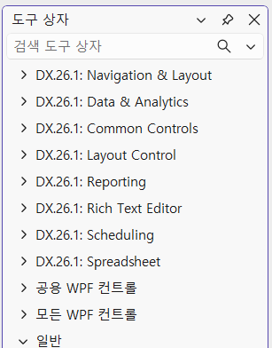

##### DevExpress 윈도우로 변경
- 아래와 같이 Xaml 디자이너에서 윈도우 클래스 ThemedWindow로 변경

```cs
<dx:ThemedWindow    -- 클래스 확인
        x:Class="AiKnowledgeApp.MainWindow"
        xmlns="http://schemas.microsoft.com/winfx/2006/xaml/presentation"
        xmlns:x="http://schemas.microsoft.com/winfx/2006/xaml"
        xmlns:d="http://schemas.microsoft.com/expression/blend/2008"
        xmlns:mc="http://schemas.openxmlformats.org/markup-compatibility/2006"
        xmlns:dx="http://schemas.devexpress.com/winfx/2008/xaml/core"  -- 확인
        xmlns:local="clr-namespace:AiKnowledgeApp"
```

- 코드비하인드 변경해서 오류 제거

```cs
using Microsoft.Win32  // 삭제

if (dialog.ShowDialog() == System.Windows.Forms.DialogResult.OK) {
...
MessageBox.Show("질문을 입력하세요."); --> DXMessageBox.Show("질문을 입력하세요.");
```

- App.xaml 코드비하인드의 부모클래스 Application을 변경

```cs
public partial class App: System.Windows.Application {
```

- 주요 컨트롤
    - xmlns:dx="http://schemas.devexpress.com/winfx/2008/xaml/core" : SimpleButton, ..
    - xmlns:dxe="http://schemas.devexpress.com/winfx/2008/xaml/editors" : TextEdit, ..
- GridControl 사용시 주의점: 상위 Grid RowDefinition이 Auto일 때 Height 속성 필수.

- 실행 화면

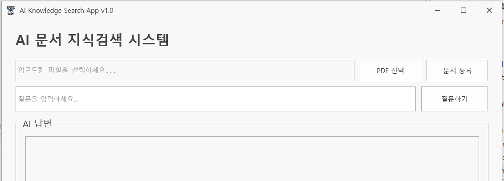

- 실행 결과


#### 추가 작업

##### 검색 중 진행 상태 표시
- DevExpress ProgressBarEdit 사용

```xml
<dxe:ProgressBarEdit Grid.Row="0" x:Name="PrgAnswer"
                     Height="20"
                     Minimum="0" Maximum="100"
                     Visibility="Collapsed" >
    <dxe:ProgressBarEdit.StyleSettings>
        <dxe:ProgressBarMarqueeStyleSettings />
    </dxe:ProgressBarEdit.StyleSettings>
</dxe:ProgressBarEdit>
```

- 실행 결과

#### 추가 수정사항

##### Local LLM 응답 속도 개선

* Ollama Local LLM 사용 시 질문에 따라 답변 생성 시간이 길어지는 현상 확인
* 처리 구간별 실행 시간을 측정하여 병목 구간 확인

  * 벡터 검색 시간
  * 검색된 Chunk 수
  * LLM에 전달되는 글자 수
  * Ollama 답변 생성 시간
  * 전체 처리 시간
* 측정 결과 벡터 검색은 약 `0.25초`, Ollama 답변 생성은 약 `16.91초`가 소요되어 LLM 답변 생성 과정이 주요 병목임을 확인
* 검색 결과 수를 `top_k=5`에서 `top_k=3`으로 조정하여 LLM에 전달되는 문맥 크기 축소
* RAG 문서 검색 목적에 맞게 Ollama 답변 생성 옵션 최적화

  * `think=False` : 별도의 추론 과정 비활성화
  * `num_predict=100` : 최대 답변 생성 길이 제한
  * `temperature=0.2` : 문서 내용을 기반으로 일관된 답변을 생성하도록 설정
  * `keep_alive='10m'` : 모델을 일정 시간 메모리에 유지하여 반복 질문 시 로딩 시간 감소
* 프롬프트에 `답변은 핵심 내용만 2~3문장으로 간결하게 작성하세요.` 조건 추가
* 최적화 후 동일한 문서 질의에서 답변 생성 시간이 약 `0.74초`까지 단축됨

```python
response = ollama.chat(
    model='qwen3.5:2b',
    messages=[
        {
            'role': 'user',
            'content': prompt
        }
    ],
    think=False,
    options={
        'num_predict': 100,
        'temperature': 0.2
    },
    keep_alive='10m'
)
```

##### 답변 표시 방식 개선

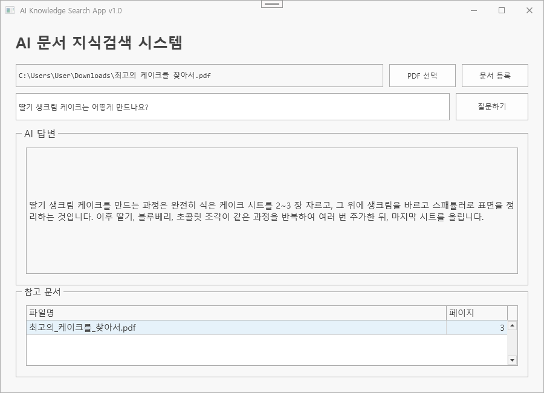

* 질문 처리 중에는 `AI가 답변을 생성하고 있습니다...` 안내 문구 표시
* 기존에는 AI 답변을 안내 문구 뒤에 추가하여 답변 완료 후에도 안내 문구가 남는 문제 발생
* 응답 완료 시 `TxtAnswer`의 내용을 AI 답변으로 교체하도록 수정

```csharp
// 수정 전
TxtAnswer.Text += askResponse.answer + Environment.NewLine;

// 수정 후
TxtAnswer.Text = askResponse.answer;
```

* 답변 생성 중에는 진행 상태를 표시하고, 응답 완료 후에는 실제 AI 답변만 화면에 출력되도록 개선


- 실행 결과