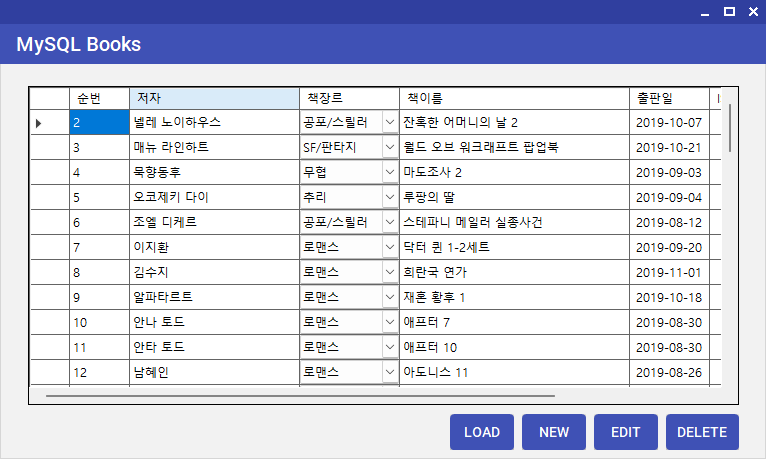

# WinForms 기반 도서 관리 프로그램

C# WinForms와 MySQL을 연동하여 도서 정보를 조회하고 등록·수정·삭제하는 Windows 응용프로그램 실습입니다.

---

## 개발 목적

WinForms의 이벤트 기반 UI 처리와 MySQL 데이터베이스 연동을 학습하고,  
`DataGridView`를 활용하여 도서 정보를 관리하는 CRUD 기능을 구현했습니다.

---

## 사용 기술

- **Language** : C#
- **Application / UI** : WinForms, MaterialSkin
- **Database** : MySQL
- **Library** : MySqlConnector
- **Development Environment** : Visual Studio, .NET 10

---

## 실행 화면



---

## 주요 기능

### 1. 도서 목록 조회

- MySQL `books` 테이블의 도서 정보 조회
- 조회 결과를 `DataTable`로 반환하여 `DataGridView`에 표시
- 도서 순번, 저자, 장르, 도서명, 출판일, ISBN, 가격 정보 표시

### 2. 장르 데이터 연동

- MySQL `division` 테이블에서 장르 코드와 장르명 조회
- `DataGridViewComboBoxColumn`을 사용하여 장르 선택 기능 구성
- 데이터베이스의 장르 코드와 화면에 표시되는 장르명을 연동

### 3. 도서 정보 등록

- `DataGridView`에 입력한 도서 정보를 확인하여 `INSERT` 쿼리 실행
- 등록 완료 후 전체 데이터를 다시 조회하여 화면 갱신

### 4. 도서 정보 수정

- 선택한 도서 정보를 기준으로 `UPDATE` 쿼리 실행
- 저자, 장르, 도서명, 출판일, ISBN, 가격 정보 수정
- 수정 완료 후 데이터를 다시 조회하여 변경 내용 표시

### 5. 도서 정보 삭제

- 삭제할 행을 선택한 후 삭제 여부 확인
- 사용자가 확인한 경우 해당 도서를 MySQL에서 삭제
- 삭제 완료 후 도서 목록 갱신

---

## 데이터 처리 흐름

```text
WinForms UI
    ↓
사용자 입력 / 버튼 이벤트
    ↓
DatabaseHelper
    ↓
MySQL
    ↓
DataTable
    ↓
DataGridView 화면 갱신
```

---

## 주요 구현

### 1. MySQL 데이터 조회

`DatabaseHelper`에서 MySQL에 연결하고 조회 결과를 `DataTable`로 반환하여  
WinForms 화면에서 사용할 수 있도록 처리했습니다.

```csharp
public DataTable Select(string sql)
{
    using MySqlConnection conn = new MySqlConnection(connStr);
    conn.Open();

    using MySqlCommand cmd = new MySqlCommand(sql, conn);
    using MySqlDataAdapter adapter = new MySqlDataAdapter(cmd);

    DataTable dt = new DataTable();
    adapter.Fill(dt);

    return dt;
}
```

### 2. 조회 데이터 DataGridView 표시

MySQL에서 조회한 도서 데이터를 `DataGridView`의 `DataSource`에 연결하여  
화면에 표시했습니다.

```csharp
private void LoadData()
{
    // SQL 쿼리문 작성
    string query = "SELECT book_idx, author, div_code, book_name, release_dt, isbn, price FROM books";

    // DataGridView 컨트롤 내 DataSource: DataTable 객체를 할당
    DgvBooks.DataSource = dbHelper.Select(query);
}
```

### 3. 장르 데이터 ComboBox 연동

`division` 테이블에서 장르 데이터를 조회하고,  
`DataGridViewComboBoxColumn`에 연결하여 장르명을 선택할 수 있도록 구성했습니다.

```csharp
string divSql = "SELECT div_code, div_name FROM division";
DataTable divTable = dbHelper.Select(divSql);

DataGridViewComboBoxColumn colCboDivCode = new DataGridViewComboBoxColumn
{
    Name = "div_code",
    HeaderText = "책장르",
    DataPropertyName = "div_code",
    DataSource = divTable,
    ValueMember = "div_code",
    DisplayMember = "div_name",
};
```

---

## 학습 내용

- WinForms 기반 Windows 응용프로그램 화면 구성
- 버튼 이벤트를 활용한 사용자 입력 처리
- `DataGridView`를 활용한 데이터 표시 및 편집
- C#과 MySQL 데이터베이스 연동
- SELECT / INSERT / UPDATE / DELETE를 활용한 CRUD 처리
- 데이터 변경 후 목록을 다시 조회하여 화면을 갱신하는 처리 흐름